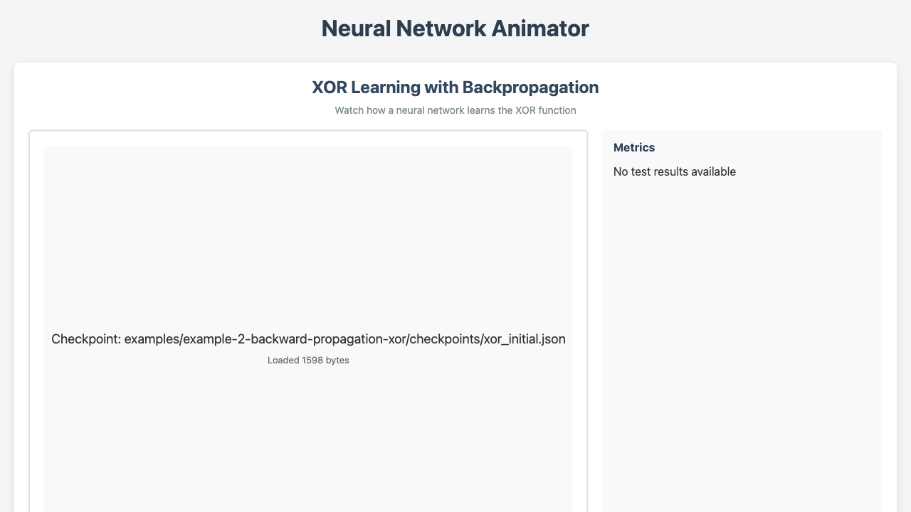

# Neural Network Examples in Rust

A comprehensive machine learning demonstration platform built in Rust, showcasing neural network architectures and techniques through incremental, educational examples.

## Live Demo

**[View Live Demo](https://softwarewrighter.github.io/neural-network-examples-rs/)** - Interactive neural network animation built with Yew/WASM



The demo runs entirely in your browser (no backend required) and shows an animated XOR training visualization.

## Vision

This project aims to create an **educational ML platform** with:

- **Reusable Core Library:** Type-safe, high-performance implementations of fundamental ML components
- **Incremental Examples:** Step-by-step progression from basic to advanced concepts
- **Comprehensive Tutorials:** Each example includes theory, code, visualizations, and benchmarks
- **Production Quality:** Leveraging Rust's safety guarantees and zero-cost abstractions

## Current Status: v0.1 - Foundation

**Phase 0 Complete:** Project structure, core data types, and error handling ✓
**Phase 2 Complete:** Forward propagation implementation ✓
**Serialization & Visualization Complete:** Checkpointing and SVG generation ✓

**Next:** Implementing backpropagation and training (Phase 3)

### What's Implemented

- ✓ Core error types (`NeuralNetError`, `Result`)
- ✓ Activation functions (Sigmoid, Linear) with trait-based design
- ✓ Layer structure with weight initialization
- ✓ **Forward propagation** - Matrix multiplication and activation
- ✓ Network structure (3-layer FFN)
- ✓ **JSON Serialization** - Save/load network checkpoints with metadata
- ✓ **SVG Visualization** - Generate network diagrams with weight visualization
- ✓ File I/O utilities for matrix data
- ✓ Workspace structure with `crates/` and `examples/`
- ✓ Comprehensive test suite (28 unit tests + 4 doctests passing)
- ✓ Example: `examples/forward-propagation/` - XOR problem with visualizations

### In Progress

- Backpropagation and weight updates (Phase 3)
- Training algorithms (by iteration, by error threshold)
- Digit recognition example

## Quick Start

### Try the Live Demo

Visit **[https://softwarewrighter.github.io/neural-network-examples-rs/](https://softwarewrighter.github.io/neural-network-examples-rs/)** to see the interactive neural network animator in action.

### Prerequisites

- Rust 1.70+ ([Install Rust](https://www.rust-lang.org/tools/install))
- Cargo (included with Rust)
- Trunk (for building the demo): `cargo install trunk`

### Build & Test

```bash
# Clone the repository
git clone https://github.com/softwarewrighter/neural-network-examples-rs.git
cd neural-network-examples-rs

# Build the project
cargo build

# Run tests
cargo test

# Run linting
cargo clippy -- -D warnings

# Generate documentation
cargo doc --open
```

### Build and Serve the Demo Locally

```bash
# Build the WASM demo
bash scripts/build-demo.sh

# Serve locally at http://127.0.0.1:8080
bash scripts/serve-demo.sh
```

### Try the XOR Example

```bash
cd examples/forward-propagation
cargo run
```

This demonstrates forward propagation, manual weight tuning limitations, and generates visualizations!

### Usage (Current Features)

```rust
use neural_net_core::{FeedForwardNetwork, NetworkMetadata};
use neural_net_viz::{NetworkVisualization, VisualizationConfig};

// Create a network: 2 inputs, 4 hidden neurons, 1 output
let mut network = FeedForwardNetwork::new(2, 4, 1);

// Forward propagation
let output = network.forward(&[1.0, 0.0])?;
println!("Output: {:.4}", output[0]);

// Save checkpoint with metadata
let metadata = NetworkMetadata::initial("My XOR Network");
network.save_checkpoint("checkpoint.json", metadata.clone())?;

// Generate SVG visualization
let config = VisualizationConfig::default();
network.save_svg_with_metadata("network.svg", &metadata, &config)?;

// Load checkpoint
let (loaded_network, loaded_metadata) =
    FeedForwardNetwork::load_checkpoint("checkpoint.json")?;
```

### Usage (When Backpropagation is Complete)

```rust
// Training will be available in the next phase
network.train_by_error(&inputs, &targets, 0.0001)?;
```

## Project Structure

```
neural-network-examples-rs/
├── crates/
│   ├── neural-net-core/   # Core library crate (algorithms & data structures)
│   │   ├── Cargo.toml
│   │   └── src/
│   │       ├── lib.rs          # Public API
│   │       ├── error.rs        # Error types
│   │       ├── activation.rs   # Activation functions
│   │       ├── layer.rs        # Layer implementation
│   │       ├── network.rs      # Network implementation
│   │       ├── persistence.rs  # Checkpointing & serialization
│   │       └── utils/          # Utilities (file I/O, etc.)
│   └── neural-net-viz/    # Visualization library (separate crate)
│       ├── Cargo.toml
│       └── src/
│           └── lib.rs          # SVG generation & network visualization
├── examples/
│   └── forward-propagation/   # Example: XOR with manual weight tuning
│       ├── Cargo.toml
│       ├── README.md          # Example documentation
│       ├── src/main.rs
│       ├── checkpoints/       # Generated JSON checkpoints
│       │   ├── xor_initial.json
│       │   ├── xor_manual_attempt1.json
│       │   └── xor_manual_attempt2.json
│       └── images/            # Generated SVG visualizations
│           ├── xor_initial.svg
│           ├── xor_manual_attempt1.svg
│           └── xor_manual_attempt2.svg
├── documentation/         # Project documentation (process, architecture, planning)
├── docs/                  # GitHub Pages build output (static site)
├── research/              # C++ reference code (gitignored artifacts)
├── samples/               # Training/test data
└── Cargo.toml            # Workspace configuration
```

## Documentation

Comprehensive documentation is available in the `documentation/` directory:

- **[documentation/process.md](documentation/process.md)** - **READ FIRST** - MANDATORY development process and requirements
- **[documentation/architecture.md](documentation/architecture.md)** - Technical architecture, design decisions, and patterns
- **[documentation/PRD.md](documentation/PRD.md)** - Product requirements, goals, success metrics, and roadmap
- **[documentation/plan.md](documentation/plan.md)** - Detailed 6-phase implementation plan with tasks and timelines
- **[documentation/learnings.md](documentation/learnings.md)** - Key decisions, rationale, and lessons learned

**Start here:** Read `documentation/process.md` for development requirements, then `documentation/PRD.md` for project goals, then `documentation/architecture.md` for technical details.

## Roadmap

### v0.1 - Feed-Forward Network Foundation (Current)
- ✓ Project setup and core data structures (Phase 0)
- ✓ Forward propagation (Phase 2)
- ✓ JSON serialization and checkpointing
- ✓ SVG visualization generation
- ✓ XOR forward propagation example with visualizations
- ⏳ Backpropagation and training (Phase 3) - **Next**
- ⏳ Training algorithms (Phase 3)
- ⏳ XOR learning example with convergence (Phase 4)
- ⏳ Digit recognition example (Phase 4)

### v0.2+ - Incremental ML Techniques (Future)

The project will evolve into a structured learning platform:

```
examples/
├── 01-feedforward/      # Basic FFN (v0.1)
├── 02-optimizers/       # SGD, Momentum, Adam (v0.2)
├── 03-regularization/   # L1/L2, Dropout (v0.3)
├── 04-cnn/              # Convolutional networks (v0.4)
├── 05-rnn/              # Recurrent networks (v0.5)
├── 06-gan/              # Generative models (v0.6)
└── ...                  # More as techniques evolve
```

Each example directory will include:
- README with theory and concepts
- Working code with extensive comments
- Visualizations of results
- Performance benchmarks
- References to papers/resources

## Development Approach

### Test-Driven Development (TDD)

We use Red-Green-Refactor methodology:
1. **Red:** Write failing test defining desired behavior
2. **Green:** Implement minimal code to pass test
3. **Refactor:** Improve code quality while keeping tests green

### Local CI

Quality checks run on local infrastructure:
```bash
cargo test                     # All tests must pass
cargo clippy -- -D warnings    # Zero warnings required
cargo fmt -- --check           # Consistent formatting
cargo doc --no-deps            # Documentation builds
```

## Dependencies

### Core Dependencies
- `ndarray` (0.15) - Multi-dimensional arrays with BLAS integration
- `rand` (0.8) - Random number generation for weight initialization
- `thiserror` (1.0) - Ergonomic error types
- `serde` (1.0) - Serialization framework
- `serde_json` (1.0) - JSON serialization for checkpoints
- `chrono` (0.4) - Timestamp generation for metadata

### Development Dependencies
- `approx` (0.5) - Float comparison in tests
- `criterion` (0.5) - Statistical benchmarking (future use)

## Contributing

This is currently an educational project in active development. Contributions, suggestions, and discussions are welcome!

### Areas for Future Contribution
- Additional activation functions (ReLU, Tanh, etc.)
- New network architectures
- Optimization algorithms
- Visualization tools
- Tutorial documentation
- Performance optimizations

## License

MIT License (see [LICENSE](LICENSE))

## References

### Original C++ Implementation
- [Feed-Forward-Neural-Network](https://github.com/wimacod/Feed-Forward-Neural-Network)
- See `research/README-cpp-original.md` for original project documentation

### Neural Network Theory
- [Backpropagation Tutorial](http://www.cs.bham.ac.uk/~jxb/NN/l7.pdf)
- [Feed-Forward Neural Networks](http://www.di.unito.it/~cancelli/retineu06_07/FNN.pdf)

### Rust ML Ecosystem
- [Are We Learning Yet?](http://www.arewelearningyet.com/) - Rust ML crate directory
- [ndarray documentation](https://docs.rs/ndarray/)
- [Rust Performance Book](https://nnethercote.github.io/perf-book/)

## Acknowledgments

- Original C++ implementation by Alexis Louis
- Inspired by classic backpropagation algorithms and educational ML resources
- Built with Rust's powerful type system and zero-cost abstractions

---

**Status:** Phase 2 (Forward Propagation) + Serialization + Visualization complete ✓
**Next:** Phase 3 (Backpropagation) ready to begin

**Last Updated:** 2025-10-14
