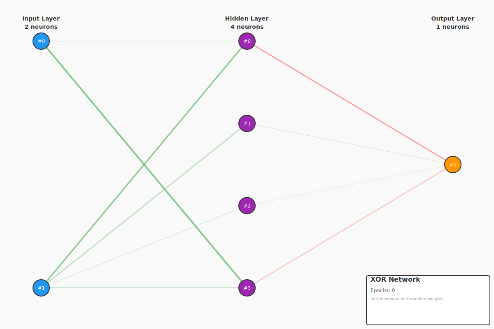
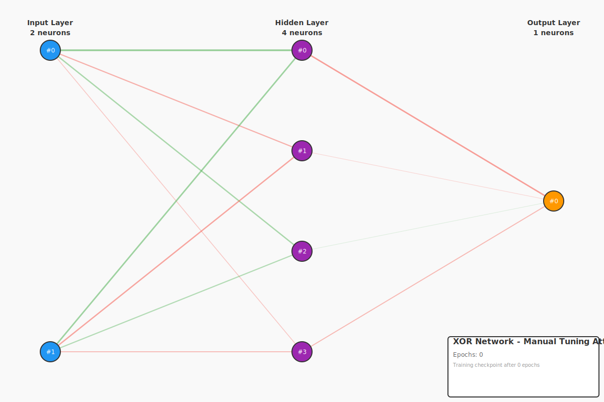
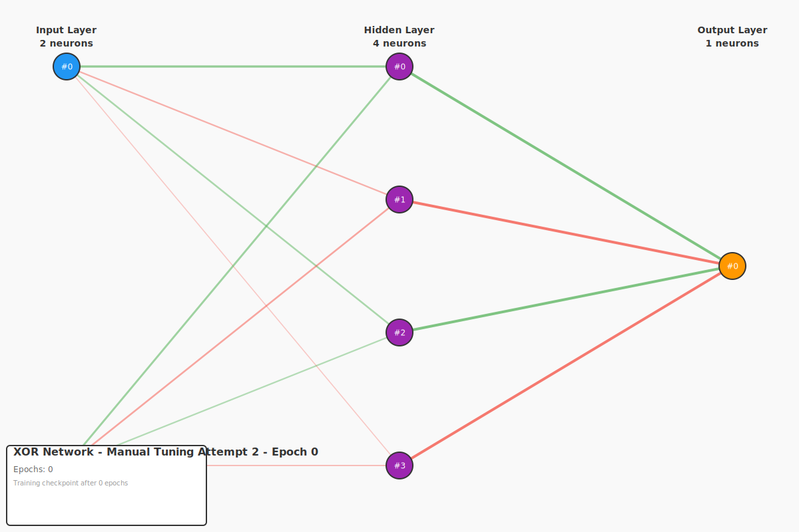

# Forward Propagation Example - XOR Problem

This example demonstrates **forward propagation** through a neural network using the classic XOR (exclusive OR) problem. This is an educational example showing how neural networks process information and why we need automatic learning algorithms like backpropagation.

## The XOR Problem

XOR is a **non-linearly separable** problem, meaning you cannot draw a single straight line to separate the outputs. This makes it impossible for a simple perceptron to solve, but a network with a hidden layer can learn it.

### Truth Table

| Input A | Input B | Output (A XOR B) |
|---------|---------|------------------|
|   0.0   |   0.0   |       0.0        |
|   0.0   |   1.0   |       1.0        |
|   1.0   |   0.0   |       1.0        |
|   1.0   |   1.0   |       0.0        |

### Why XOR is Important

- **Historical Significance**: XOR was one of the problems that led to the "AI winter" in the 1960s when simple perceptrons couldn't solve it
- **Non-linear Separability**: Demonstrates why hidden layers are necessary
- **Classic Benchmark**: Standard test problem for neural network implementations
- **Minimal Complexity**: Simple enough to understand but complex enough to require a hidden layer

## Network Architecture

```
Input Layer (2 neurons)  →  Hidden Layer (4 neurons)  →  Output Layer (1 neuron)
      [A, B]                    [sigmoid]                    [linear]
```

- **Input Layer**: 2 neurons (for inputs A and B)
- **Hidden Layer**: 4 neurons with sigmoid activation
- **Output Layer**: 1 neuron with linear activation (produces the XOR result)

## What This Example Teaches

### 1. Random Initialization
Networks start with **random weights** between -1.0 and 1.0. Without training, the outputs are essentially random:

```
Testing: Initial (Random)
  Input    Target  Output   Error
  -------  ------  -------  -------
  [0, 0]   0.0     1.0991   1.0991
  [0, 1]   1.0     1.2851   0.2851
  [1, 0]   1.0     1.1146   0.1146
  [1, 1]   0.0     1.2927   1.2927
  Mean Absolute Error: 0.6979
```

### 2. Manual Tuning is Impractical
We attempt to manually adjust weights to improve performance, but this demonstrates the problem:

- **Attempt 1**: Manually set hidden layer weights → Error improves slightly (0.6404)
- **Attempt 2**: Manually set output layer weights → Error improves more (0.4723)
- **Problem**: Still far from solving XOR, and we only have 12 weights!

Imagine trying to manually tune thousands or millions of weights in a real network!

### 3. Forward Propagation Mechanics
See how information flows through the network:
- Input layer receives raw inputs
- Hidden layer applies weighted sums + sigmoid activation
- Output layer produces final result

### 4. The Need for Backpropagation
This example proves we need an **automatic learning algorithm** to find good weights. Manual tuning:
- Takes too long
- Doesn't find optimal solutions
- Doesn't scale to larger networks
- Requires expert intuition

## Visualizations

The example generates SVG diagrams showing the network at different stages:

### Initial Network (Random Weights)


The network starts with random weights. Green lines show positive weights, red lines show negative weights, and line thickness represents magnitude.

### Manual Tuning Attempt 1


After manually adjusting the hidden layer weights, we see some improvement but the network still doesn't solve XOR.

### Manual Tuning Attempt 2


After also adjusting the output layer weights, performance improves slightly more, but we're still far from a working solution. This demonstrates the difficulty of manual weight tuning.

## Running the Example

```bash
cd examples/forward-propagation
cargo run
```

## Generated Files

The example produces two types of files:

### Checkpoints (JSON)
```
checkpoints/
├── xor_initial.json           # Random weights
├── xor_manual_attempt1.json   # After first manual adjustment
└── xor_manual_attempt2.json   # After second manual adjustment
```

Each checkpoint contains:
- Network metadata (name, timestamp, epochs, accuracy)
- Complete network state (all weights, layer sizes)
- Can be loaded and resumed

Example checkpoint structure:
```json
{
  "metadata": {
    "name": "XOR Network",
    "description": "Initial network with random weights",
    "timestamp": "2025-10-14T23:29:48.750027+00:00",
    "epochs": 0,
    "accuracy": null
  },
  "network": {
    "layers": [...]
  }
}
```

### Visualizations (SVG)
```
images/
├── xor_initial.svg            # Initial network diagram
├── xor_manual_attempt1.svg    # After first adjustment
└── xor_manual_attempt2.svg    # After second adjustment
```

Each SVG shows:
- Network architecture (layer sizes)
- Neuron positions (color-coded: blue=input, purple=hidden, orange=output)
- Weight connections (green=positive, red=negative, thickness=magnitude)
- Metadata overlay (name, epochs, accuracy)

## Key Takeaways

1. **Random weights produce random outputs** - Untrained networks are useless
2. **Forward propagation alone doesn't learn** - We can only evaluate, not improve
3. **Manual weight tuning is impractical** - Even with just 12 weights it's difficult
4. **We need automatic learning** - This motivates the next example: **Backpropagation**

## Next Steps

The next example will implement **backpropagation**, an algorithm that:
- Automatically adjusts weights to reduce error
- Uses gradient descent to find optimal weights
- Scales to networks with millions of parameters
- Can solve XOR and much more complex problems

## Code Structure

```rust
// Create network
let mut network = FeedForwardNetwork::new(2, 4, 1);

// Forward propagation
let output = network.forward(&[1.0, 0.0])?;

// Save checkpoint
network.save_checkpoint("checkpoint.json", metadata)?;

// Generate visualization
network.save_svg_with_metadata("network.svg", &metadata, &config)?;
```

## Learning Resources

- **Perceptron Limitations**: Minsky & Papert (1969) - Showed perceptrons can't solve XOR
- **Backpropagation**: Rumelhart et al. (1986) - The solution to the XOR problem
- **Universal Approximation**: Networks with hidden layers can approximate any function
- **Activation Functions**: Sigmoid enables non-linear decision boundaries

## Dependencies

This example uses:
- `neural-net-core` - Core network implementation and algorithms
- `neural-net-viz` - SVG visualization generation
- `ndarray` - Matrix operations for weights

## License

MIT - See repository root for full license
