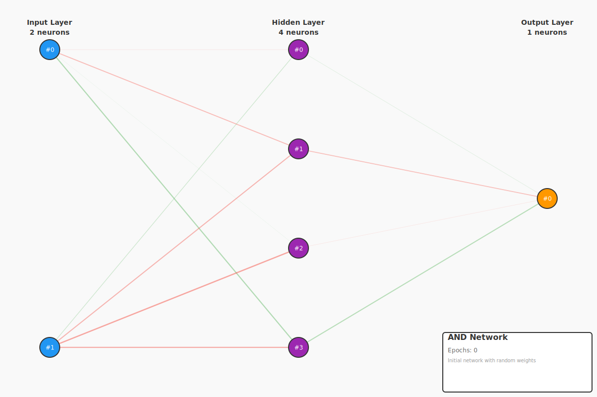
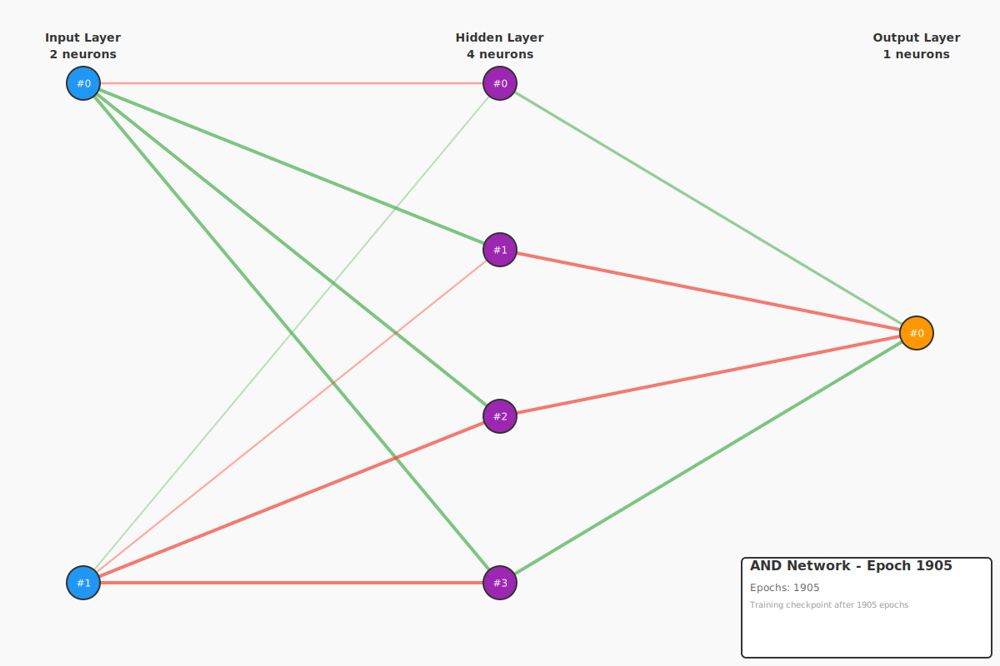

# Backpropagation Example - AND Gate

This example demonstrates **backpropagation learning** using the simple AND logic gate. While AND is linearly separable (a single perceptron could solve it), we use a neural network with a hidden layer to demonstrate how backpropagation automatically learns the correct weights.

## The AND Problem

AND is the simplest non-trivial boolean function. It returns 1 only when **both** inputs are 1.

### Truth Table

| Input A | Input B | Output (A AND B) |
|---------|---------|------------------|
|   0.0   |   0.0   |       0.0        |
|   0.0   |   1.0   |       0.0        |
|   1.0   |   0.0   |       0.0        |
|   1.0   |   1.0   |       1.0        |

### Why AND is a Good Starting Point

- **Linearly Separable**: Can be solved with a single straight line
- **Simple Pattern**: Easy to understand what the network should learn
- **Fast Convergence**: Usually trains in <2000 iterations
- **Confidence Builder**: Shows backpropagation working on the simplest case

## Network Architecture

```
Input Layer (2 neurons)  →  Hidden Layer (4 neurons)  →  Output Layer (1 neuron)
      [A, B]                    [sigmoid]                    [linear]
```

- **Input Layer**: 2 neurons (for inputs A and B)
- **Hidden Layer**: 4 neurons with sigmoid activation
- **Output Layer**: 1 neuron with linear activation (produces the AND result)

## What This Example Demonstrates

### Before Training (Random Weights)
```
  A    B   | Expected | Actual  | Error
-----------|----------|---------|-------
  0    0   |   0.0    | -0.4955 | 0.4955
  0    1   |   0.0    | -0.7264 | 0.7264
  1    0   |   0.0    | -0.5495 | 0.5495
  1    1   |   1.0    | -0.7540 | 1.7540
-----------|----------|---------|-------
Total Error: 3.5254
Correct: 0/4
```

The untrained network produces random outputs with **0% accuracy**.

### After Training (~1500 iterations)
```
  A    B   | Expected | Actual  | Error
-----------|----------|---------|-------
  0    0   |   0.0    | -0.0775 | 0.0775
  0    1   |   0.0    | 0.0245  | 0.0245
  1    0   |   0.0    | 0.0416  | 0.0416
  1    1   |   1.0    | 0.9846  | 0.0154
-----------|----------|---------|-------
Total Error: 0.1591
Correct: 4/4 (100%)
```

The trained network achieves **100% accuracy**! All predictions are within 0.1 of the target.

## How Backpropagation Works

1. **Forward Pass**: Calculate outputs with current weights
2. **Error Calculation**: Measure how far outputs are from targets
3. **Backward Pass**: Calculate gradients (how much each weight contributed to error)
4. **Weight Update**: Adjust weights in the direction that reduces error
5. **Repeat**: Until error falls below threshold

### Training Progress

```
Iteration 1000: error = 0.045333
Training complete after 1471 iterations (final error: 0.009983)
```

The network converges quickly because AND is relatively simple.

## Key Learning Points

1. **Automatic Learning**: No manual weight tuning needed
2. **Gradient Descent**: Weights move in the direction that reduces error
3. **Convergence**: Error decreases steadily until threshold is reached
4. **Perfect Learning**: Network learns the exact AND function

## Running the Example

```bash
cd examples/example-2-backward-propagation-and
cargo run
```

Or from the repository root:
```bash
cargo run -p example-2-backward-propagation-and
```

## Network Visualizations

### Initial Network (Random Weights)

The network starts with randomly initialized weights, producing essentially random outputs:



**Key observations:**
- **Random weight distribution**: Both positive (green) and negative (red) weights scattered throughout
- **No learned pattern**: Weight magnitudes (line thickness) show no meaningful structure
- **Poor performance**: 0/4 correct predictions (25% accuracy or worse)
- **Network state**: 2 inputs → 4 hidden neurons (sigmoid) → 1 output (linear)

### Trained Network (After Backpropagation)

After ~1500-2000 iterations of backpropagation, the network learns the AND function perfectly:



**Key observations:**
- **Organized weights**: Clear pattern emerges as specific connections strengthen/weaken
- **Learned representation**: Hidden layer discovers features that enable AND computation
- **Perfect accuracy**: 4/4 correct predictions (100% accuracy)
- **Converged state**: All outputs within 0.1 of target values

**Weight color coding:**
- 🟢 **Green lines** = Positive weights (excitatory connections)
- 🔴 **Red lines** = Negative weights (inhibitory connections)
- **Line thickness** = Absolute weight magnitude (thicker = stronger influence)

### Generated Files

The example saves both checkpoints and visualizations:

**Checkpoints (JSON):**
- `checkpoints/and_initial.json` - Initial network state with random weights
- `checkpoints/and_trained.json` - Final network state after training

**Visualizations (SVG):**
- `images/and_initial.svg` - Visual representation of initial network
- `images/and_trained.svg` - Visual representation of trained network

## Comparison with Other Gates

| Gate | Linearly Separable? | Training Iterations | Difficulty |
|------|---------------------|---------------------|------------|
| AND  | ✓ Yes               | ~1500               | Easy       |
| OR   | ✓ Yes               | ~900                | Easy       |
| XOR  | ✗ No                | ~2500               | Medium     |

AND is slightly harder than OR because 3 out of 4 examples have the same output (0).

## Next Steps

After seeing AND work, try:
- **OR Gate**: Similar difficulty, different pattern
- **XOR Gate**: The classic non-linearly separable problem
- **3-Bit Functions**: More complex patterns requiring more neurons

## Code Highlights

```rust
// Create network
let mut network = FeedForwardNetwork::new(2, 4, 1);

// Training data
let inputs = vec![
    vec![0.0, 0.0],
    vec![0.0, 1.0],
    vec![1.0, 0.0],
    vec![1.0, 1.0],
];
let targets = vec![vec![0.0], vec![0.0], vec![0.0], vec![1.0]];

// Train until error < 0.01
network.train_by_error(&inputs, &targets, 0.01, Some(0.1), Some(5000))?;

// Test the network
for (input, target) in inputs.iter().zip(&targets) {
    let output = network.forward(input)?;
    println!("AND({}, {}) = {:.4}", input[0], input[1], output[0]);
}
```

## Learning Resources

- **Boolean Logic**: Foundation of digital computers
- **Perceptrons**: Simple linear classifiers (can solve AND)
- **Backpropagation**: The algorithm that made neural networks practical
- **Gradient Descent**: Optimization technique used to adjust weights

## Dependencies

- `neural-net-core` - Backpropagation implementation
- `neural-net-viz` - Network visualization (optional)

## License

MIT - See repository root for full license
