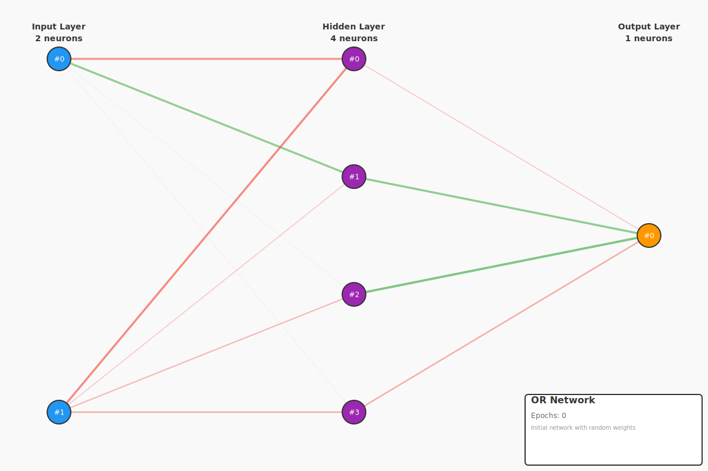

# Backpropagation Example - OR Gate

This example demonstrates **backpropagation learning** using the OR logic gate. OR is linearly separable but provides a different pattern than AND, showing how backpropagation adapts to different boolean functions.

## The OR Problem

OR returns 1 when **at least one** input is 1.

### Truth Table

| Input A | Input B | Output (A OR B) |
|---------|---------|-----------------|
|   0.0   |   0.0   |      0.0        |
|   0.0   |   1.0   |      1.0        |
|   1.0   |   0.0   |      1.0        |
|   1.0   |   1.0   |      1.0        |

### Why OR is Important

- **Linearly Separable**: Like AND, can be solved with a single line
- **Complementary Pattern**: Inverse of NOR, useful comparison to AND
- **Fast Convergence**: Often trains faster than AND (~900 iterations)
- **Balanced Classes**: 3 positive examples, 1 negative (vs AND's 1 positive, 3 negative)

## Network Architecture

```
Input Layer (2 neurons)  →  Hidden Layer (4 neurons)  →  Output Layer (1 neuron)
      [A, B]                    [sigmoid]                    [linear]
```

## What This Example Demonstrates

### Before Training (Random Weights)
```
  A    B   | Expected | Actual  | Error
-----------|----------|---------|-------
  0    0   |   0.0    | -0.5538 | 0.5538
  0    1   |   1.0    | -0.4603 | 1.4603
  1    0   |   1.0    | -0.6944 | 1.6944
  1    1   |   1.0    | -0.5993 | 1.5993
-----------|----------|---------|-------
Total Error: 5.3078
Correct: 0/4
```

### After Training (~900 iterations)
```
  A    B   | Expected | Actual  | Error
-----------|----------|---------|-------
  0    0   |   0.0    | 0.0367  | 0.0367
  0    1   |   1.0    | 0.9601  | 0.0399
  1    0   |   1.0    | 0.9461  | 0.0539
  1    1   |   1.0    | 1.0496  | 0.0496
-----------|----------|---------|-------
Total Error: 0.1801
Correct: 4/4 (100%)
```

## Why OR Trains Faster Than AND

OR typically converges faster because:
- **More positive examples**: 3 out of 4 rows output 1
- **Clearer gradient**: Multiple paths to positive output
- **Simpler decision boundary**: "Any input high → output high"

Versus AND which requires:
- **Specific pattern**: BOTH inputs high → output high
- **More restrictive**: Harder pattern for network to discover

## Running the Example

```bash
cargo run -p example-2-backward-propagation-or
```

## Key Observations

Compare OR to AND:

| Aspect | OR | AND |
|--------|-----|-----|
| Positive Examples | 3/4 (75%) | 1/4 (25%) |
| Training Iterations | ~900 | ~1500 |
| Decision Boundary | "At least one" | "Both required" |
| Convergence Speed | Faster | Slower |

## Network Visualizations

### Initial Network (Random Weights)

The network starts with randomly initialized weights:



**Key observations:**
- **Random initialization**: Weights distributed randomly with no pattern
- **Poor predictions**: Typically 1/4 or 0/4 correct (random guessing)
- **Network architecture**: 2 inputs → 4 hidden neurons (sigmoid) → 1 output (linear)

### Trained Network (After Backpropagation)

After ~900-1100 iterations, the network learns OR (faster than AND or XOR!):


**Key observations:**
- **Faster convergence**: OR trains fastest of the three basic gates
- **Positive bias**: Network learns "if ANY input is high, output high"
- **Perfect accuracy**: 4/4 correct predictions (100% accuracy)
- **Efficient learning**: Fewer iterations needed due to 3/4 positive examples

**Why OR trains faster:**
- **More positive examples**: 3 out of 4 rows output 1
- **Clearer gradient signal**: Multiple paths lead to positive output
- **Simpler decision boundary**: "Any input high → output high"

**Weight color coding:**
- 🟢 **Green lines** = Positive weights (excitatory connections)
- 🔴 **Red lines** = Negative weights (inhibitory connections)
- **Line thickness** = Absolute weight magnitude

### Generated Files

**Checkpoints (JSON):**
- `checkpoints/or_initial.json` - Initial random network
- `checkpoints/or_trained.json` - Trained network

**Visualizations (SVG):**
- `images/or_initial.svg` - Initial network visualization
- `images/or_trained.svg` - Trained network visualization

## Next Steps

- Compare with **AND** to see how patterns affect learning
- Try **XOR** to see why non-linearly separable problems are harder
- Experiment with **3-bit functions** for increased complexity

## Code Example

```rust
let mut network = FeedForwardNetwork::new(2, 4, 1);

// OR truth table
let inputs = vec![
    vec![0.0, 0.0],
    vec![0.0, 1.0],
    vec![1.0, 0.0],
    vec![1.0, 1.0],
];
let targets = vec![vec![0.0], vec![1.0], vec![1.0], vec![1.0]];

// Train
network.train_by_error(&inputs, &targets, 0.01, Some(0.1), Some(5000))?;
```

## License

MIT - See repository root for full license
