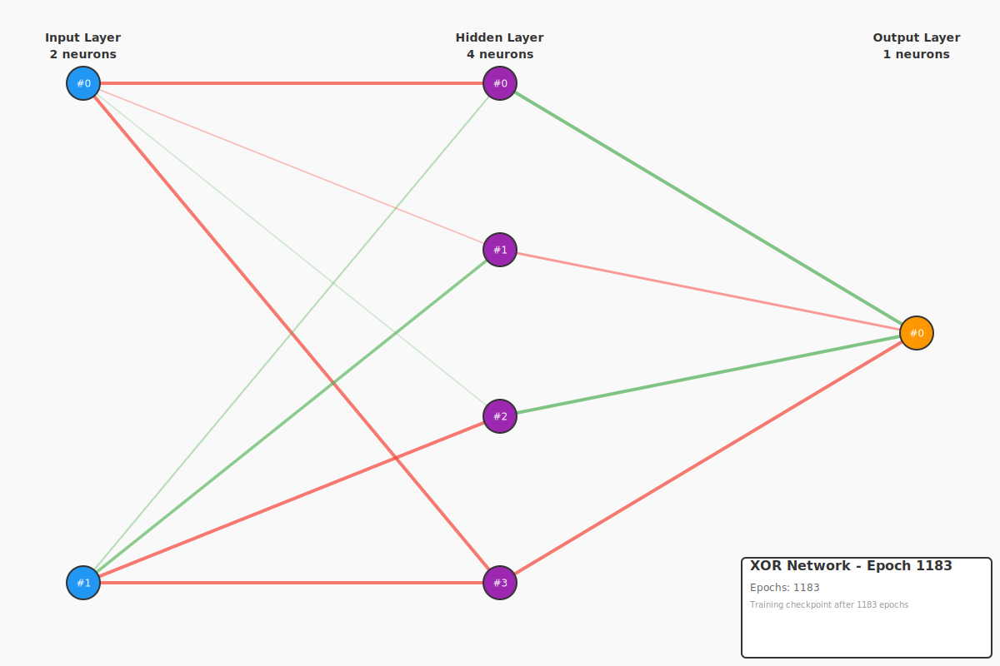

# Backpropagation Example - XOR Gate (The Classic Problem)

This example demonstrates why backpropagation was revolutionary by solving the **XOR problem** - the classic benchmark that simple perceptrons cannot solve.

## The XOR Problem

XOR (exclusive OR) returns 1 when inputs are **different**, 0 when they're the same.

### Truth Table

| Input A | Input B | Output (A XOR B) | Explanation |
|---------|---------|------------------|-------------|
|   0.0   |   0.0   |       0.0        | Same → 0    |
|   0.0   |   1.0   |       1.0        | Different → 1 |
|   1.0   |   0.0   |       1.0        | Different → 1 |
|   1.0   |   1.0   |       0.0        | Same → 0    |

## Why XOR is Special

### Historical Significance

1. **1969 - The Problem Discovered**
   - Marvin Minsky & Seymour Papert proved perceptrons can't solve XOR
   - Led to the first "AI Winter" - funding for neural network research dried up
   - Single-layer networks were considered fundamentally limited

2. **1986 - The Solution**
   - Rumelhart, Hinton & Williams rediscovered backpropagation
   - Showed multi-layer networks CAN solve XOR
   - Sparked the modern era of deep learning

### Why XOR is NOT Linearly Separable

```
     B
   1 |  1   0      Try to draw a single line that separates
     |             the 1s from the 0s - impossible!
   0 |  0   1
     +------
     0      1  A
```

You cannot draw a single straight line to separate:
- The 1s: (0,1) and (1,0)
- From the 0s: (0,0) and (1,1)

This requires a **non-linear decision boundary**, which needs:
1. **Hidden layer** - to create non-linear representations
2. **Backpropagation** - to train the hidden layer weights

## Network Architecture

```
Input Layer (2 neurons)  →  Hidden Layer (4 neurons)  →  Output Layer (1 neuron)
      [A, B]                    [sigmoid]                    [linear]
```

The hidden layer learns to create a representation where XOR becomes separable!

## What This Example Demonstrates

### Before Training (Random Weights - ~50% Accuracy)
```
  A    B   | Expected | Actual  | Error  | Correct?
-----------|----------|---------|--------|----------
  0    0   |   0.0    | 0.0408  | 0.0408 | ✓
  0    1   |   1.0    | 0.0287  | 0.9713 | ✗
  1    0   |   1.0    | 0.0519  | 0.9481 | ✗
  1    1   |   0.0    | 0.0399  | 0.0399 | ✓
-----------|----------|---------|--------|----------
Accuracy: 2/4 (50.0%) - Random chance!
```

### After Training (~2500 iterations - 100% Accuracy)
```
  A    B   | Expected | Actual  | Error  | Correct?
-----------|----------|---------|--------|----------
  0    0   |   0.0    | 0.0495  | 0.0495 | ✓
  0    1   |   1.0    | 0.9654  | 0.0346 | ✓
  1    0   |   1.0    | 0.9500  | 0.0500 | ✓
  1    1   |   0.0    | 0.0404  | 0.0404 | ✓
-----------|----------|---------|--------|----------
Accuracy: 4/4 (100%) - Perfect!
```

## Training Progress

```
Iteration 1000: error = 1.105814  (still learning)
Iteration 2000: error = 0.185163  (converging)
Training complete after 2504 iterations (final error: 0.009949)
```

XOR takes longer to train than AND/OR because:
- **More complex pattern**: Requires non-linear decision boundary
- **Hidden layer learning**: Must discover useful internal representations
- **No linear shortcut**: Network must truly learn the XOR function

## Comparison of Boolean Functions

| Function | Separability | Training Iterations | Hidden Layer Needed? |
|----------|-------------|---------------------|---------------------|
| AND      | Linear      | ~1500               | No (but we use one) |
| OR       | Linear      | ~900                | No (but we use one) |
| **XOR**  | **Non-linear** | **~2500**       | **Yes (required!)** |

## Why This Proves Backpropagation Works

1. **Solves "Impossible" Problem**: What perceptrons can't do, multi-layer networks can
2. **Automatic Feature Learning**: Hidden layer discovers useful representations
3. **Scales to Complexity**: If it can learn XOR, it can learn anything (given enough neurons)

## Running the Example

```bash
cargo run -p example-2-backward-propagation-xor
```

## Network Visualizations

### Initial Network (Random Weights - ~50% Accuracy)

The network starts with random weights, performing no better than chance:


**Key observations:**
- **Random guessing**: ~50% accuracy (2/4 correct) due to random initialization
- **No pattern learned**: Weights show no structure or organization
- **The XOR challenge**: Unlike AND/OR, no single layer can solve this
- **Network state**: 2 inputs → 4 hidden neurons (sigmoid) → 1 output (linear)

### Trained Network (After Backpropagation - 100% Accuracy!)

After ~2500 iterations, the network solves the "impossible" XOR problem:



**Key observations:**
- **Hidden layer breakthrough**: The 4 hidden neurons learn a representation where XOR becomes solvable
- **Non-linear transformation**: Hidden layer creates features like "A high", "B high", "both low", "both high"
- **Perfect accuracy**: 4/4 correct predictions - the network truly learned XOR!
- **Historical significance**: This proves multi-layer networks with backpropagation can solve non-linearly separable problems

**What the hidden layer learns:**

The hidden neurons might discover representations like:
- **Neuron 1**: Detects when input A is high
- **Neuron 2**: Detects when input B is high
- **Neuron 3**: Detects when both are low
- **Neuron 4**: Detects when both are high

The output layer then combines these: "Output high when (A high XOR B high) = (exactly one input is high)"

**Why XOR is harder:**
- **Not linearly separable**: Cannot draw a single line to separate 1s from 0s
- **Requires hidden layer**: Must transform inputs into a space where separation is possible
- **More training iterations**: ~2500 vs ~900 (OR) or ~1500 (AND)
- **Proves backpropagation works**: This is the problem that motivated modern neural networks!

**Weight color coding:**
- 🟢 **Green lines** = Positive weights (excitatory connections)
- 🔴 **Red lines** = Negative weights (inhibitory connections)
- **Line thickness** = Absolute weight magnitude (thicker = stronger influence)

### Generated Files

**Checkpoints (JSON):**
- `checkpoints/xor_initial.json` - Initial random network (50% accuracy)
- `checkpoints/xor_trained.json` - Trained XOR-solving network (100% accuracy)

**Visualizations (SVG):**
- `images/xor_initial.svg` - Random network visualization
- `images/xor_trained.svg` - XOR-solving network visualization

The trained network's hidden layer creates a representation where XOR becomes linearly separable - a remarkable achievement that demonstrates the power of backpropagation!

## What the Hidden Layer Learns

The 4 hidden neurons learn to represent:
- Neuron 1: Maybe detects "A is high"
- Neuron 2: Maybe detects "B is high"
- Neuron 3: Maybe detects "both low"
- Neuron 4: Maybe detects "both high"

The output layer then combines these to produce XOR! The exact representation varies (random initialization), but it always works.

## Next Steps

Now that you've seen backpropagation solve the classic XOR problem:
- Try **3-bit parity** (3-input XOR) for more complexity
- Implement **half adder** for multi-output networks
- Explore **majority function** for different patterns

## The Bottom Line

**XOR proves that:**
- Hidden layers are essential for complex patterns
- Backpropagation can learn non-linear functions
- Neural networks are universal function approximators

This is why XOR is the "Hello World" of neural networks!

## Code Example

```rust
let mut network = FeedForwardNetwork::new(2, 4, 1);

let inputs = vec![
    vec![0.0, 0.0],
    vec![0.0, 1.0],
    vec![1.0, 0.0],
    vec![1.0, 1.0],
];
let targets = vec![vec![0.0], vec![1.0], vec![1.0], vec![0.0]];

// Train until error < 0.01 (or max 10000 iterations)
network.train_by_error(&inputs, &targets, 0.01, Some(0.1), Some(10000))?;
```

## License

MIT - See repository root for full license
