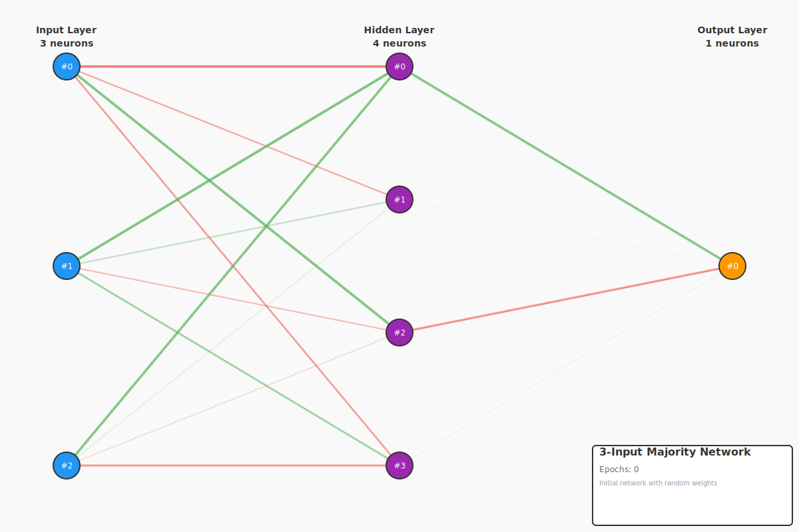
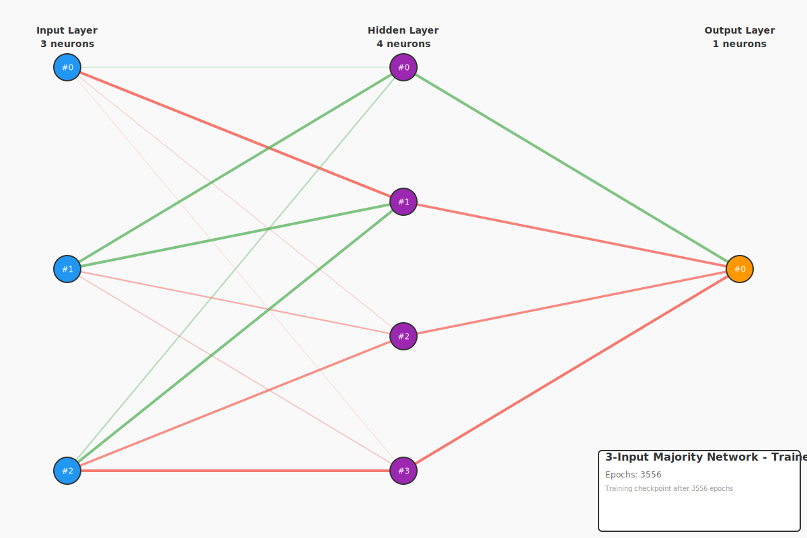

# 3-Input Majority - Voting Logic and Linear Separability

This example demonstrates learning the **majority function**: output 1 if at least 2 of the 3 inputs are 1. This represents voting logic (2-out-of-3) and contrasts with parity by being **linearly separable**.

## The 3-Input Majority Problem

| A | B | C | Majority (≥2 ones) |
|---|---|---|---------------------|
| 0 | 0 | 0 |         0           |
| 0 | 0 | 1 |         0           |
| 0 | 1 | 0 |         0           |
| 0 | 1 | 1 |         1           |
| 1 | 0 | 0 |         0           |
| 1 | 0 | 1 |         1           |
| 1 | 1 | 0 |         1           |
| 1 | 1 | 1 |         1           |

**Boolean Algebra Expression**:
```
Majority(A, B, C) = (A·B) + (A·C) + (B·C)
```

## Network Architecture

- **Input Layer**: 3 neurons (A, B, C)
- **Hidden Layer**: 4 neurons (fewer than parity - simpler function!)
- **Output Layer**: 1 neuron (majority decision)

## Linear Separability

**Key Difference from Parity**: The majority function IS linearly separable!

This means:
- A hyperplane can separate the 0s from 1s in 3D input space
- In theory, could be learned without a hidden layer (though we use one)
- Generally trains faster than non-linearly separable functions

**Why This Matters**: Linear separability is a fundamental concept in machine learning that determines problem difficulty.

## Training Results

- **Iterations**: ~3500-5000 (can vary significantly)
- **Learning Rate**: 0.5
- **Target Error**: <0.1

**Note**: Despite being linearly separable, training can take longer than expected due to:
- Random initialization effects
- Local minima in error surface
- Limited hidden layer capacity (only 4 neurons)

## Visualizations

### Initial Network (Random Weights)



**Key observations:**
- **Random initialization**: Weights show no structure
- **Moderate initial error**: Better than parity's random start (~0.54 vs ~1.25)
- **No decision boundary**: Network hasn't learned the majority rule yet

### Trained Network



**Key observations:**
- **Clearer structure**: Weight patterns show learned logic
- **Voting representation**: Hidden neurons detect pair-wise agreements
- **Threshold behavior**: Network implements "≥2 inputs are 1" logic
- **Good performance**: Mean absolute error ~0.23

## Running the Example

```bash
cargo run -p example-3-complex-boolean-majority-3
```

## What You'll Learn

1. **Linear Separability**: Understanding when problems are "easier" to learn
2. **Voting Logic**: How neural networks implement democratic decisions
3. **Boolean Algebra**: The (A·B) + (A·C) + (B·C) pattern
4. **Network Capacity**: Why some functions need fewer hidden neurons

## Comparison: Majority vs Parity

| Aspect | Majority | Parity |
|--------|----------|--------|
| Linear Separability | YES ✓ | NO ✗ |
| Hidden Neurons | 4 | 6 |
| Typical Iterations | 3500-5000 | 800-1000 |
| Boolean Formula | (A·B)+(A·C)+(B·C) | XOR(XOR(A,B), C) |

**Surprising Result**: Despite being linearly separable, majority sometimes takes longer to train! This can happen due to:
- Random weight initialization
- Optimization landscape differences
- Hyperparameter choices (learning rate, network size)

## Real-World Applications

**Voting Systems:**
- 2-out-of-3 redundancy in critical systems
- Fault-tolerant computing
- Consensus algorithms

**Examples:**
- Spacecraft control (multiple sensors must agree)
- Nuclear power safety (multiple detectors required)
- Democratic decision-making processes

## Understanding the Visualizations

**Weight Colors:**
- **Green lines**: Positive weights (increase activation)
- **Red lines**: Negative weights (decrease activation)
- **Line thickness**: Weight magnitude (thicker = stronger)

**Neuron Colors:**
- **Blue**: Input layer (A, B, C)
- **Purple**: Hidden layer (feature detectors)
- **Orange**: Output layer (majority decision)

## Next Steps

After understanding majority, explore:
- **Multi-output networks**: Half adder (2 outputs)
- **Full adder**: Combining parity (sum) + majority (carry)
- **Larger voting systems**: 3-out-of-5, 4-out-of-7, etc.
