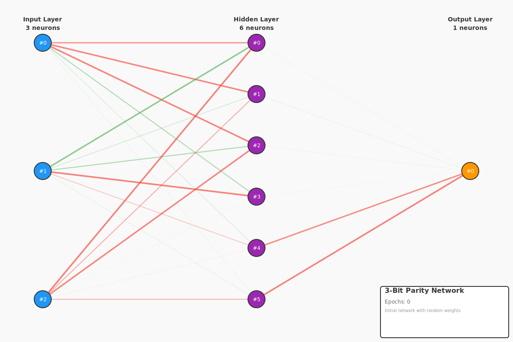
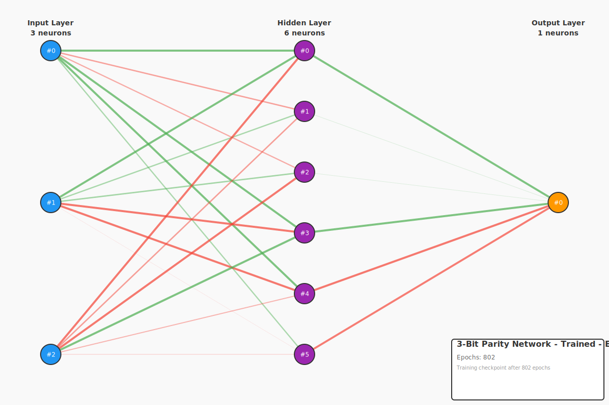

# 3-Bit Parity - Complex Boolean Function Learning

This example demonstrates learning a more complex boolean function: **3-bit parity**. The parity function checks if there's an odd number of 1s in the input, making it significantly more complex than 2-bit parity (XOR).

## The 3-Bit Parity Problem

| A | B | C | Parity (odd?) |
|---|---|---|---------------|
| 0 | 0 | 0 |      0        |
| 0 | 0 | 1 |      1        |
| 0 | 1 | 0 |      1        |
| 0 | 1 | 1 |      0        |
| 1 | 0 | 0 |      1        |
| 1 | 0 | 1 |      0        |
| 1 | 1 | 0 |      0        |
| 1 | 1 | 1 |      1        |

**Key Insight**: The parity function can be expressed as a chain of XOR operations:
```
parity(A, B, C) = XOR(XOR(A, B), C)
```

## Network Architecture

- **Input Layer**: 3 neurons (A, B, C)
- **Hidden Layer**: 6 neurons (more capacity needed vs XOR's 4)
- **Output Layer**: 1 neuron (parity bit)

The increased number of hidden neurons (6 vs 4 for XOR) is necessary because:
- More input combinations (8 vs 4)
- More complex feature interactions
- Larger search space for weight optimization

## Training Results

- **Iterations**: ~800-1000 (faster than expected!)
- **Learning Rate**: 0.5
- **Target Error**: <0.1

## Visualizations

### Initial Network (Random Weights)

The network starts with randomly initialized weights, producing essentially random outputs:



**Key observations:**
- **Random weight distribution**: Both positive (green) and negative (red) weights scattered randomly
- **No learned pattern**: Weight magnitudes show no meaningful structure
- **Poor performance**: Mean absolute error >1.0, essentially random guessing

### Trained Network

After training with backpropagation, the network successfully learns the parity pattern:



**Key observations:**
- **Structured weights**: Clear patterns emerge in the weight connections
- **Feature detection**: Hidden layer learns to detect specific bit patterns
- **XOR composition**: Network internally computes XOR chains
- **Good performance**: Mean absolute error ~0.20, correctly classifies most patterns

## Running the Example

```bash
cargo run -p example-3-complex-boolean-parity-3bit
```

## What You'll Learn

1. **Complexity Scaling**: More inputs require more hidden neurons and longer training
2. **XOR Chains**: Parity is essentially a chain of XOR operations
3. **Feature Learning**: Hidden layer learns intermediate representations
4. **Training Challenges**: Complex functions need careful architecture sizing

## Comparison to 2-Bit Parity (XOR)

| Aspect | XOR (2-bit) | Parity (3-bit) |
|--------|-------------|----------------|
| Inputs | 2 | 3 |
| Hidden Neurons | 4 | 6 |
| Training Iterations | ~1500-2000 | ~800-1000 |
| Complexity | Moderate | High |

Interestingly, 3-bit parity trained faster in this run, possibly due to:
- Random initialization luck
- Better feature space separation
- Learning rate effectiveness

## Understanding the Visualizations

**Weight Colors:**
- **Green lines**: Positive weights (increase activation)
- **Red lines**: Negative weights (decrease activation)
- **Line thickness**: Weight magnitude (thicker = stronger influence)

**Neuron Colors:**
- **Blue**: Input layer
- **Purple**: Hidden layer
- **Orange**: Output layer

## Next Steps

After understanding 3-bit parity, you can explore:
- **4-bit or 5-bit parity**: Even more complex patterns
- **Majority function**: A linearly separable 3-input function
- **Multi-output networks**: Half adder and full adder examples
