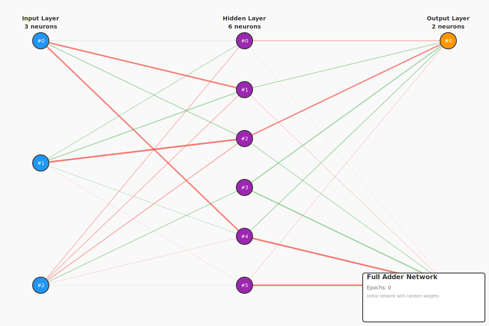
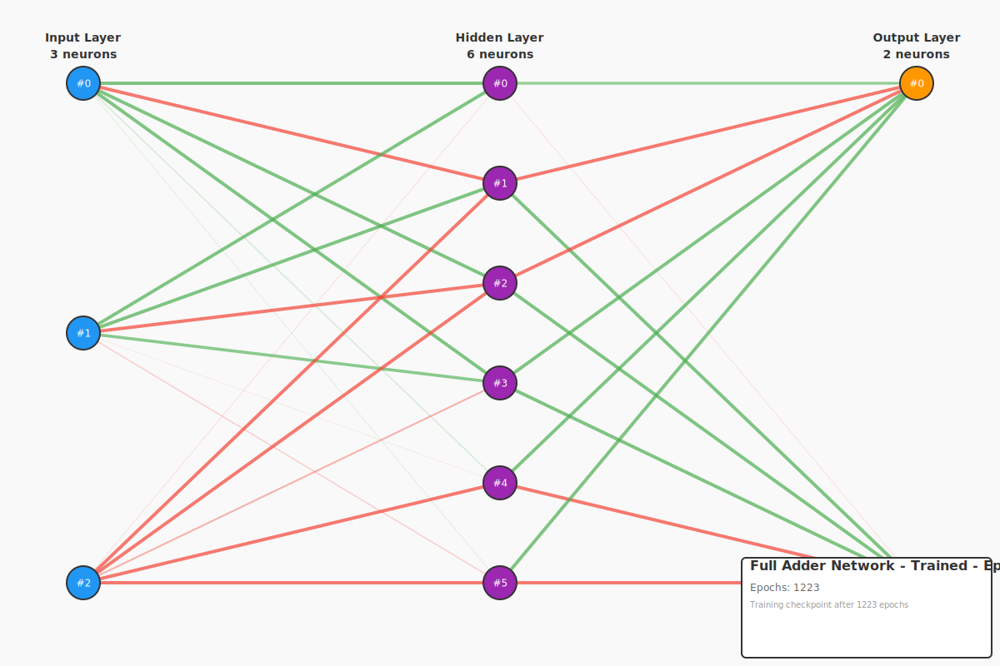

# Full Adder - Building Blocks for Multi-Bit Arithmetic

This example demonstrates a **full adder** - the fundamental building block of CPU arithmetic units. A full adder adds two binary digits PLUS a carry-in, producing a sum and carry-out. This allows chaining to create multi-bit adders.

## The Full Adder Problem

| A | B | Cin | Sum | Cout |
|---|---|-----|-----|------|
| 0 | 0 |  0  |  0  |  0   |
| 0 | 0 |  1  |  1  |  0   |
| 0 | 1 |  0  |  1  |  0   |
| 0 | 1 |  1  |  0  |  1   |
| 1 | 0 |  0  |  1  |  0   |
| 1 | 0 |  1  |  0  |  1   |
| 1 | 1 |  0  |  0  |  1   |
| 1 | 1 |  1  |  1  |  1   |

**Key Insight**: Full adder outputs combine two functions we've already seen!
```
Sum        = 3-bit parity(A, B, Cin)   # XOR of all three inputs
Carry-out  = majority(A, B, Cin)        # ≥2 of 3 inputs are 1
```

## Network Architecture

- **Input Layer**: 3 neurons (A, B, Carry-in)
- **Hidden Layer**: 6 neurons (complex function needs more capacity)
- **Output Layer**: 2 neurons (sum, carry-out)

## Why Full Adder Matters

**Chainability**: Full adders can be connected in series:
```
      A₀ B₀              A₁ B₁              A₂ B₂
       ↓ ↓                ↓ ↓                ↓ ↓
    ┌────────┐         ┌────────┐         ┌────────┐
Cin→│   FA   │→Cout→Cin│   FA   │→Cout→Cin│   FA   │→Cout
    └────────┘         └────────┘         └────────┘
         ↓                  ↓                  ↓
        S₀                 S₁                 S₂
```

**Real-World Application**:
- 8-bit adder: Chain 8 full adders
- 32-bit adder: Chain 32 full adders
- 64-bit adder: Chain 64 full adders (modern CPUs)

## Training Results

- **Iterations**: ~1200-2600
- **Learning Rate**: 0.5
- **Target Error**: <0.1

## Visualizations

### Initial Network (Random Weights)



**Key observations:**
- **Three inputs**: A, B, and Carry-in (left side)
- **Two outputs**: Sum and Carry-out (right side)
- **Random initialization**: High error (~1.5 mean absolute error)
- **Complex task**: Network must learn two distinct functions simultaneously

### Trained Network



**Key observations:**
- **Dual function learning**: Top output (sum) implements 3-bit XOR
- **Bottom output (carry-out)**: Implements majority function
- **Feature sharing**: Hidden neurons contribute to both outputs
- **Good performance**: Mean absolute error ~0.26

## Running the Example

```bash
cargo run -p example-3-multi-output-full-adder
```

## What You'll Learn

1. **Carry Chains**: How adders connect to create multi-bit arithmetic
2. **Function Composition**: Sum = parity, Carry = majority
3. **ALU Foundations**: Building blocks of CPU arithmetic units
4. **Complex Multi-Output**: Learning two moderately complex functions

## Building a 4-Bit Adder

To add two 4-bit numbers (A₃A₂A₁A₀ + B₃B₂B₁B₀):

1. **Bit 0**: Half adder (no carry-in)
2. **Bits 1-3**: Full adders (carry chains through)

```
A₃ B₃  A₂ B₂  A₁ B₁  A₀ B₀
 ↓  ↓   ↓  ↓   ↓  ↓   ↓  ↓
┌──┐  ┌──┐  ┌──┐  ┌──┐
│FA│←─│FA│←─│FA│←─│HA│
└──┘  └──┘  └──┘  └──┘
  ↓     ↓     ↓     ↓
  S₃    S₂    S₁    S₀
```

Result: S₃S₂S₁S₀ (with possible overflow from final carry-out)

## Comparison: Half Adder vs Full Adder

| Aspect | Half Adder | Full Adder |
|--------|------------|------------|
| Inputs | 2 (A, B) | 3 (A, B, Cin) |
| Outputs | 2 (S, C) | 2 (S, Cout) |
| Chainable | NO ✗ | YES ✓ |
| Hidden Neurons | 4 | 6 |
| Iterations | ~1200-1700 | ~1200-2600 |
| Use Case | LSB only | Any bit position |

## Digital Logic Implementation

**Half Adder (2 gates):**
- Sum = XOR gate
- Carry = AND gate

**Full Adder (5 gates):**
- Sum = 3-input XOR (2 XOR gates)
- Cout = (A·B) + (Cin·(A⊕B)) (2 AND + 1 OR)

Our neural network learns this with 6 hidden neurons + connections!

## Real CPU Arithmetic Units

Modern CPUs use optimized adder circuits:

**Ripple Carry Adder** (Simple, slow):
- Chain full adders sequentially
- Carry ripples through all bits
- Delay: O(n) where n = bit width

**Carry Look-Ahead Adder** (Fast, complex):
- Parallel carry computation
- Uses additional logic to predict carries
- Delay: O(log n)

**Carry Select Adder** (Balanced):
- Computes both carry scenarios in parallel
- Selects result based on actual carry
- Delay: O(√n)

## Understanding the Visualizations

**Weight Colors:**
- **Green lines**: Positive weights (increase activation)
- **Red lines**: Negative weights (decrease activation)
- **Line thickness**: Weight magnitude (thicker = stronger)

**Neuron Colors:**
- **Blue**: Input layer (A, B, Cin)
- **Purple**: Hidden layer (feature detectors)
- **Orange**: Output layer (sum on top, carry-out on bottom)

## Next Steps

After understanding full adder, explore:
- **Ripple Carry Adder**: Chain multiple full adders
- **Subtraction**: Using 2's complement representation
- **Multiplication**: Shift-and-add algorithm
- **ALU Design**: Complete arithmetic logic unit
