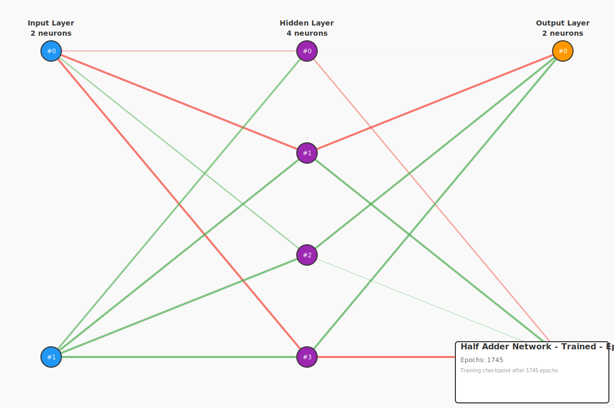

# Half Adder - Multi-Output Neural Networks

This example demonstrates **multi-output neural networks** by learning a half adder circuit. A half adder adds two binary digits and produces both a **sum** and a **carry** output.

## The Half Adder Problem

| A | B | Sum | Carry |
|---|---|-----|-------|
| 0 | 0 |  0  |   0   |
| 0 | 1 |  1  |   0   |
| 1 | 0 |  1  |   0   |
| 1 | 1 |  0  |   1   |

**Digital Logic Equivalents:**
```
Sum   = XOR(A, B)    # Output 1 if inputs are different
Carry = AND(A, B)    # Output 1 if both inputs are 1
```

## Network Architecture

- **Input Layer**: 2 neurons (A, B)
- **Hidden Layer**: 4 neurons (shared features for both outputs)
- **Output Layer**: 2 neurons (sum, carry)

**Key Innovation**: This is our first multi-output network! The single hidden layer learns features that are useful for BOTH output computations simultaneously.

## Why Multi-Output Networks Matter

**Shared Representation Learning:**
- The hidden layer discovers features useful for both sum and carry
- More efficient than training two separate networks
- Mirrors how real digital circuits share transistors

**Building Block for Complexity:**
- Half adders chain together to form full adders
- Full adders chain to create multi-bit arithmetic units
- Foundation of CPU arithmetic logic units (ALUs)

## Training Results

- **Iterations**: ~1200-1700
- **Learning Rate**: 0.5
- **Target Error**: <0.1

## Visualizations

### Initial Network (Random Weights)


**Key observations:**
- **Two output neurons**: Note the orange neurons at right (sum and carry)
- **Random weights**: No structure in initial connections
- **High error**: Both outputs produce incorrect results (~2.1 total error)
- **Independent learning**: Network must learn two related but distinct functions

### Trained Network



**Key observations:**
- **Differentiated outputs**: Top output learns sum (XOR), bottom learns carry (AND)
- **Shared hidden features**: Purple neurons learn representations useful for both
- **Complementary weights**: Some hidden neurons contribute positively to sum, negatively to carry
- **Good performance**: Mean absolute error ~0.35 (sum + carry errors combined)

## Running the Example

```bash
cargo run -p example-3-multi-output-half-adder
```

## What You'll Learn

1. **Multi-Output Networks**: Networks can learn multiple functions simultaneously
2. **Shared Representations**: Hidden layers discover common features
3. **Digital Arithmetic**: Foundation of computer addition circuits
4. **Feature Reuse**: Efficient learning through shared hidden neurons

## Understanding Multi-Output Learning

**How It Works:**
- During forward propagation, all outputs are computed
- During backpropagation, errors from BOTH outputs propagate back
- Hidden layer weights update to satisfy both output requirements
- Network learns to balance competing objectives

**Advantages:**
- More parameter-efficient than separate networks
- Faster training than training two networks independently
- Hidden layer learns richer representations

## Digital Circuit Analogy

In hardware, a half adder uses:
- **1 XOR gate** for sum (2 NAND gates in CMOS)
- **1 AND gate** for carry (1 NAND gate + 1 inverter)
- **Total**: ~3-4 logic gates

Our neural network learns this with:
- **4 hidden neurons** (each like a configurable logic gate)
- **12 weight connections** to outputs (configurable wiring)

## Comparison: Single-Output vs Multi-Output

| Aspect | XOR (single) | Half Adder (multi) |
|--------|--------------|---------------------|
| Outputs | 1 | 2 |
| Hidden Neurons | 4 | 4 |
| Iterations | ~1500-2000 | ~1200-1700 |
| Complexity | Moderate | High |

## Real-World Applications

**Arithmetic Circuits:**
- CPU adders (8-bit, 16-bit, 32-bit, 64-bit)
- Digital signal processors
- Graphics processing units

**Beyond Arithmetic:**
- Multi-task learning (e.g., object detection + segmentation)
- Neural networks with auxiliary outputs
- Encoder-decoder architectures

## Limitations of Half Adder

A half adder **cannot** chain with other adders because:
- It has no carry-in input
- Can only add two bits (least significant position)

For chaining, we need a **full adder** with carry-in → see example-3-multi-output-full-adder!

## Understanding the Visualizations

**Weight Colors:**
- **Green lines**: Positive weights (increase activation)
- **Red lines**: Negative weights (decrease activation)
- **Line thickness**: Weight magnitude (thicker = stronger)

**Neuron Colors:**
- **Blue**: Input layer (A, B)
- **Purple**: Hidden layer (shared features)
- **Orange**: Output layer (sum on top, carry on bottom)

## Next Steps

After understanding half adder, proceed to:
- **Full Adder**: Adds three inputs (A + B + Carry-in)
- **4-bit Ripple Carry Adder**: Chain 4 full adders
- **Multi-task Learning**: Other applications of multi-output networks
