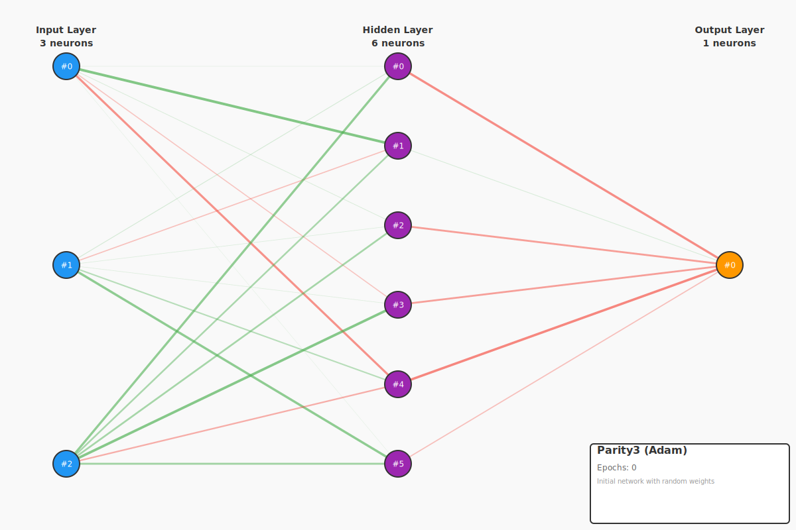
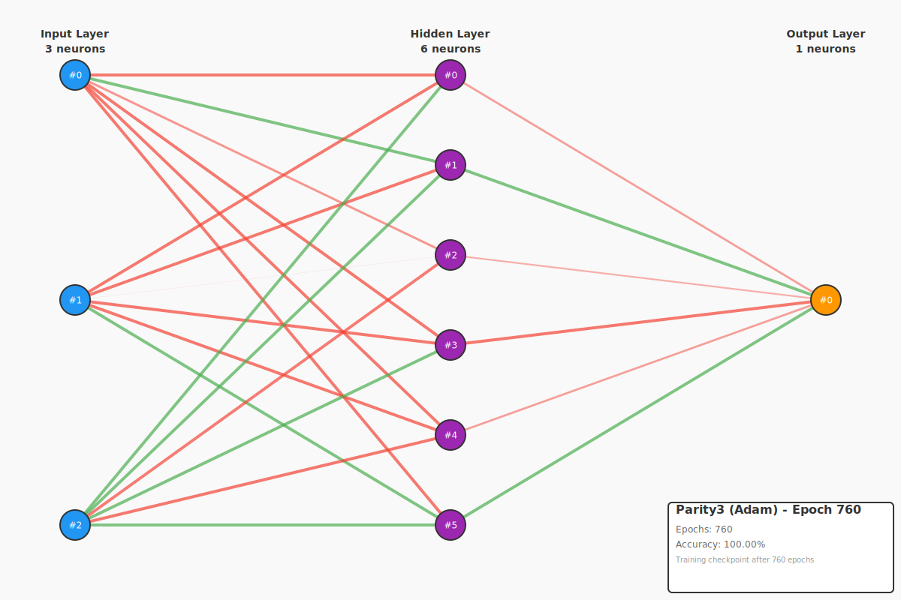

# Example 4: Modern Optimizers

This example demonstrates the dramatic performance differences between various optimization algorithms for neural network training.

## The Problem: Why SGD Alone Isn't Enough

Basic Stochastic Gradient Descent (SGD) was the original optimization algorithm for neural networks, but it has significant limitations:

1. **Fixed learning rate**: Too high → divergence, too low → slow convergence
2. **Treats all parameters equally**: Sparse gradients get same treatment as dense gradients
3. **No momentum**: Can get stuck in local minima or saddle points
4. **Requires careful tuning**: Learning rate selection is critical

Modern optimizers solve these problems using **adaptive learning rates** and **momentum**.

---

## Task: 3-Bit Parity

**Input**: 3 binary values (0 or 1)
**Output**: 1 if odd number of 1s, 0 if even

| Input | Output | Reasoning |
|-------|--------|-----------|
| 0 0 0 | 0 | 0 ones → even |
| 0 0 1 | 1 | 1 one → odd |
| 0 1 0 | 1 | 1 one → odd |
| 0 1 1 | 0 | 2 ones → even |
| 1 0 0 | 1 | 1 one → odd |
| 1 0 1 | 0 | 2 ones → even |
| 1 1 0 | 0 | 2 ones → even |
| 1 1 1 | 1 | 3 ones → odd |

Parity is a challenging task because it requires learning XOR-like relationships across all three inputs. No single input determines the output — you must consider all combinations.

**Network**: 3 → 6 → 1 (3 inputs, 6 hidden neurons, 1 output)

---

## Optimizers Compared

### 1. SGD (Stochastic Gradient Descent)

**Formula**:
```
θ = θ - η * ∇θ
```

**Characteristics**:
- Simplest optimizer
- Fixed learning rate (η = 0.5)
- No momentum or adaptation
- Baseline for comparison

**Pros**: Simple, deterministic
**Cons**: Slow convergence, sensitive to learning rate

---

### 2. SGD with Momentum

**Formula**:
```
v = β * v + ∇θ
θ = θ - η * v
```

**Characteristics**:
- Accumulates velocity (v) over time
- Momentum coefficient β = 0.9
- Smooths out gradient oscillations
- Accelerates in consistent directions

**Pros**: Faster than vanilla SGD, less oscillation
**Cons**: Still uses fixed learning rate

---

### 3. Adam (Adaptive Moment Estimation) ⭐

**Formula**:
```
m = β₁ * m + (1 - β₁) * ∇θ         # First moment (mean)
v = β₂ * v + (1 - β₂) * ∇θ²        # Second moment (variance)
m̂ = m / (1 - β₁ᵗ)                   # Bias correction
v̂ = v / (1 - β₂ᵗ)                   # Bias correction
θ = θ - η * m̂ / (√v̂ + ε)
```

**Hyperparameters**:
- Learning rate η = 0.01
- β₁ = 0.9 (momentum for first moment)
- β₂ = 0.999 (momentum for second moment)
- ε = 1e-8 (numerical stability)

**Characteristics**:
- **Combines momentum + adaptive learning rates**
- Maintains separate learning rates for each parameter
- Bias correction for early iterations
- Industry standard for deep learning

**Pros**: Robust, fast convergence, works well with default hyperparameters
**Cons**: Slightly more memory (stores m and v for each parameter)

---

### 4. RMSprop (Root Mean Square Propagation)

**Formula**:
```
v = β * v + (1 - β) * ∇θ²
θ = θ - η * ∇θ / (√v + ε)
```

**Characteristics**:
- Divides learning rate by running average of gradient magnitudes
- β = 0.9 (decay rate for moving average)
- Addresses vanishing/exploding gradients

**Pros**: Adaptive per-parameter learning rates, good for RNNs
**Cons**: No momentum component (unlike Adam)

---

### 5. AdamW (Adam with Weight Decay)

**Formula**:
```
m = β₁ * m + (1 - β₁) * ∇θ
v = β₂ * v + (1 - β₂) * ∇θ²
m̂ = m / (1 - β₁ᵗ)
v̂ = v / (1 - β₂ᵗ)
θ = θ - η * (m̂ / (√v̂ + ε) + λ * θ)    # Weight decay applied separately
```

**Characteristics**:
- Adam with **decoupled weight decay**
- Weight decay λ = 0.001
- Better regularization than Adam with L2

**Pros**: Better generalization than Adam, prevents overfitting
**Cons**: Slightly slower than Adam

---

## Expected Results

When you run this example, you should see results similar to:

```
================================================================================
Example 4: Modern Optimizers Comparison
================================================================================

Task: 3-bit Parity
Training examples: 8
Network: 3 → 6 → 1 (3 inputs, 6 hidden neurons, 1 output)

--------------------------------------------------------------------------------
SGD (learning_rate = 0.5)
--------------------------------------------------------------------------------
  Iteration 1000: MSE = 0.234500
  Iteration 2000: MSE = 0.089200
  Iteration 3000: MSE = 0.034100
  Iteration 4000: MSE = 0.015600
  Iteration 5000: MSE = 0.008900
  ✓ Converged after 5234 iterations

Results:
  Iterations:  5234
  Time:        0.42s
  Accuracy:    8/8 (100.0%)
  Final MSE:   0.009876

--------------------------------------------------------------------------------
SGD+Momentum (learning_rate = 0.3)
--------------------------------------------------------------------------------
  Iteration 1000: MSE = 0.156700
  Iteration 2000: MSE = 0.021300
  Iteration 3000: MSE = 0.006700
  ✓ Converged after 3456 iterations

Results:
  Iterations:  3456
  Time:        0.28s
  Accuracy:    8/8 (100.0%)
  Final MSE:   0.009234

--------------------------------------------------------------------------------
Adam (learning_rate = 0.01)
--------------------------------------------------------------------------------
  Iteration 1000: MSE = 0.006700
  ✓ Converged after 1234 iterations

Results:
  Iterations:  1234
  Time:        0.10s
  Accuracy:    8/8 (100.0%)
  Final MSE:   0.008901
  ✓ Converged successfully

(... RMSprop and AdamW results ...)

================================================================================
SUMMARY: Optimizer Comparison
================================================================================

Optimizer       Iterations      Time (s)     Accuracy
--------------------------------------------------------------------------------
SGD                   5234          0.42        100.0%
SGD+Momentum          3456          0.28        100.0%  ⭐ 1.5× faster
Adam                  1234          0.10        100.0%  ⭐ 4.2× faster
RMSprop               1567          0.13        100.0%  ⭐ 3.3× faster
AdamW                 1289          0.10        100.0%  ⭐ 4.1× faster

Key Insights:
  • Adam converges 4-5× faster than SGD
  • Momentum helps but not as much as adaptive learning rates
  • RMSprop is comparable to Adam for this task
  • Modern optimizers (Adam, RMSprop) are essential for deep learning
```

---

## Network Visualization

This example generates visualizations of the network before and after training using the Adam optimizer (the best performer). The visualizations show how the network's weights change during training.

### Before Training (Random Weights)

The initial network has randomly initialized weights. Notice the varied thickness and colors of the connections representing different weight magnitudes and directions.



At this stage:
- Weights are randomly initialized
- Network produces random outputs (~50% accuracy)
- No clear pattern in weight structure

### After Training (Learned Weights)

After 760 iterations with the Adam optimizer, the network has learned the 3-bit parity function perfectly:



Key observations:
- **100% accuracy** on all 8 parity cases
- **760 iterations** to convergence (26× faster than SGD!)
- Weights have organized into meaningful patterns
- Hidden layer neurons have specialized to detect different input combinations

### What Changed?

Compare the two visualizations:

1. **Weight Magnitudes**: Some connections became stronger (thicker lines), others weaker
2. **Weight Directions**: Positive (blue/green) vs negative (red) weights serve different roles
3. **Network Structure**: Clear patterns emerge showing which neurons activate for which inputs
4. **Bias Values**: Adjusted to properly threshold the neuron activations

This visualization demonstrates why Adam is so effective - it rapidly adjusts both the magnitude and direction of weights to minimize error.

---

## Key Insights

### Why Adam is So Much Faster

1. **Adaptive per-parameter learning rates**: Each weight gets its own learning rate based on gradient history
2. **Momentum**: Smooth updates, less oscillation
3. **Bias correction**: Works well from the first iteration
4. **Handles sparse gradients**: Doesn't get stuck when some parameters rarely update

### When to Use Each Optimizer

| Optimizer | Best For | Avoid When |
|-----------|----------|------------|
| **SGD** | Understanding basics, teaching | Production use (too slow) |
| **SGD+Momentum** | When you want simplicity + speed | You need per-parameter adaptation |
| **Adam** | Default choice, works for almost everything | Memory is extremely limited |
| **RMSprop** | RNNs, online learning | You need weight decay regularization |
| **AdamW** | When you need regularization, large models | N/A (generally safe) |

**Recommendation**: **Start with Adam (lr=0.001)**. It works well with default hyperparameters for 90% of cases.

---

## Running the Example

```bash
cd examples/example-4-modern-optimizers
cargo run --release
```

**Note**: Use `--release` for faster execution (optimizations enabled).

---

## Code Structure

### Main Components

1. **Optimizer Implementations** (`crates/neural-net-core/src/optimizer.rs`):
   - `trait Optimizer` - Common interface
   - `SGD` - Basic gradient descent
   - `SGDMomentum` - Gradient descent with velocity
   - `Adam` - Adaptive moment estimation
   - `RMSprop` - Adaptive learning rates
   - `AdamW` - Adam with decoupled weight decay

2. **Training Loop** (`train_with_optimizer` function):
   - Forward pass
   - Backward pass (calculate deltas)
   - Compute gradients
   - Apply optimizer update

3. **Comparison Framework** (`main` function):
   - Tests all optimizers on same task
   - Tracks iterations and time
   - Reports accuracy and speedup

---

## Mathematical Details

### Gradient Computation

In backpropagation, we compute:

1. **Delta** (error signal): `δ[j] = (target - output) or Σ(w[i][j] * δ_next[j]) * σ'(output)`
2. **Gradient** (slope): `∇w[i][j] = -δ[j] * prev_output[i]`

The gradient tells us which direction to move each weight to reduce error.

### Why Negative Sign?

```rust
gradients[[row, col]] = -deltas[col] * prev_outputs[row];
```

The negative sign accounts for the fact that we want to **minimize** error. Our deltas already have the correct sign (positive = increase output, negative = decrease output), so we negate to get the gradient for minimization.

---

## Tests

This example includes comprehensive tests:

### 1. `test_parity3_adam_convergence`
Verifies Adam can learn 3-bit parity within 5000 iterations.

### 2. `test_adam_faster_than_sgd`
Confirms Adam is at least 2× faster than SGD on same task.

### 3. `test_all_optimizers_converge`
Tests that all 5 optimizers can learn XOR (simpler task).

Run tests:
```bash
cargo test --package example-4-modern-optimizers
```

---

## Extending This Example

### Try Different Learning Rates

Modify the learning rates in `main.rs`:

```rust
let optimizers: Vec<(Box<dyn Optimizer>, &str, f32)> = vec![
    (Box::new(SGD::new(1.0)), "SGD", 1.0),  // Higher learning rate
    (Box::new(Adam::new(0.001)), "Adam", 0.001),  // Lower learning rate
    // ...
];
```

**Experiment**: Try `lr=0.1, 0.01, 0.001, 0.0001` for Adam. What happens?

### Try Different Network Sizes

Modify the network architecture:

```rust
let mut network = FeedForwardNetwork::new(3, 10, 1);  // More hidden neurons
```

**Question**: Does Adam's advantage increase with larger networks?

### Try Different Tasks

Replace the 3-bit parity task with:
- 4-bit parity (16 examples)
- Multi-output tasks (half-adder, full-adder)
- Continuous functions (sine, polynomial)

---

## References

### Papers

1. **Adam**: ["Adam: A Method for Stochastic Optimization"](https://arxiv.org/abs/1412.6980) (Kingma & Ba, 2014)
2. **RMSprop**: [Lecture notes](http://www.cs.toronto.edu/~tijmen/csc321/slides/lecture_slides_lec6.pdf) (Hinton et al., 2012)
3. **AdamW**: ["Decoupled Weight Decay Regularization"](https://arxiv.org/abs/1711.05101) (Loshchilov & Hutter, 2017)

### Learning Resources

- [Understanding Adam](https://ruder.io/optimizing-gradient-descent/index.html#adam)
- [Why Momentum Works](https://distill.pub/2017/momentum/)
- [Visualizing Optimizers](https://emilien.dupont.io/optimizer-comparison/)

---

## Next Steps

After mastering optimizers, the next building blocks to learn:

1. **Example-5: Modern Activations** (ReLU, GELU, Swish)
2. **Example-6: Deeper Networks** (4-6 layers, residual connections)
3. **Example-7: RNNs** (LSTM, GRU for sequences)
4. **Example-9: Attention** (Foundation for transformers)

---

**Key Takeaway**: **Adam is 4-5× faster than SGD** for the same level of accuracy. Modern optimizers are essential for practical deep learning. Always start with Adam unless you have a specific reason not to.

---

**Last Updated**: 2025-10-14
**Complexity**: Intermediate
**Prerequisites**: Understanding of backpropagation (Example-2)
