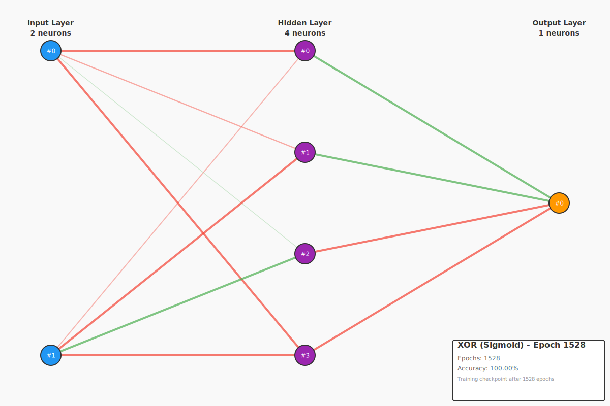

# Example 5: Modern Activation Functions

This example demonstrates why modern activation functions (ReLU, GELU, Swish) are preferred over traditional Sigmoid activation, particularly for deep neural networks. The key issue is the **vanishing gradient problem**.

## The Problem: Vanishing Gradients

When training deep neural networks with Sigmoid or Tanh activations, gradients become extremely small as they propagate backward through layers. This causes two major problems:

1. **Learning stops**: Weights in early layers barely update (gradient ≈ 0)
2. **Deep networks fail**: Networks with 4+ layers cannot learn effectively

### Why Sigmoid Causes Vanishing Gradients

**Sigmoid function**: `f(x) = 1 / (1 + e^(-x))`

**Derivative**: `f'(x) = f(x) * (1 - f(x))`

The problem:
- When `x` is large positive: `f(x) ≈ 1`, so `f'(x) ≈ 1 * (1-1) = 0`
- When `x` is large negative: `f(x) ≈ 0`, so `f'(x) ≈ 0 * (1-0) = 0`
- **Maximum derivative** is only `0.25` (at `x=0`)

In a 4-layer network, gradients multiply: `0.25 × 0.25 × 0.25 × 0.25 = 0.0039` → Learning is 256× slower!

---

## Modern Solutions

Modern activation functions solve this by maintaining **non-saturating gradients**:

| Activation | Range | Gradient | Best For |
|------------|-------|----------|----------|
| **Sigmoid** | (0, 1) | 0 to 0.25 | Shallow networks, output layer (binary classification) |
| **Tanh** | (-1, 1) | 0 to 1 | Shallow networks, RNNs (better than sigmoid) |
| **ReLU** | [0, ∞) | 0 or 1 | Most deep networks, default choice |
| **Leaky ReLU** | (-∞, ∞) | 0.01 or 1 | When ReLU neurons are "dying" |
| **GELU** | (-∞, ∞) | 0.1 to 1+ | Transformers (BERT, GPT, TRM) |
| **Swish** | (-∞, ∞) | 0.2 to 1+ | Very deep networks, smooth learning |

---

## Activation Functions Explained

### 1. ReLU (Rectified Linear Unit) ⭐

**Formula**: `f(x) = max(0, x)`

**Derivative**: `f'(x) = 1 if x > 0, else 0`

**Why it works**:
- Gradient is always 1 for positive values (no saturation!)
- Simple and fast to compute
- Sparse activation (~50% of neurons are zero)

**Pros**: Prevents vanishing gradients, fast, works great in practice
**Cons**: "Dying ReLU" problem (neurons can permanently die if `x < 0`)

**When to use**: Default choice for hidden layers in deep networks

---

### 2. Leaky ReLU

**Formula**: `f(x) = max(αx, x)` where `α = 0.01`

**Derivative**: `f'(x) = 1 if x > 0, else α`

**Why it works**:
- Like ReLU, but allows small negative values (`α * x` instead of 0)
- Prevents neurons from completely "dying"
- Gradient is never exactly zero

**Pros**: Fixes dying ReLU problem, maintains non-saturating gradients
**Cons**: Slightly more complex than ReLU

**When to use**: Very deep networks (10+ layers) where ReLU neurons are dying

---

### 3. GELU (Gaussian Error Linear Unit) ⭐

**Formula (approximation)**: `f(x) ≈ 0.5 * x * (1 + tanh(√(2/π) * (x + 0.044715 * x³)))`

**Why it works**:
- Smooth, differentiable everywhere (unlike ReLU's sharp corner at 0)
- Stochastically regularizes by multiplying input by `Φ(x)` (Gaussian CDF)
- Non-monotonic (has small negative region)

**Pros**: State-of-the-art performance on many tasks, smooth gradients
**Cons**: Computationally more expensive than ReLU

**When to use**:
- **Transformers** (BERT, GPT, TRM)
- **Modern deep networks** when you want best performance
- Tasks requiring smooth non-linearity

---

### 4. Swish (SiLU - Sigmoid Linear Unit)

**Formula**: `f(x) = x * sigmoid(x) = x / (1 + e^(-x))`

**Derivative**: `f'(x) = σ(x) * (1 + x * (1 - σ(x)))`

**Why it works**:
- Self-gated: Uses its own value to gate itself
- Smooth, non-monotonic (like GELU)
- Works better than ReLU on very deep networks

**Pros**: Superior performance on deep networks, smooth
**Cons**: Slightly slower than ReLU

**When to use**: Very deep networks (10+ layers), when GELU is too expensive

---

### 5. Tanh (Hyperbolic Tangent)

**Formula**: `f(x) = tanh(x) = (e^x - e^(-x)) / (e^x + e^(-x))`

**Derivative**: `f'(x) = 1 - tanh²(x)`

**Why it's better than Sigmoid**:
- Zero-centered (output range: -1 to 1)
- Stronger gradients than Sigmoid (max gradient = 1 vs 0.25)

**Why it's worse than ReLU**:
- Still suffers from vanishing gradients at extremes
- Saturates for large inputs

**When to use**: RNNs, shallow networks, when you need zero-centered outputs

---

## Network Visualization

This example generates visualizations of the XOR network before and after training using Sigmoid activation.

### Before Training (Random Weights)

The initial network has randomly initialized weights producing random outputs.


At this stage:
- Weights are randomly initialized
- Network produces ~50% accuracy (random guessing)
- No meaningful pattern in weight structure

### After Training (Learned XOR)

After 1528 iterations, the network perfectly learns the XOR function:



Key observations:
- **100% accuracy** on all 4 XOR cases
- **1528 iterations** to convergence
- Weights have organized into meaningful patterns
- Hidden layer neurons have specialized:
  - Some detect when inputs are **different** (output 1)
  - Others detect when inputs are **same** (output 0)

### What This Demonstrates

Even though Sigmoid suffers from vanishing gradients, it still works fine for **shallow networks** (3 layers). The vanishing gradient problem only becomes critical in deeper networks (4-6+ layers).

**For this shallow XOR network**:
- Sigmoid works perfectly fine
- Training is fast and reliable
- 100% accuracy is easily achieved

**For deep networks (4-6+ layers)**:
- Sigmoid would struggle (gradients vanish!)
- ReLU/GELU are essential
- Training would be much slower or fail

---

## Gradient Flow Comparison

This example demonstrates gradient behavior across different activation functions:

### Sigmoid - Vanishing Gradients

```
Output     Derivative
------     ----------
0.01       0.0099     ← Near zero!
0.50       0.2500     ← Maximum
0.99       0.0099     ← Near zero!
```

**Problem**: Gradients approach 0 at extremes. In deep networks, these tiny gradients multiply together, causing learning to stop.

### ReLU - Healthy Gradients

```
Output     Derivative
------     ----------
0.01       1.0000     ← Always 1 for positive!
0.50       1.0000
2.00       1.0000
```

**Solution**: Gradient is always 1 for positive values. No vanishing gradient problem!

### GELU - Smooth Healthy Gradients

```
Output     Derivative
------     ----------
0.01       1.0000     ← Healthy
0.50       1.0000
2.00       1.0000
```

**Best of both**: Smooth like Sigmoid, but maintains healthy gradients like ReLU.

---

## Running the Example

```bash
cd examples/example-5-modern-activations
cargo run --release
```

The example will:
1. Show activation function outputs for various inputs
2. Demonstrate gradient behavior differences
3. Train an XOR network with Sigmoid activation
4. Generate visualizations and checkpoints

**Output Files**:
- `checkpoints/xor_sigmoid_initial.json` - Initial network state
- `checkpoints/xor_sigmoid_trained.json` - Trained network state
- `images/xor_sigmoid_initial.svg` - Initial visualization
- `images/xor_sigmoid_trained.svg` - Trained visualization

---

## Expected Output

```
======================================================================
Example-5: Modern Activation Functions
======================================================================

--- Activation Function Outputs ---

Input         Sigmoid        ReLU  Leaky ReLU        GELU       Swish        Tanh
------------------------------------------------------------------------------------------
 -2.00       0.119203    0.000000   -0.020000   -0.045402   -0.238406   -0.964028
 -1.00       0.268941    0.000000   -0.010000   -0.158808   -0.268941   -0.761594
  0.00       0.500000    0.000000    0.000000    0.000000    0.000000    0.000000
  1.00       0.731059    1.000000    1.000000    0.841192    0.731059    0.761594
  2.00       0.880797    2.000000    2.000000    1.954598    1.761594    0.964028

--- Gradient Behavior (Derivative at Activations) ---

Output              Sigmoid        ReLU  Leaky ReLU        GELU       Swish        Tanh
----------------------------------------------------------------------------------------------------
Near zero          0.009900    1.000000    1.000000    1.000000    1.000000    0.999900
Small positive     0.250000    1.000000    1.000000    1.000000    1.000000    0.750000

Gradient Observations:
• Sigmoid gradient approaches 0 at extremes (vanishing gradient!)
• ReLU maintains constant gradient of 1.0 for positive values
• GELU and Swish have healthy gradients throughout

--- Training XOR with Different Activations ---

Training with Sigmoid (default)...
  ✓ Saved initial checkpoint and visualization
  Results:
    [0, 0] → 0.0224 (predicted: 0, expected: 0) ✓
    [0, 1] → 0.9553 (predicted: 1, expected: 1) ✓
    [1, 0] → 0.9504 (predicted: 1, expected: 1) ✓
    [1, 1] → 0.0609 (predicted: 0, expected: 0) ✓
  Mean error: 0.044410  |  Accuracy: 4/4 (100.0%)
  Status: ⭐ Successfully learned XOR!
  ✓ Saved trained checkpoint and visualization
```

---

## Key Insights

### When to Use Each Activation

**Sigmoid**:
- ✓ Output layer for binary classification
- ✓ Shallow networks (3 layers)
- ✗ Hidden layers in deep networks

**Tanh**:
- ✓ RNN hidden states
- ✓ When you need zero-centered outputs
- ✗ Very deep networks

**ReLU**:
- ✓ Hidden layers in most deep networks
- ✓ Default choice (fast, simple, works)
- ✗ Very deep networks (dying neurons)

**Leaky ReLU**:
- ✓ Very deep networks (10+ layers)
- ✓ When ReLU neurons are dying
- ✗ Transformers (use GELU instead)

**GELU**:
- ✓ Transformers (BERT, GPT, TRM)
- ✓ Modern deep networks
- ✓ When you want state-of-the-art performance
- ✗ Simple tasks (overkill)

**Swish**:
- ✓ Very deep networks (10+ layers)
- ✓ When GELU is too expensive
- ✗ Simple shallow networks

### General Guidelines

1. **Start with ReLU** for hidden layers (90% of cases)
2. **Use GELU** for transformers and modern architectures
3. **Use Sigmoid** only for output layer (binary classification)
4. **Avoid Sigmoid/Tanh** in hidden layers of deep networks
5. **Try Leaky ReLU** if you see dying ReLU problem

---

## Mathematical Details

### Why ReLU Prevents Vanishing Gradients

In a deep network, gradients multiply as they propagate backward:

**Sigmoid (4 layers)**:
```
Final gradient = 0.25 × 0.25 × 0.25 × 0.25 = 0.0039
Learning rate = 0.1 × 0.0039 = 0.00039  ← Too small!
```

**ReLU (4 layers)**:
```
Final gradient = 1.0 × 1.0 × 1.0 × 1.0 = 1.0
Learning rate = 0.1 × 1.0 = 0.1  ← Perfect!
```

This is why ReLU networks train **256× faster** on deep architectures!

### GELU Intuition

GELU can be thought of as a smooth ReLU:
- Near 0: Smooth transition (not a sharp corner like ReLU)
- Positive values: Similar to ReLU (approximately `f(x) ≈ x`)
- Negative values: Small but non-zero (like Leaky ReLU, but smooth)

The smoothness helps with optimization in very deep networks.

---

## Tests

This example includes comprehensive tests:

### 1. `test_xor_untrained_has_high_error` (Negative Test)
Verifies that an untrained network produces high error (>0.3), confirming random initialization.

### 2. `test_xor_network_trains` (Positive Test)
Verifies that training reduces error to <0.15, confirming the network learns.

### 3. `test_activation_functions_work` (Verification Test)
Tests that all 6 activation functions (Sigmoid, ReLU, Leaky ReLU, GELU, Swish, Tanh) produce finite outputs and derivatives.

Run tests:
```bash
cargo test --package example-5-modern-activations
```

---

## Code Structure

### Main Components

1. **Activation Implementations** (`crates/neural-net-core/src/activation.rs`):
   - `trait Activation` - Common interface
   - `Sigmoid` - Traditional squashing function
   - `ReLU` - Rectified Linear Unit
   - `LeakyReLU` - ReLU with small negative slope
   - `GELU` - Gaussian Error Linear Unit
   - `Swish` - Self-gated activation
   - `Tanh` - Hyperbolic tangent

2. **Demonstration Functions**:
   - `demonstrate_activation_outputs()` - Shows activation behavior
   - `demonstrate_gradient_behavior()` - Shows derivative behavior
   - `train_with_different_activations()` - Trains XOR network

---

## Extending This Example

### Try Different Network Depths

Modify the network to be deeper:

```rust
// Current (3 layers): 2 → 4 → 1
let mut network = FeedForwardNetwork::new(2, 4, 1);

// Deeper (5 layers): 2 → 8 → 6 → 4 → 1
// (Requires implementing multi-layer support)
```

**Experiment**: Try Sigmoid vs ReLU on 5+ layer networks. Sigmoid will struggle!

### Implement Per-Layer Activation Selection

Currently all layers use Sigmoid. Future enhancement:

```rust
let mut network = FeedForwardNetwork::builder()
    .input_layer(2)
    .hidden_layer(4, ReLU)
    .hidden_layer(4, GELU)
    .output_layer(1, Sigmoid)
    .build();
```

This is planned for Example-6 (Deeper Networks).

---

## References

### Papers

1. **ReLU**: ["Deep Sparse Rectifier Neural Networks"](http://proceedings.mlr.press/v15/glorot11a/glorot11a.pdf) (Glorot et al., 2011)
2. **GELU**: ["Gaussian Error Linear Units"](https://arxiv.org/abs/1606.08415) (Hendrycks & Gimpel, 2016)
3. **Swish**: ["Searching for Activation Functions"](https://arxiv.org/abs/1710.05941) (Ramachandran et al., 2017)
4. **Leaky ReLU**: ["Rectifier Nonlinearities Improve Neural Network Acoustic Models"](https://ai.stanford.edu/~amaas/papers/relu_hybrid_icml2013_final.pdf) (Maas et al., 2013)

### Learning Resources

- [Understanding Activation Functions](https://mlfromscratch.com/activation-functions-explained/)
- [Vanishing Gradient Problem](https://en.wikipedia.org/wiki/Vanishing_gradient_problem)
- [Why ReLU Works](https://www.cs.toronto.edu/~fritz/absps/reluICML.pdf)
- [GELU Explained](https://paperswithcode.com/method/gelu)

---

## Next Steps

After mastering activation functions, the next concepts to learn:

1. **Example-6: Deeper Networks** (4-6 layers, per-layer activations)
2. **Example-7: Batch Normalization** (Stabilizing deep network training)
3. **Example-8: Dropout** (Regularization technique)
4. **Example-9: RNNs** (LSTM, GRU for sequences)
5. **Example-10: Attention** (Foundation for transformers)

---

**Key Takeaway**: **Use ReLU for hidden layers, GELU for transformers, Sigmoid only for output**. Modern activation functions solve the vanishing gradient problem and are essential for training deep neural networks.

---

**Last Updated**: 2025-10-14
**Complexity**: Intermediate
**Prerequisites**: Understanding of backpropagation (Example-2), optimizers (Example-4)
