# Architecture Overview

This page provides a comprehensive overview of the neural network platform architecture, including system design, component relationships, and key architectural decisions.

## System Architecture

The project follows a **layered architecture** with clear separation of concerns:

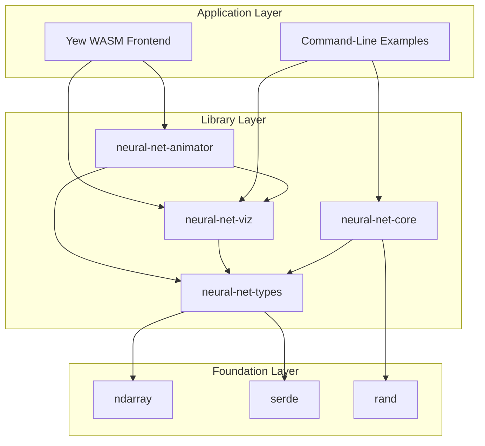

### Layer Descriptions

#### Application Layer
- **Yew WASM Frontend**: Interactive web application for visualizing neural networks
- **Command-Line Examples**: Educational examples demonstrating specific concepts

#### Library Layer
- **neural-net-types**: Foundation data structures (Network, Layer, errors)
- **neural-net-core**: Algorithms (forward/backward propagation, optimization)
- **neural-net-viz**: SVG visualization and rendering
- **neural-net-animator**: Animation framework for training visualization

#### Foundation Layer
- **ndarray**: Multi-dimensional array operations
- **serde**: Serialization/deserialization
- **rand**: Random number generation

## Crate Dependency Graph

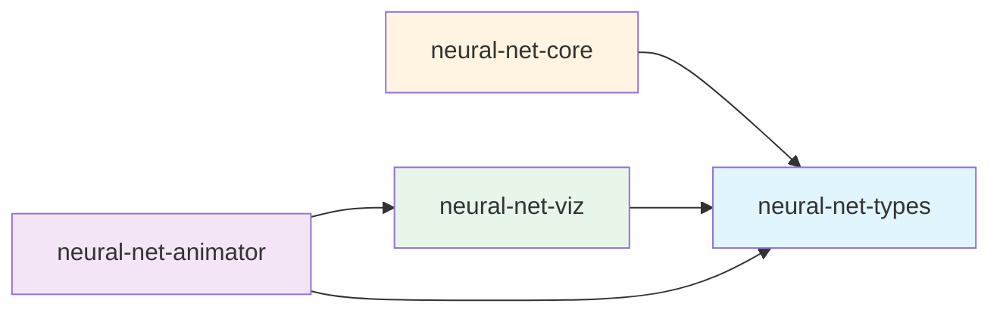

**Key Principle**: No circular dependencies. All crates depend on `neural-net-types` as the foundation.

## Component Architecture

### Network Structure

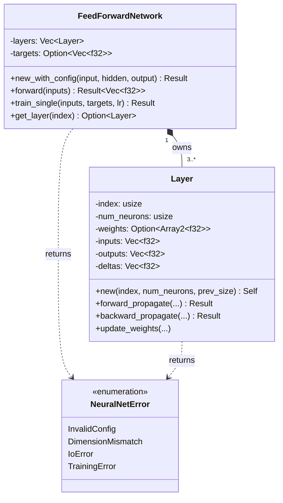

### Key Design Decisions

#### 1. Unidirectional Ownership

**C++ Pattern (Problematic):**
```
Layer* ←→ FFN*  (bidirectional pointers)
```

**Rust Pattern (Clean):**
```
FeedForwardNetwork → Vec<Layer>  (unidirectional ownership)
```

The network owns all layers, eliminating circular references and potential memory leaks.

#### 2. Trait-Based Extensibility

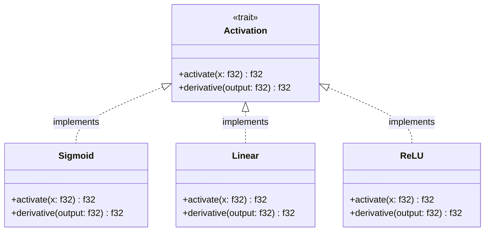

All extensible components (activations, optimizers, layers) use traits for polymorphism.

## Data Structure Design

### Layer Memory Layout

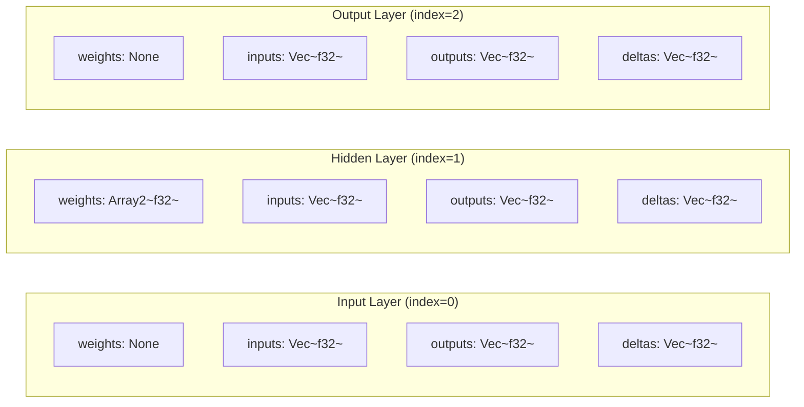

**Key Points:**
- Input layer has no weights (passthrough)
- Hidden layer stores weight matrix (prev_size × num_neurons)
- Output layer has no weights (uses hidden layer outputs directly)
- All layers maintain inputs, outputs, and deltas for backpropagation

### Weight Matrix Layout

For a hidden layer connecting previous layer (size M) to current layer (size N):

```
Weights[M][N] where:
  - M = number of neurons in previous layer
  - N = number of neurons in current layer
  - weights[i][j] = connection strength from neuron i to neuron j
```

## Algorithm Flow Architecture

### Forward Propagation Flow

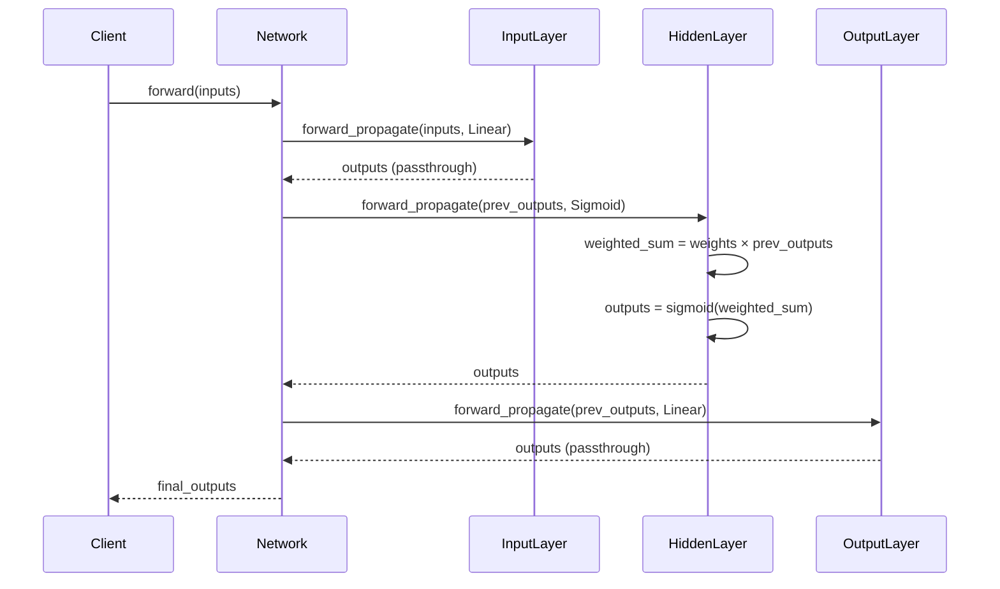

### Backpropagation Flow

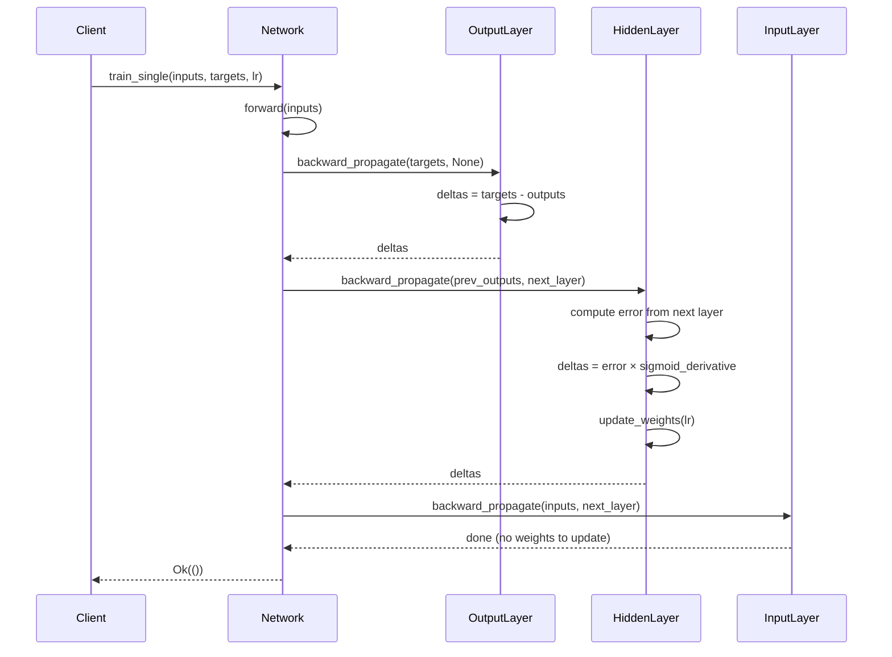

## Error Handling Architecture

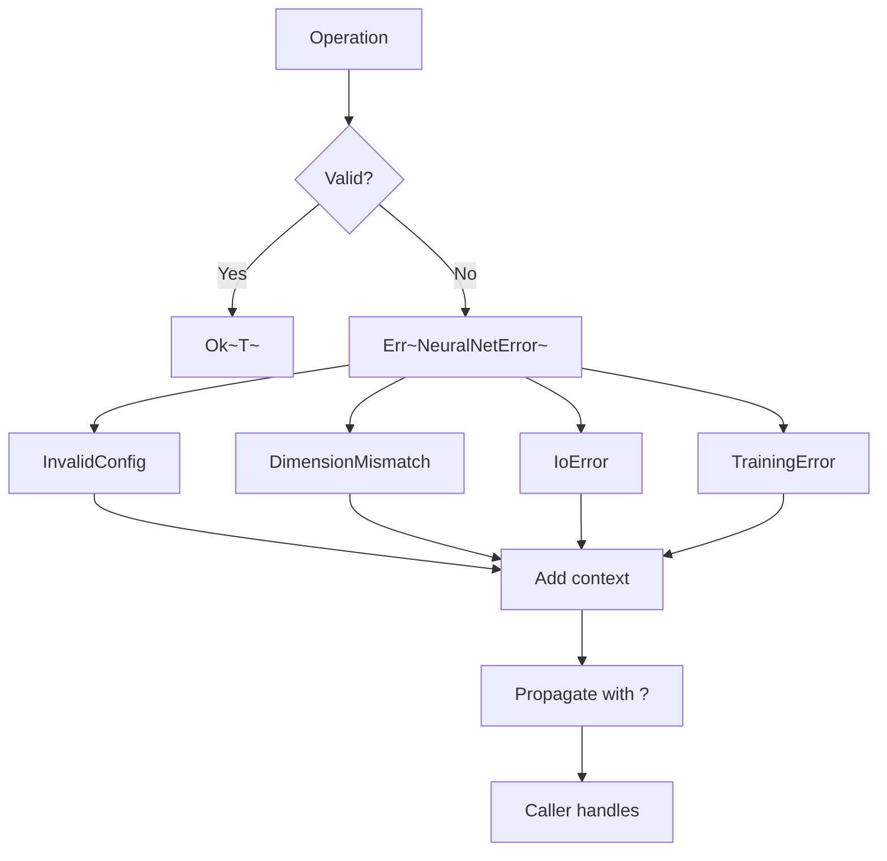

**Strategy:**
- All fallible operations return `Result<T, NeuralNetError>`
- Never panic in library code
- Provide context in error messages
- Use `?` operator for clean propagation

## Visualization Architecture

### SVG Generation Pipeline

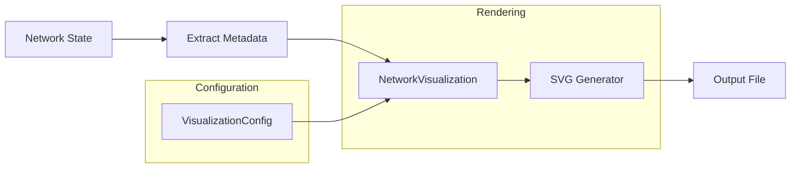

### Animation Framework

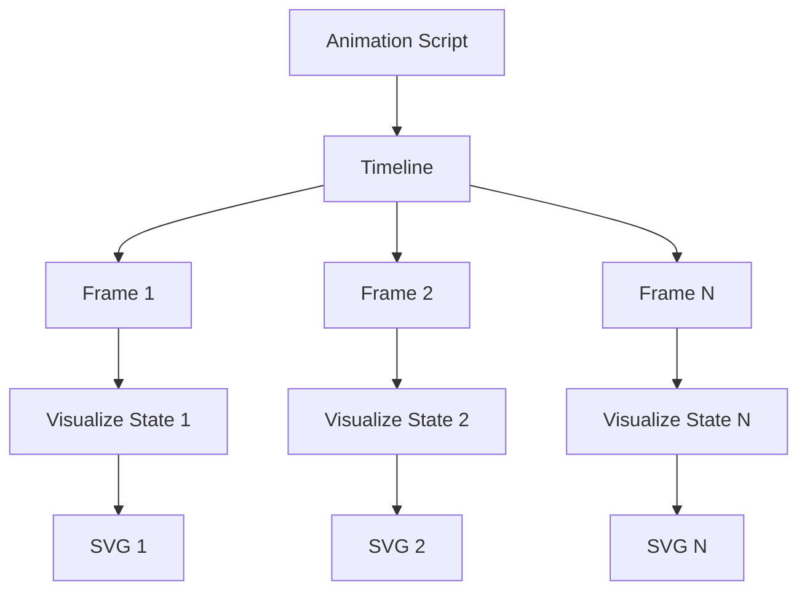

## Security & Safety

### Memory Safety

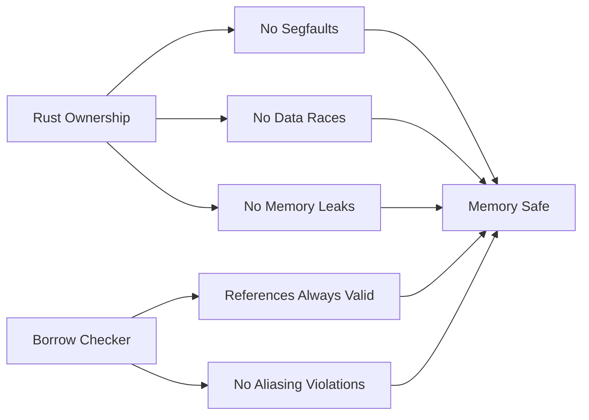

**Guarantees:**
- No unsafe code in library (Phases 1-4)
- All references validated at compile time
- No manual memory management
- Thread-safe by default

## Performance Considerations

### Optimization Strategy

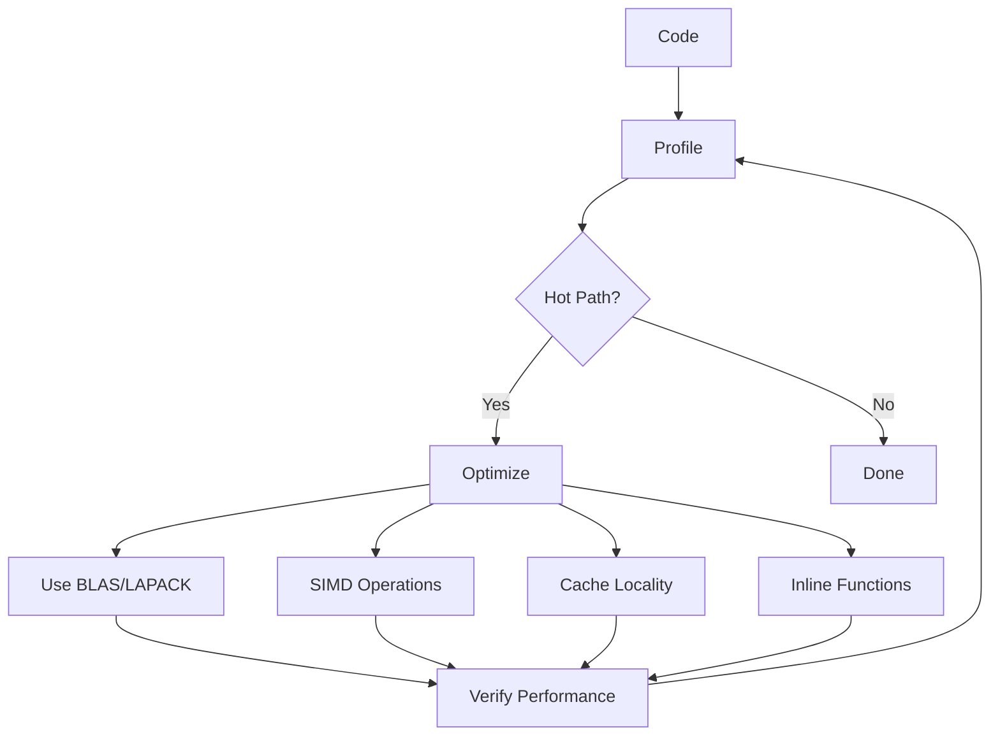

**Optimizations Applied:**
1. **BLAS Integration**: `ndarray` with optimized linear algebra
2. **Memory Layout**: Contiguous memory for cache efficiency
3. **Borrowing**: Use references to avoid copies
4. **Iterator Chains**: Lazy evaluation

## Testing Architecture

### Test Pyramid

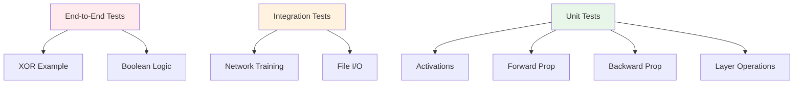

**Coverage:**
- **Unit Tests**: Individual functions and methods
- **Integration Tests**: Multiple components working together
- **End-to-End Tests**: Complete examples (negative + positive)

## Related Pages

- [[Core-Components]] - Detailed crate descriptions
- [[Training-Algorithms]] - Algorithm implementations
- [[Data-Flow]] - Sequence diagrams for data flow
- [[Error-Handling]] - Error handling patterns
- [[Testing-Strategy]] - Comprehensive testing approach

## External Documentation

- [Architecture Document](../../blob/main/documentation/architecture.md) - Full architecture specification
- [PRD](../../blob/main/documentation/PRD.md) - Product requirements
- [Process Guide](../../blob/main/documentation/process.md) - Development workflow
