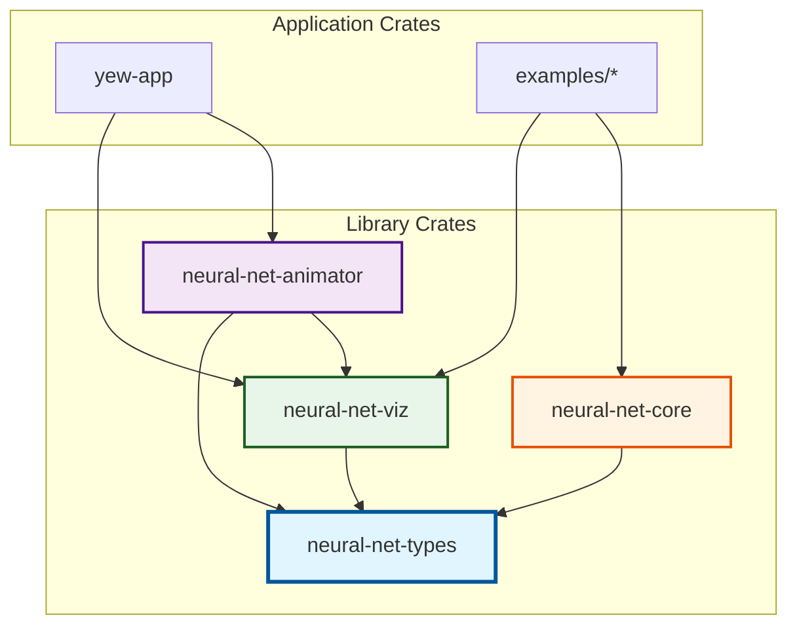
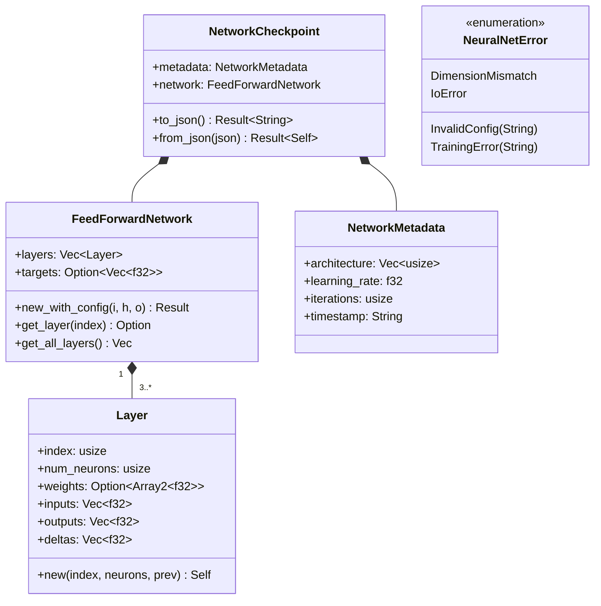
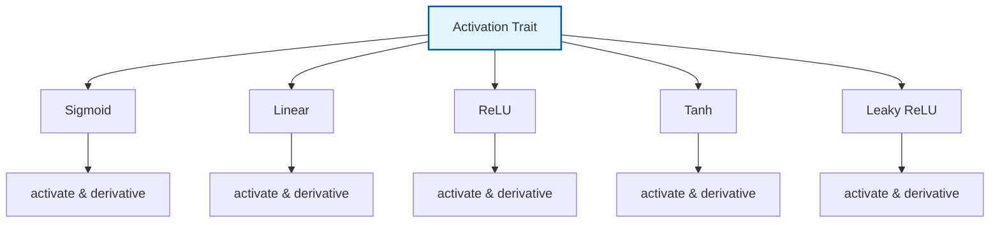
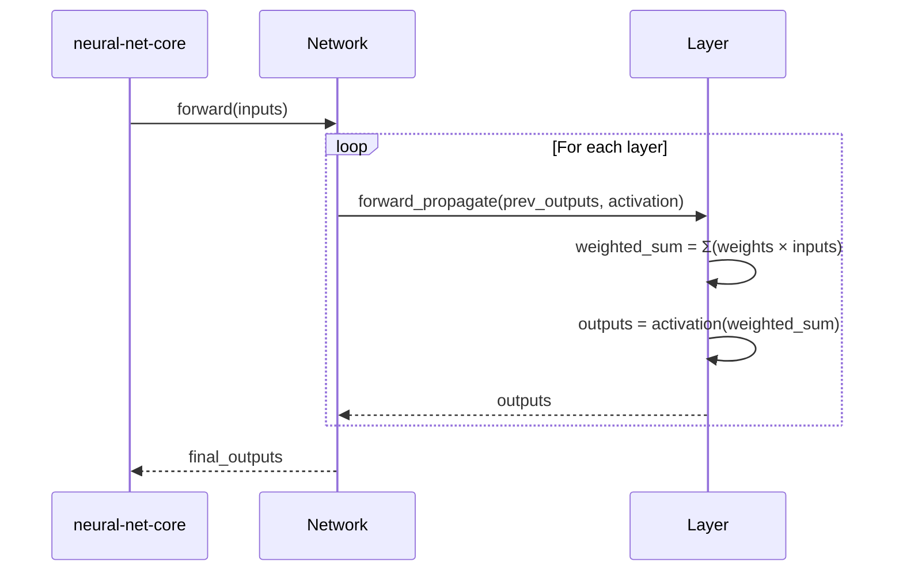
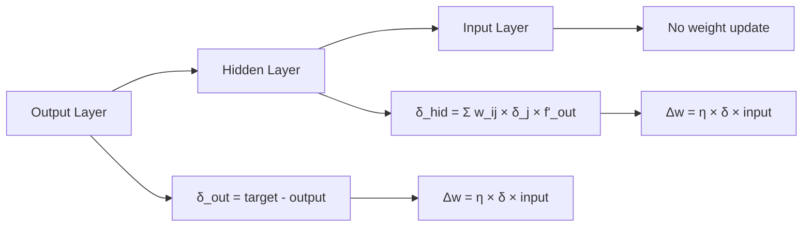
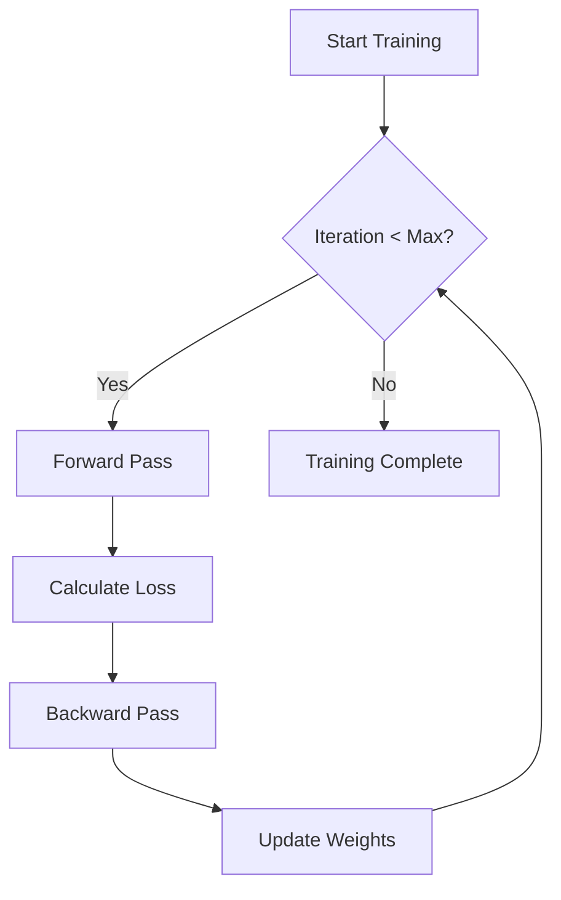
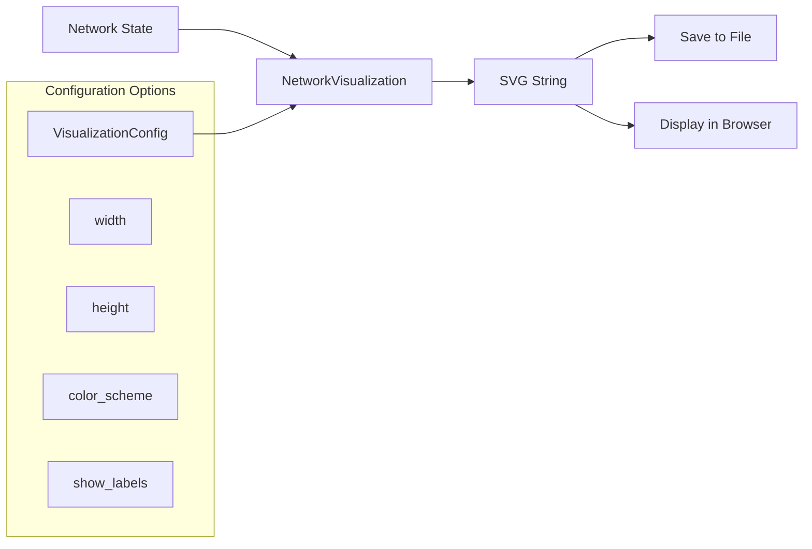
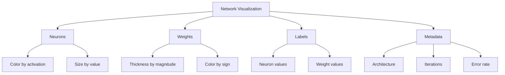
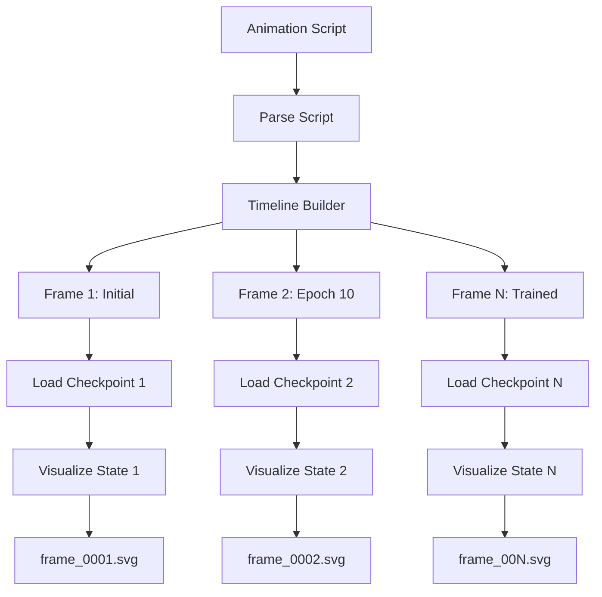
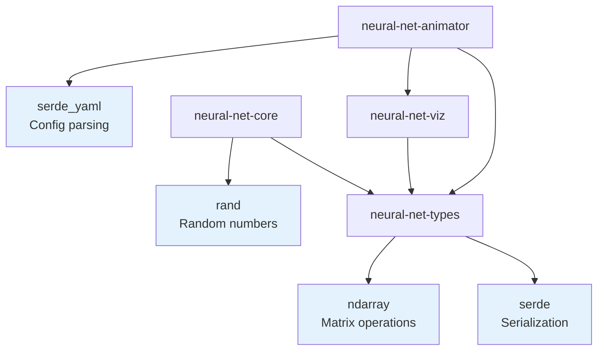

# Core Components

This page details the core library crates that form the foundation of the neural network platform. Each crate has a single, well-defined responsibility and maintains clear boundaries.

## Crate Structure



## Foundation: neural-net-types

**Purpose**: Foundation data structures and types used across all crates.

**Location**: [`crates/neural-net-types/`](../../tree/main/crates/neural-net-types)

### Responsibilities

- Define core data structures (`Layer`, `FeedForwardNetwork`)
- Network metadata and checkpointing
- Error types and Result aliases
- Serialization support (via serde)

### Key Types



### Module Structure

```
neural-net-types/src/
├── lib.rs           # Public API exports
├── layer.rs         # Layer struct
├── network.rs       # FeedForwardNetwork struct
├── metadata.rs      # Metadata and checkpoint types
└── error.rs         # Error types
```

### Design Principles

1. **No algorithms**: Pure data structures only
2. **Serializable**: All types implement serde traits
3. **Foundation layer**: No dependencies on other project crates
4. **Type safety**: Leverage Rust's type system for correctness

### Example Usage

```rust
use neural_net_types::{FeedForwardNetwork, Layer, NeuralNetError};

// Create network
let network = FeedForwardNetwork::new_with_config(2, 4, 1)?;

// Access layers
let hidden_layer = network.get_layer(1).unwrap();
println!("Hidden layer has {} neurons", hidden_layer.num_neurons);
```

## Algorithm Engine: neural-net-core

**Purpose**: Implements neural network algorithms and computations.

**Location**: [`crates/neural-net-core/`](../../tree/main/crates/neural-net-core)

### Responsibilities

- Forward propagation implementation
- Backpropagation and gradient descent
- Activation functions (trait-based)
- Training algorithms
- Optimization strategies

### Module Structure

```
neural-net-core/src/
├── lib.rs           # Public API and prelude
├── activation.rs    # Activation trait and implementations
├── forward.rs       # Forward propagation
├── backward.rs      # Backpropagation
└── optimizer.rs     # Training and optimization
```

### Activation Functions



#### Activation Trait

```rust
pub trait Activation {
    fn activate(&self, x: f32) -> f32;
    fn derivative(&self, output: f32) -> f32;
}
```

#### Implementations

| Activation | Formula | Derivative | Use Case |
|------------|---------|------------|----------|
| Sigmoid | `1 / (1 + e^-x)` | `output × (1 - output)` | Binary classification, hidden layers |
| Linear | `x` | `1` | Regression, passthrough layers |
| ReLU | `max(0, x)` | `x > 0 ? 1 : 0` | Deep networks, hidden layers |
| Tanh | `tanh(x)` | `1 - output²` | Normalized outputs [-1, 1] |
| Leaky ReLU | `x > 0 ? x : 0.01x` | `x > 0 ? 1 : 0.01` | Avoid dead neurons |

### Forward Propagation



### Backpropagation



### Training Loop



### Example Usage

```rust
use neural_net_core::prelude::*;
use neural_net_types::FeedForwardNetwork;

let mut network = FeedForwardNetwork::new_with_config(2, 2, 1)?;

// Forward propagation
let outputs = forward(&mut network, &[1.0, 0.0])?;

// Training single example
train_single(&mut network, &[1.0, 0.0], &[1.0], 0.5)?;

// Multiple iterations
for _ in 0..1000 {
    train_single(&mut network, &input, &target, 0.5)?;
}
```

## Visualization: neural-net-viz

**Purpose**: Generate SVG visualizations of neural networks.

**Location**: [`crates/neural-net-viz/`](../../tree/main/crates/neural-net-viz)

### Responsibilities

- SVG generation for network diagrams
- Weight visualization (color, thickness)
- Neuron state visualization
- Metadata overlays
- Customizable styling

### Visualization Architecture



### Visualization Features



### Example Usage

```rust
use neural_net_viz::NetworkVisualization;
use neural_net_types::FeedForwardNetwork;

let network = FeedForwardNetwork::new_with_config(2, 4, 1)?;

// Generate SVG
let svg = network.to_svg(800, 600)?;

// Save to file
std::fs::write("network.svg", svg)?;
```

### SVG Output Example

The visualization shows:
- **Circles**: Neurons colored by activation value
- **Lines**: Connections colored by weight (red=negative, blue=positive)
- **Thickness**: Weight magnitude
- **Labels**: Neuron values and indices

## Animation: neural-net-animator

**Purpose**: Create animated visualizations of network training.

**Location**: [`crates/neural-net-animator/`](../../tree/main/crates/neural-net-animator)

### Responsibilities

- Animation script definition
- Timeline and keyframe management
- Frame generation
- Checkpoint integration
- Multi-format export (SVG sequence, GIF, video)

### Architecture



### Animation Script Format

```yaml
animation:
  name: "XOR Training Progress"
  duration: 5000  # milliseconds

frames:
  - time: 0
    checkpoint: "xor_epoch_0000.json"
    label: "Initial (random weights)"

  - time: 1000
    checkpoint: "xor_epoch_0100.json"
    label: "Epoch 100"

  - time: 5000
    checkpoint: "xor_epoch_1000.json"
    label: "Trained"
```

### Example Usage

```rust
use neural_net_animator::{AnimationScript, Timeline};

// Load animation script
let script = AnimationScript::from_file("animation.yaml")?;

// Generate frames
let timeline = Timeline::from_script(&script)?;
for (index, frame) in timeline.frames().enumerate() {
    let svg = frame.render()?;
    std::fs::write(format!("frame_{:04}.svg", index), svg)?;
}

// Convert to GIF (external tool)
// ffmpeg -i frame_%04d.svg animation.gif
```

## Crate Comparison

| Feature | neural-net-types | neural-net-core | neural-net-viz | neural-net-animator |
|---------|------------------|-----------------|----------------|---------------------|
| **Purpose** | Data structures | Algorithms | Visualization | Animation |
| **Dependencies** | ndarray, serde | neural-net-types | neural-net-types | neural-net-types, neural-net-viz |
| **LOC** | ~300 | ~500 | ~400 | ~300 |
| **Key Types** | Layer, Network | Activation trait | NetworkVisualization | Timeline, AnimationScript |
| **Exported API** | Types, errors | Training functions | SVG generation | Frame generation |
| **Testing** | Unit tests | Unit + integration | Visual tests | Integration tests |

## Dependency Analysis



### External Dependencies

| Crate | Version | Purpose | License |
|-------|---------|---------|---------|
| ndarray | 0.15+ | Multi-dimensional arrays | MIT/Apache-2.0 |
| serde | 1.0+ | Serialization framework | MIT/Apache-2.0 |
| rand | 0.8+ | Random number generation | MIT/Apache-2.0 |
| serde_yaml | 0.9+ | YAML parsing | MIT/Apache-2.0 |
| thiserror | 1.0+ | Error type derivation | MIT/Apache-2.0 |

## Design Principles Summary

1. **Single Responsibility**: Each crate has one clear purpose
2. **No Circular Dependencies**: Unidirectional dependency graph
3. **Small & Focused**: Each crate < 500 LOC
4. **Clear Boundaries**: Well-defined public APIs
5. **Testable**: Each crate independently testable
6. **Composable**: Crates work together seamlessly

## Related Pages

- [[Architecture-Overview]] - System architecture diagrams
- [[Training-Algorithms]] - Algorithm implementations
- [[Data-Flow]] - Sequence diagrams
- [[Activation-Functions]] - Detailed activation function guide

## Source Code

- [neural-net-types source](../../tree/main/crates/neural-net-types/src)
- [neural-net-core source](../../tree/main/crates/neural-net-core/src)
- [neural-net-viz source](../../tree/main/crates/neural-net-viz/src)
- [neural-net-animator source](../../tree/main/crates/neural-net-animator/src)
