# Data Flow

This page illustrates the flow of data through the neural network system, from user input to trained models, with detailed sequence diagrams for each operation.

## High-Level Data Flow

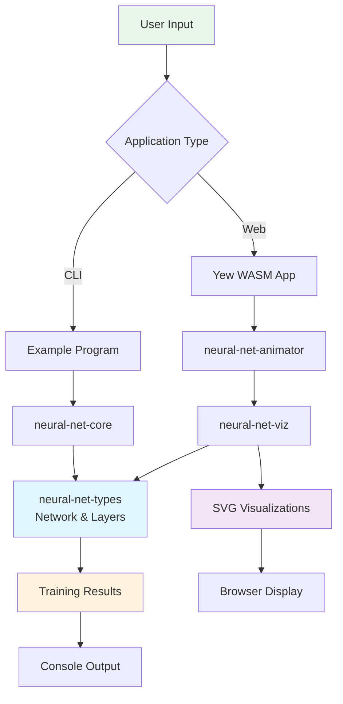
```mermaid
graph TB
    USER[User Input] --> APP{Application Type}

    APP -->|CLI| EXAMPLE[Example Program]
    APP -->|Web| YEWAPP[Yew WASM App]

    EXAMPLE --> CORE[neural-net-core]
    YEWAPP --> ANIM[neural-net-animator]

    CORE --> TYPES[neural-net-types<br/>Network & Layers]
    ANIM --> VIZ[neural-net-viz]
    VIZ --> TYPES

    TYPES --> RESULT[Training Results]
    VIZ --> SVG[SVG Visualizations]

    RESULT --> OUTPUT[Console Output]
    SVG --> BROWSER[Browser Display]

    style USER fill:#e8f5e9
    style TYPES fill:#e1f5ff
    style RESULT fill:#fff3e0
    style SVG fill:#f3e5f5
```

## Network Creation Flow

### Initialization Sequence

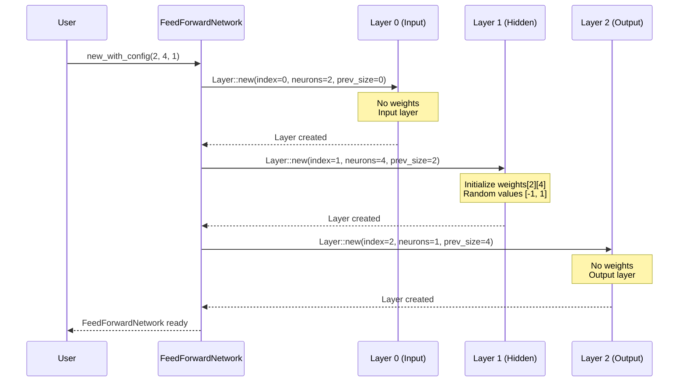
```mermaid
sequenceDiagram
    participant User
    participant Network as FeedForwardNetwork
    participant L0 as Layer 0 (Input)
    participant L1 as Layer 1 (Hidden)
    participant L2 as Layer 2 (Output)

    User->>Network: new_with_config(2, 4, 1)

    Network->>L0: Layer::new(index=0, neurons=2, prev_size=0)
    Note over L0: No weights<br/>Input layer
    L0-->>Network: Layer created

    Network->>L1: Layer::new(index=1, neurons=4, prev_size=2)
    Note over L1: Initialize weights[2][4]<br/>Random values [-1, 1]
    L1-->>Network: Layer created

    Network->>L2: Layer::new(index=2, neurons=1, prev_size=4)
    Note over L2: No weights<br/>Output layer
    L2-->>Network: Layer created

    Network-->>User: FeedForwardNetwork ready
```

### Weight Initialization Detail

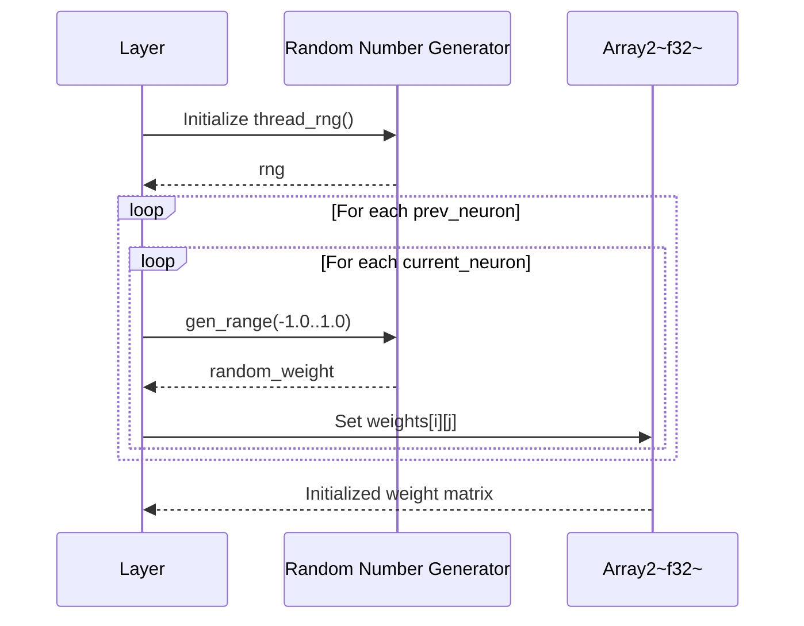
```mermaid
sequenceDiagram
    participant Layer
    participant RNG as Random Number Generator
    participant Weights as Array2~f32~

    Layer->>RNG: Initialize thread_rng()
    RNG-->>Layer: rng

    loop For each prev_neuron
        loop For each current_neuron
            Layer->>RNG: gen_range(-1.0..1.0)
            RNG-->>Layer: random_weight
            Layer->>Weights: Set weights[i][j]
        end
    end

    Weights-->>Layer: Initialized weight matrix
```

## Forward Propagation Data Flow

### Complete Forward Pass

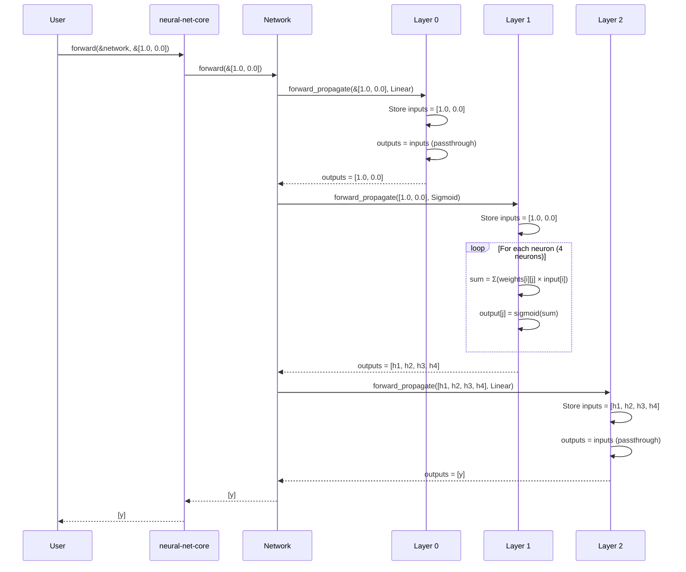
```mermaid
sequenceDiagram
    participant User
    participant Core as neural-net-core
    participant Network
    participant L0 as Layer 0
    participant L1 as Layer 1
    participant L2 as Layer 2

    User->>Core: forward(&network, &[1.0, 0.0])
    Core->>Network: forward(&[1.0, 0.0])

    Network->>L0: forward_propagate(&[1.0, 0.0], Linear)
    L0->>L0: Store inputs = [1.0, 0.0]
    L0->>L0: outputs = inputs (passthrough)
    L0-->>Network: outputs = [1.0, 0.0]

    Network->>L1: forward_propagate([1.0, 0.0], Sigmoid)
    L1->>L1: Store inputs = [1.0, 0.0]

    loop For each neuron (4 neurons)
        L1->>L1: sum = Σ(weights[i][j] × input[i])
        L1->>L1: output[j] = sigmoid(sum)
    end

    L1-->>Network: outputs = [h1, h2, h3, h4]

    Network->>L2: forward_propagate([h1, h2, h3, h4], Linear)
    L2->>L2: Store inputs = [h1, h2, h3, h4]
    L2->>L2: outputs = inputs (passthrough)
    L2-->>Network: outputs = [y]

    Network-->>Core: [y]
    Core-->>User: [y]
```

### Hidden Layer Computation Detail

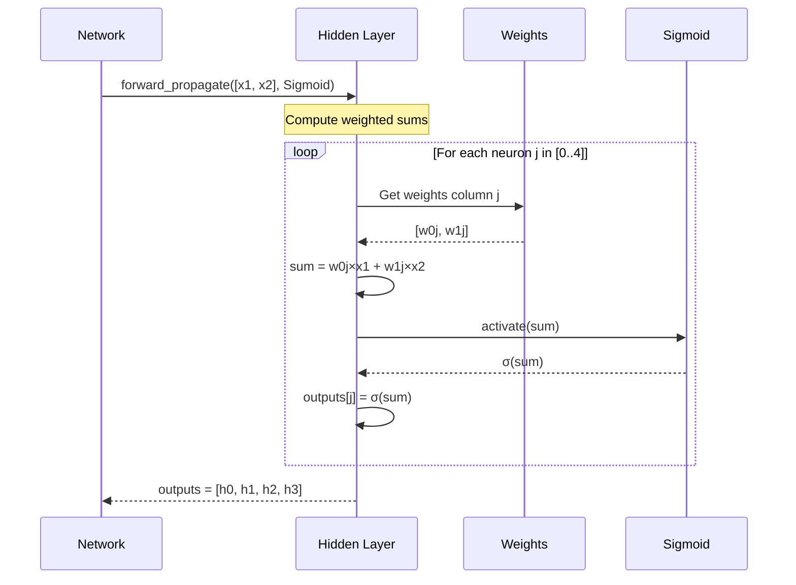
```mermaid
sequenceDiagram
    participant Network
    participant Layer as Hidden Layer
    participant Weights
    participant Activation as Sigmoid

    Network->>Layer: forward_propagate([x1, x2], Sigmoid)

    Note over Layer: Compute weighted sums

    loop For each neuron j in [0..4]
        Layer->>Weights: Get weights column j
        Weights-->>Layer: [w0j, w1j]

        Layer->>Layer: sum = w0j×x1 + w1j×x2

        Layer->>Activation: activate(sum)
        Activation-->>Layer: σ(sum)

        Layer->>Layer: outputs[j] = σ(sum)
    end

    Layer-->>Network: outputs = [h0, h1, h2, h3]
```

## Backpropagation Data Flow

### Complete Backward Pass

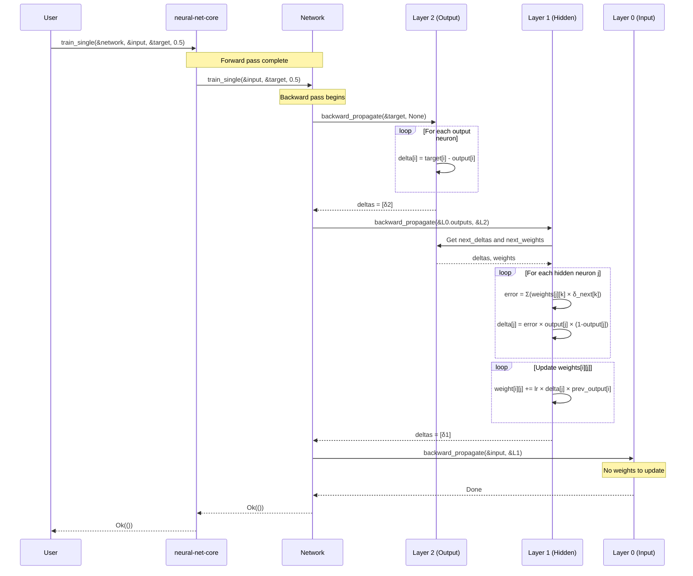
```mermaid
sequenceDiagram
    participant User
    participant Core as neural-net-core
    participant Network
    participant L2 as Layer 2 (Output)
    participant L1 as Layer 1 (Hidden)
    participant L0 as Layer 0 (Input)

    User->>Core: train_single(&network, &input, &target, 0.5)

    Note over Core,Network: Forward pass complete

    Core->>Network: train_single(&input, &target, 0.5)

    Note over Network: Backward pass begins

    Network->>L2: backward_propagate(&target, None)

    loop For each output neuron
        L2->>L2: delta[i] = target[i] - output[i]
    end

    L2-->>Network: deltas = [δ2]

    Network->>L1: backward_propagate(&L0.outputs, &L2)

    L1->>L2: Get next_deltas and next_weights
    L2-->>L1: deltas, weights

    loop For each hidden neuron j
        L1->>L1: error = Σ(weights[j][k] × δ_next[k])
        L1->>L1: delta[j] = error × output[j] × (1-output[j])
    end

    loop Update weights[i][j]
        L1->>L1: weight[i][j] += lr × delta[j] × prev_output[i]
    end

    L1-->>Network: deltas = [δ1]

    Network->>L0: backward_propagate(&input, &L1)
    Note over L0: No weights to update
    L0-->>Network: Done

    Network-->>Core: Ok(())
    Core-->>User: Ok(())
```

### Weight Update Detail

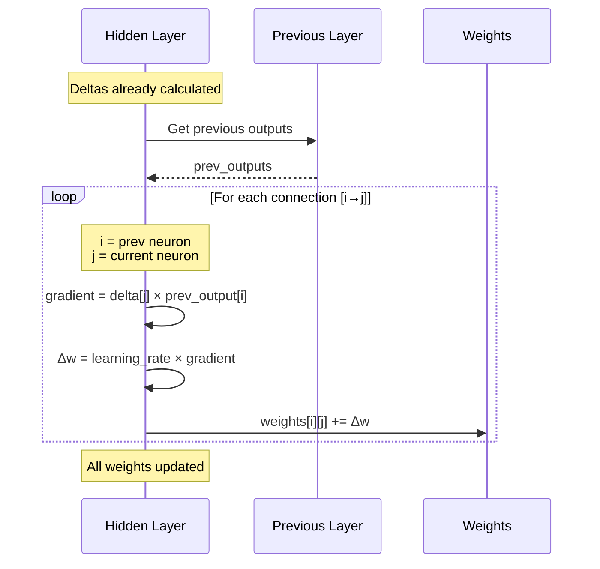
```mermaid
sequenceDiagram
    participant Layer as Hidden Layer
    participant PrevLayer as Previous Layer
    participant Weights

    Note over Layer: Deltas already calculated

    Layer->>PrevLayer: Get previous outputs
    PrevLayer-->>Layer: prev_outputs

    loop For each connection [i→j]
        Note over Layer: i = prev neuron<br/>j = current neuron

        Layer->>Layer: gradient = delta[j] × prev_output[i]
        Layer->>Layer: Δw = learning_rate × gradient

        Layer->>Weights: weights[i][j] += Δw
    end

    Note over Layer: All weights updated
```

## Training Loop Data Flow

### Epoch-Based Training

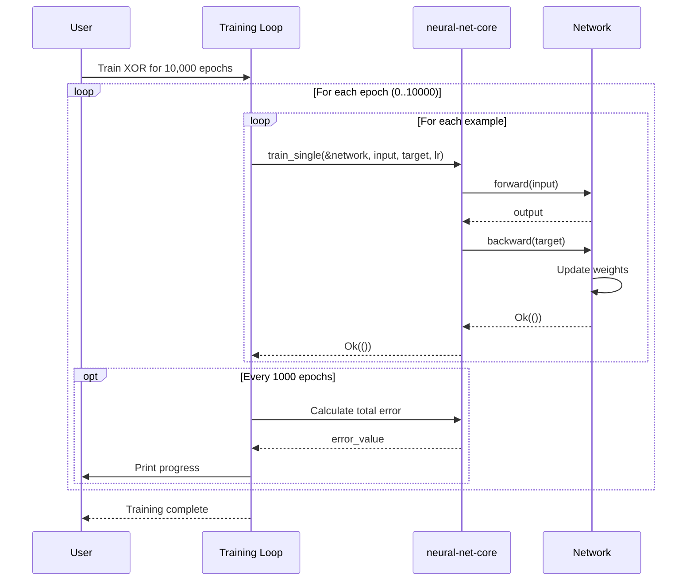
```mermaid
sequenceDiagram
    participant User
    participant TrainLoop as Training Loop
    participant Core as neural-net-core
    participant Network

    User->>TrainLoop: Train XOR for 10,000 epochs

    loop For each epoch (0..10000)
        loop For each example
            TrainLoop->>Core: train_single(&network, input, target, lr)

            Core->>Network: forward(input)
            Network-->>Core: output

            Core->>Network: backward(target)
            Network->>Network: Update weights
            Network-->>Core: Ok(())

            Core-->>TrainLoop: Ok(())
        end

        opt Every 1000 epochs
            TrainLoop->>Core: Calculate total error
            Core-->>TrainLoop: error_value
            TrainLoop->>User: Print progress
        end
    end

    TrainLoop-->>User: Training complete
```

### Error-Based Training

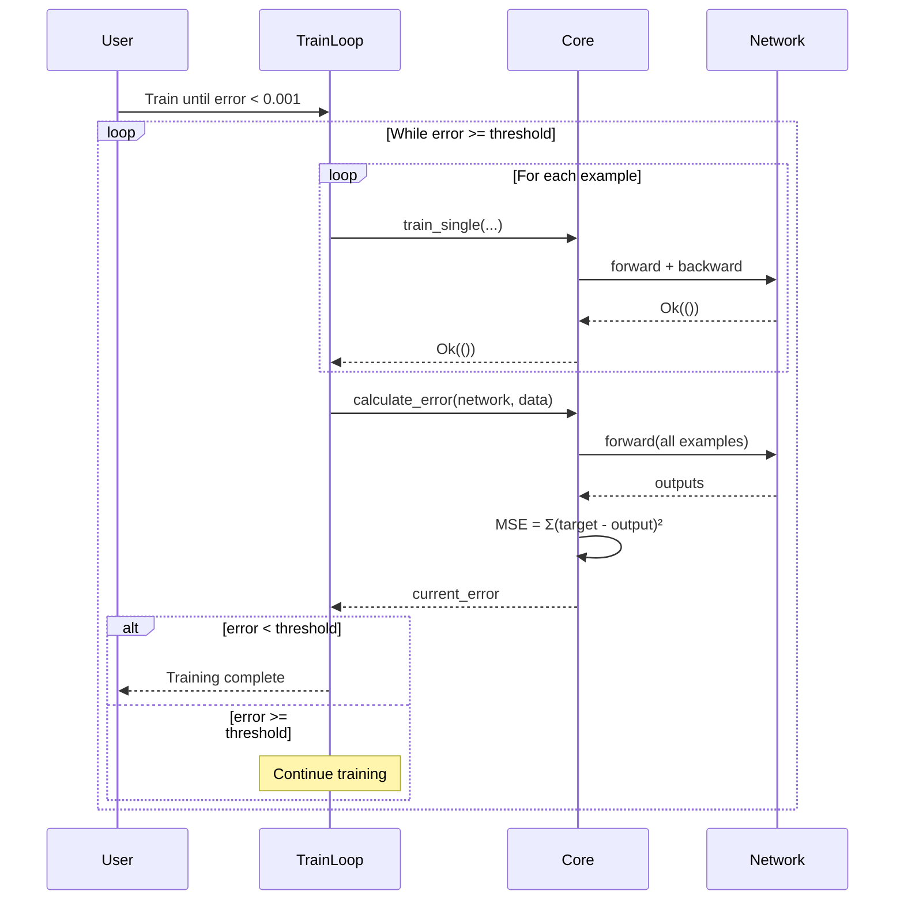
```mermaid
sequenceDiagram
    participant User
    participant TrainLoop
    participant Core
    participant Network

    User->>TrainLoop: Train until error < 0.001

    loop While error >= threshold
        loop For each example
            TrainLoop->>Core: train_single(...)
            Core->>Network: forward + backward
            Network-->>Core: Ok(())
            Core-->>TrainLoop: Ok(())
        end

        TrainLoop->>Core: calculate_error(network, data)
        Core->>Network: forward(all examples)
        Network-->>Core: outputs
        Core->>Core: MSE = Σ(target - output)²
        Core-->>TrainLoop: current_error

        alt error < threshold
            TrainLoop-->>User: Training complete
        else error >= threshold
            Note over TrainLoop: Continue training
        end
    end
```

## Visualization Data Flow

### SVG Generation

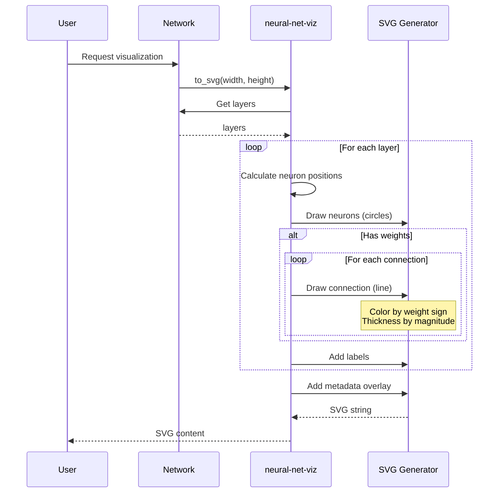
```mermaid
sequenceDiagram
    participant User
    participant Network
    participant Viz as neural-net-viz
    participant SVG as SVG Generator

    User->>Network: Request visualization

    Network->>Viz: to_svg(width, height)

    Viz->>Network: Get layers
    Network-->>Viz: layers

    loop For each layer
        Viz->>Viz: Calculate neuron positions
        Viz->>SVG: Draw neurons (circles)

        alt Has weights
            loop For each connection
                Viz->>SVG: Draw connection (line)
                Note over SVG: Color by weight sign<br/>Thickness by magnitude
            end
        end

        Viz->>SVG: Add labels
    end

    Viz->>SVG: Add metadata overlay

    SVG-->>Viz: SVG string
    Viz-->>User: SVG content
```

### Animation Frame Generation

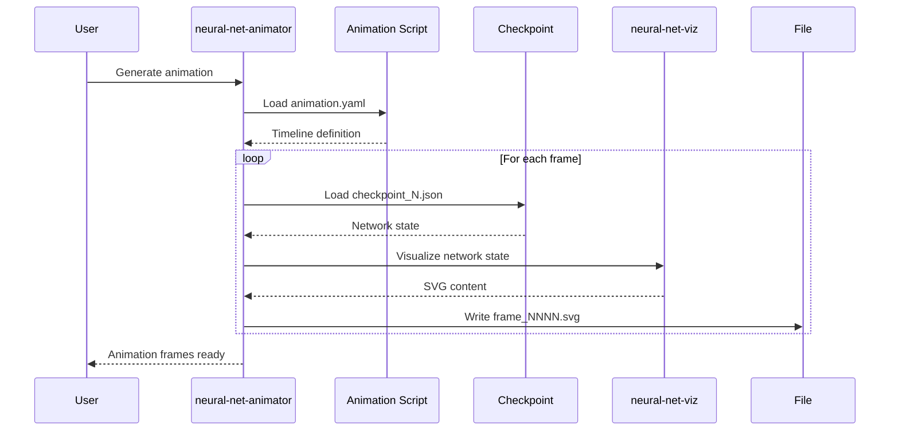
```mermaid
sequenceDiagram
    participant User
    participant Animator as neural-net-animator
    participant Script as Animation Script
    participant Checkpoint
    participant Viz as neural-net-viz
    participant File

    User->>Animator: Generate animation

    Animator->>Script: Load animation.yaml
    Script-->>Animator: Timeline definition

    loop For each frame
        Animator->>Checkpoint: Load checkpoint_N.json
        Checkpoint-->>Animator: Network state

        Animator->>Viz: Visualize network state
        Viz-->>Animator: SVG content

        Animator->>File: Write frame_NNNN.svg
    end

    Animator-->>User: Animation frames ready
```

## Checkpoint/Serialization Flow

### Saving Network State

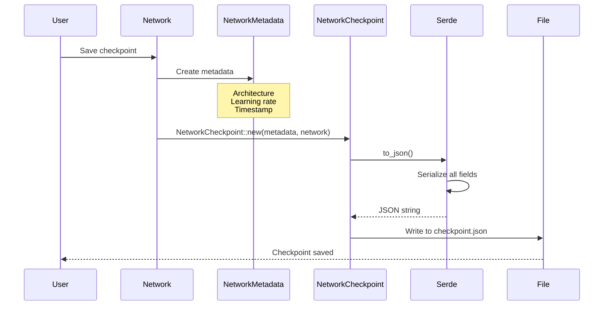
```mermaid
sequenceDiagram
    participant User
    participant Network
    participant Metadata as NetworkMetadata
    participant Checkpoint as NetworkCheckpoint
    participant Serde
    participant File

    User->>Network: Save checkpoint

    Network->>Metadata: Create metadata
    Note over Metadata: Architecture<br/>Learning rate<br/>Timestamp

    Network->>Checkpoint: NetworkCheckpoint::new(metadata, network)

    Checkpoint->>Serde: to_json()
    Serde->>Serde: Serialize all fields

    Serde-->>Checkpoint: JSON string

    Checkpoint->>File: Write to checkpoint.json
    File-->>User: Checkpoint saved
```

### Loading Network State

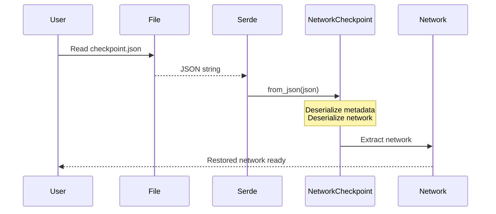
```mermaid
sequenceDiagram
    participant User
    participant File
    participant Serde
    participant Checkpoint as NetworkCheckpoint
    participant Network

    User->>File: Read checkpoint.json

    File-->>Serde: JSON string

    Serde->>Checkpoint: from_json(json)
    Note over Checkpoint: Deserialize metadata<br/>Deserialize network

    Checkpoint->>Network: Extract network
    Network-->>User: Restored network ready
```

## WASM Frontend Data Flow

### User Interaction Flow

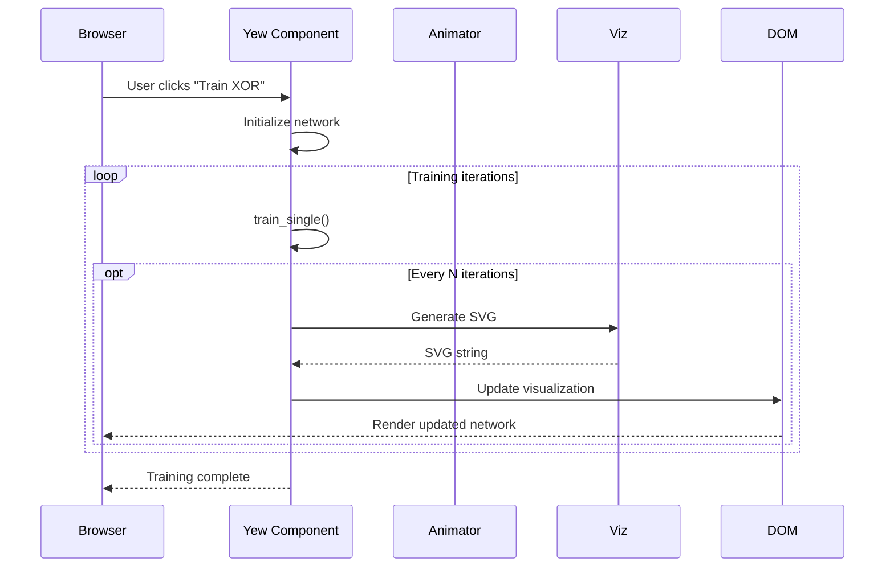
```mermaid
sequenceDiagram
    participant Browser
    participant YewApp as Yew Component
    participant Animator
    participant Viz
    participant DOM

    Browser->>YewApp: User clicks "Train XOR"

    YewApp->>YewApp: Initialize network

    loop Training iterations
        YewApp->>YewApp: train_single()

        opt Every N iterations
            YewApp->>Viz: Generate SVG
            Viz-->>YewApp: SVG string

            YewApp->>DOM: Update visualization
            DOM-->>Browser: Render updated network
        end
    end

    YewApp-->>Browser: Training complete
```

### Real-Time Visualization Update

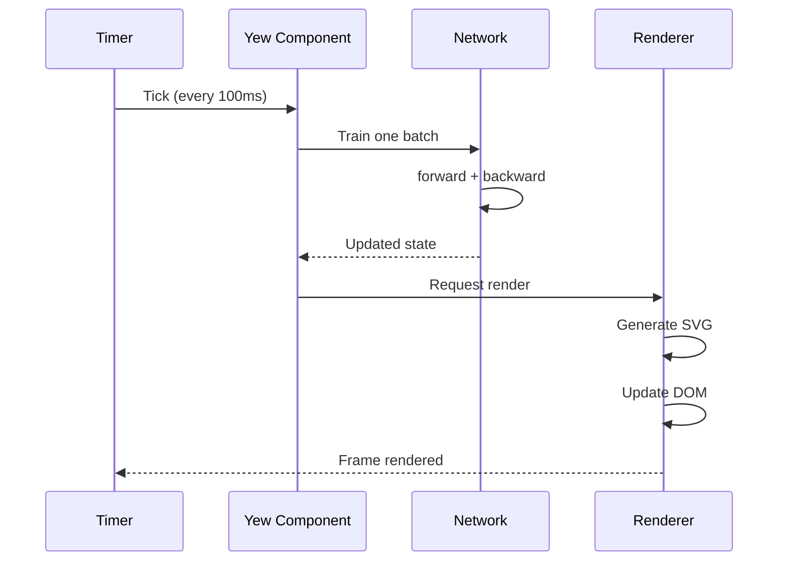
```mermaid
sequenceDiagram
    participant Timer
    participant Component as Yew Component
    participant Network
    participant Renderer

    Timer->>Component: Tick (every 100ms)

    Component->>Network: Train one batch

    Network->>Network: forward + backward
    Network-->>Component: Updated state

    Component->>Renderer: Request render

    Renderer->>Renderer: Generate SVG
    Renderer->>Renderer: Update DOM

    Renderer-->>Timer: Frame rendered
```

## Error Handling Flow

### Error Propagation

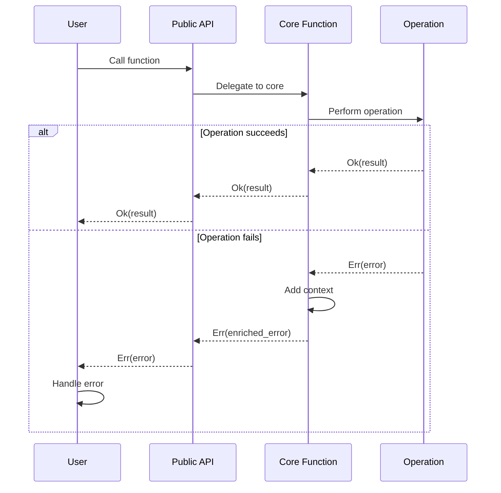
```mermaid
sequenceDiagram
    participant User
    participant API as Public API
    participant Core as Core Function
    participant Operation

    User->>API: Call function

    API->>Core: Delegate to core

    Core->>Operation: Perform operation

    alt Operation succeeds
        Operation-->>Core: Ok(result)
        Core-->>API: Ok(result)
        API-->>User: Ok(result)
    else Operation fails
        Operation-->>Core: Err(error)
        Core->>Core: Add context
        Core-->>API: Err(enriched_error)
        API-->>User: Err(error)
        User->>User: Handle error
    end
```

### Example: Dimension Mismatch

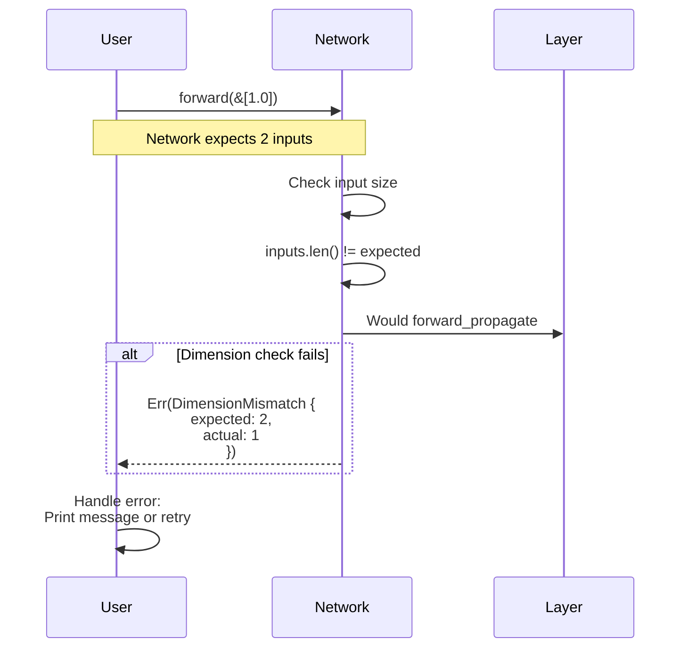
```mermaid
sequenceDiagram
    participant User
    participant Network
    participant Layer

    User->>Network: forward(&[1.0])
    Note over User,Network: Network expects 2 inputs

    Network->>Network: Check input size
    Network->>Network: inputs.len() != expected

    Network->>Layer: Would forward_propagate

    alt Dimension check fails
        Network-->>User: Err(DimensionMismatch {<br/>  expected: 2,<br/>  actual: 1<br/>})
    end

    User->>User: Handle error:<br/>Print message or retry
```

## Data Structure Memory Layout

### Network Memory Organization

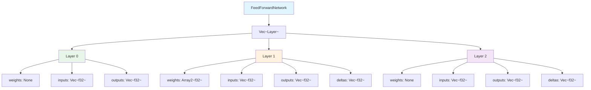
```mermaid
graph TB
    NET[FeedForwardNetwork] --> LAYERS[Vec~Layer~]

    LAYERS --> L0[Layer 0]
    LAYERS --> L1[Layer 1]
    LAYERS --> L2[Layer 2]

    L0 --> L0W[weights: None]
    L0 --> L0I[inputs: Vec~f32~]
    L0 --> L0O[outputs: Vec~f32~]

    L1 --> L1W[weights: Array2~f32~]
    L1 --> L1I[inputs: Vec~f32~]
    L1 --> L1O[outputs: Vec~f32~]
    L1 --> L1D[deltas: Vec~f32~]

    L2 --> L2W[weights: None]
    L2 --> L2I[inputs: Vec~f32~]
    L2 --> L2O[outputs: Vec~f32~]
    L2 --> L2D[deltas: Vec~f32~]

    style NET fill:#e1f5ff
    style L0 fill:#e8f5e9
    style L1 fill:#fff3e0
    style L2 fill:#f3e5f5
```

### Weight Matrix Layout

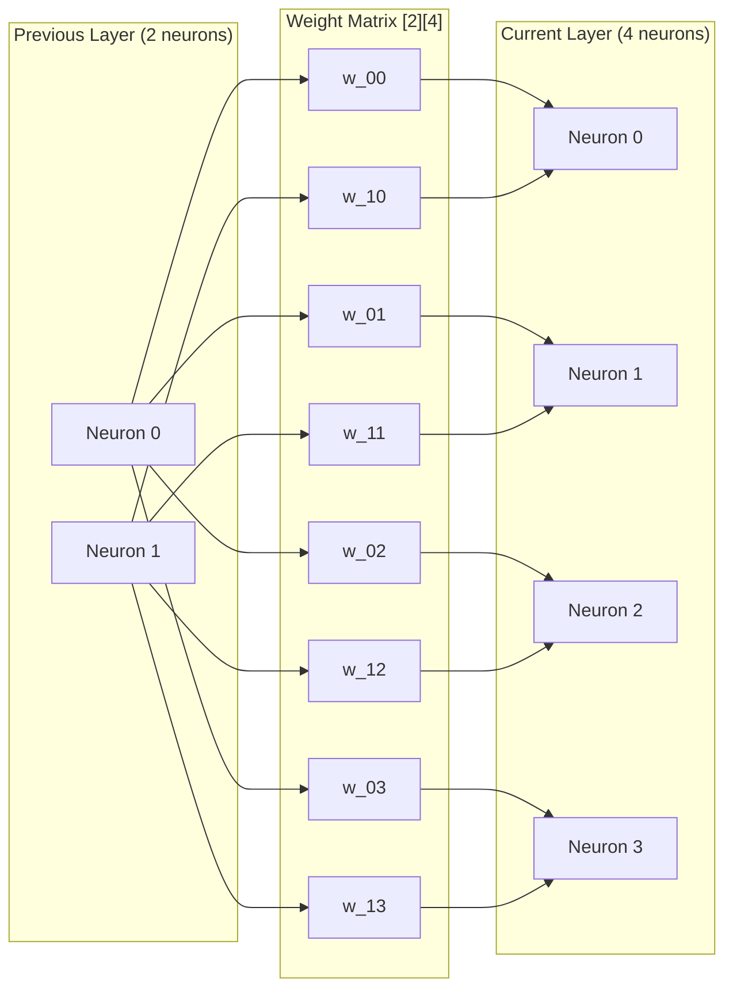
```mermaid
graph LR
    subgraph "Previous Layer (2 neurons)"
        P0[Neuron 0]
        P1[Neuron 1]
    end

    subgraph "Weight Matrix [2][4]"
        W00[w_00]
        W01[w_01]
        W02[w_02]
        W03[w_03]
        W10[w_10]
        W11[w_11]
        W12[w_12]
        W13[w_13]
    end

    subgraph "Current Layer (4 neurons)"
        C0[Neuron 0]
        C1[Neuron 1]
        C2[Neuron 2]
        C3[Neuron 3]
    end

    P0 --> W00 --> C0
    P0 --> W01 --> C1
    P0 --> W02 --> C2
    P0 --> W03 --> C3

    P1 --> W10 --> C0
    P1 --> W11 --> C1
    P1 --> W12 --> C2
    P1 --> W13 --> C3
```

## Performance Considerations

### Hot Path Analysis

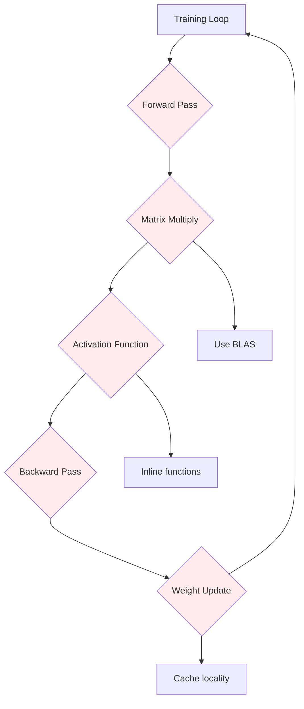
```mermaid
graph TB
    START[Training Loop] --> HOT1{Forward Pass}
    HOT1 --> HOT2{Matrix Multiply}
    HOT2 --> HOT3{Activation Function}
    HOT3 --> HOT4{Backward Pass}
    HOT4 --> HOT5{Weight Update}
    HOT5 --> START

    style HOT1 fill:#ffebee
    style HOT2 fill:#ffebee
    style HOT3 fill:#ffebee
    style HOT4 fill:#ffebee
    style HOT5 fill:#ffebee

    HOT2 --> OPT1[Use BLAS]
    HOT3 --> OPT2[Inline functions]
    HOT5 --> OPT3[Cache locality]
```

### Memory Access Patterns

```mermaid
graph LR
    SEQUENTIAL[Sequential Access] --> CACHE[Cache Friendly]
    CACHE --> FAST[Fast Performance]

    RANDOM[Random Access] --> MISS[Cache Misses]
    MISS --> SLOW[Slower Performance]

    style SEQUENTIAL fill:#e8f5e9
    style RANDOM fill:#ffebee
```

## Related Pages

- [[Architecture-Overview]] - System architecture
- [[Training-Algorithms]] - Algorithm details
- [[Core-Components]] - Component responsibilities
- [[Testing-Strategy]] - How data flows through tests

## Source Code References

- [forward.rs](../../blob/main/crates/neural-net-core/src/forward.rs) - Forward propagation implementation
- [backward.rs](../../blob/main/crates/neural-net-core/src/backward.rs) - Backpropagation implementation
- [network.rs](../../blob/main/crates/neural-net-types/src/network.rs) - Network structure
- [layer.rs](../../blob/main/crates/neural-net-types/src/layer.rs) - Layer implementation
