# Training Algorithms

This page details the neural network training algorithms implemented in the platform, including forward propagation, backpropagation, and optimization strategies.

## Overview

Neural network training consists of three main phases:

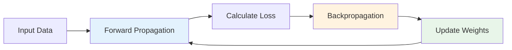
```mermaid
graph LR
    INPUT[Input Data] --> FORWARD[Forward Propagation]
    FORWARD --> LOSS[Calculate Loss]
    LOSS --> BACKWARD[Backpropagation]
    BACKWARD --> UPDATE[Update Weights]
    UPDATE --> FORWARD

    style FORWARD fill:#e3f2fd
    style BACKWARD fill:#fff3e0
    style UPDATE fill:#e8f5e9
```

## Forward Propagation

**Purpose**: Compute network output by propagating inputs through layers.

### Algorithm Flow

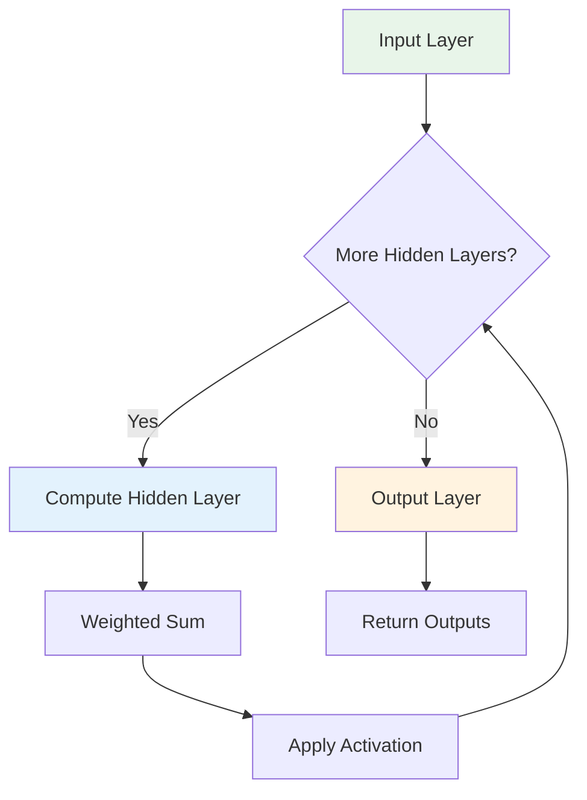
```mermaid
graph TB
    START[Input Layer] --> CHECK_HIDDEN{More Hidden Layers?}
    CHECK_HIDDEN -->|Yes| COMPUTE_HIDDEN[Compute Hidden Layer]
    CHECK_HIDDEN -->|No| OUTPUT[Output Layer]

    COMPUTE_HIDDEN --> WEIGHTED_SUM[Weighted Sum]
    WEIGHTED_SUM --> ACTIVATION[Apply Activation]
    ACTIVATION --> CHECK_HIDDEN

    OUTPUT --> RESULT[Return Outputs]

    style START fill:#e8f5e9
    style COMPUTE_HIDDEN fill:#e3f2fd
    style OUTPUT fill:#fff3e0
```

### Layer-by-Layer Process

#### Input Layer (Index 0)

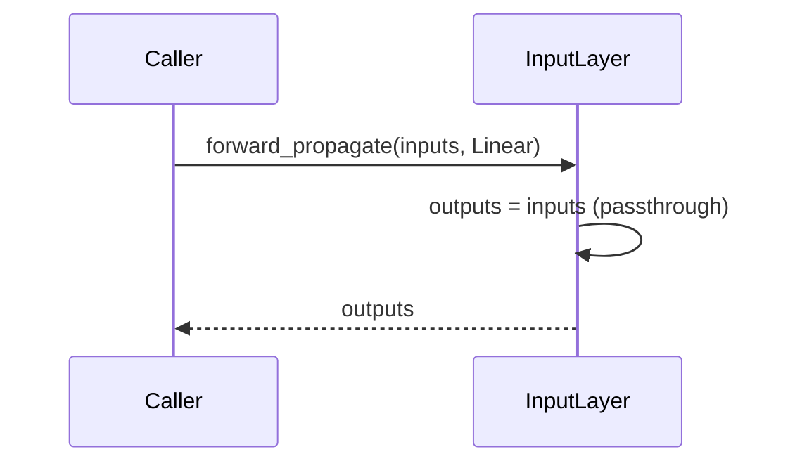
```mermaid
sequenceDiagram
    participant Caller
    participant InputLayer

    Caller->>InputLayer: forward_propagate(inputs, Linear)
    InputLayer->>InputLayer: outputs = inputs (passthrough)
    InputLayer-->>Caller: outputs
```

**Implementation:**
- No weights
- Direct passthrough: `outputs = inputs`
- Linear activation (identity function)

#### Hidden Layer (Index 1)

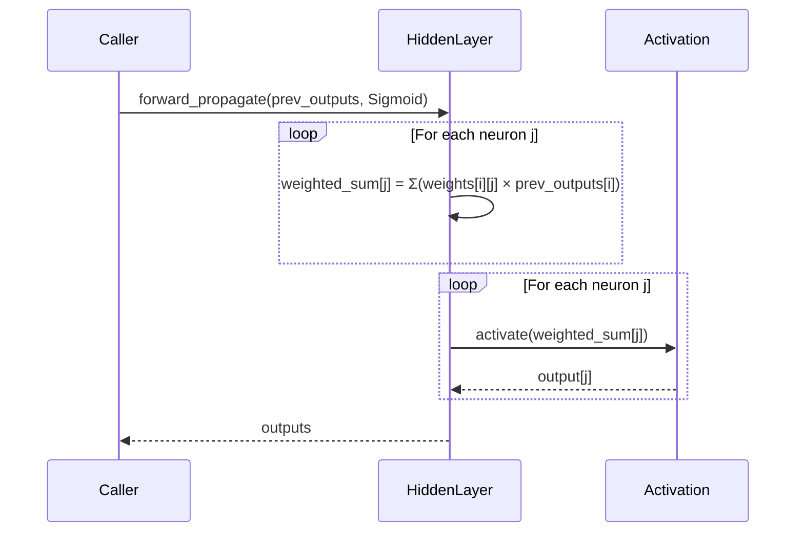
```mermaid
sequenceDiagram
    participant Caller
    participant HiddenLayer
    participant Activation

    Caller->>HiddenLayer: forward_propagate(prev_outputs, Sigmoid)

    loop For each neuron j
        HiddenLayer->>HiddenLayer: weighted_sum[j] = Σ(weights[i][j] × prev_outputs[i])
    end

    loop For each neuron j
        HiddenLayer->>Activation: activate(weighted_sum[j])
        Activation-->>HiddenLayer: output[j]
    end

    HiddenLayer-->>Caller: outputs
```

**Implementation:**
1. **Weighted Sum**: For neuron `j`: `sum[j] = Σ(w[i][j] × input[i])` for all inputs `i`
2. **Activation**: `output[j] = sigmoid(sum[j])`
3. **Sigmoid**: `σ(x) = 1 / (1 + e^-x)`

#### Output Layer (Index 2)

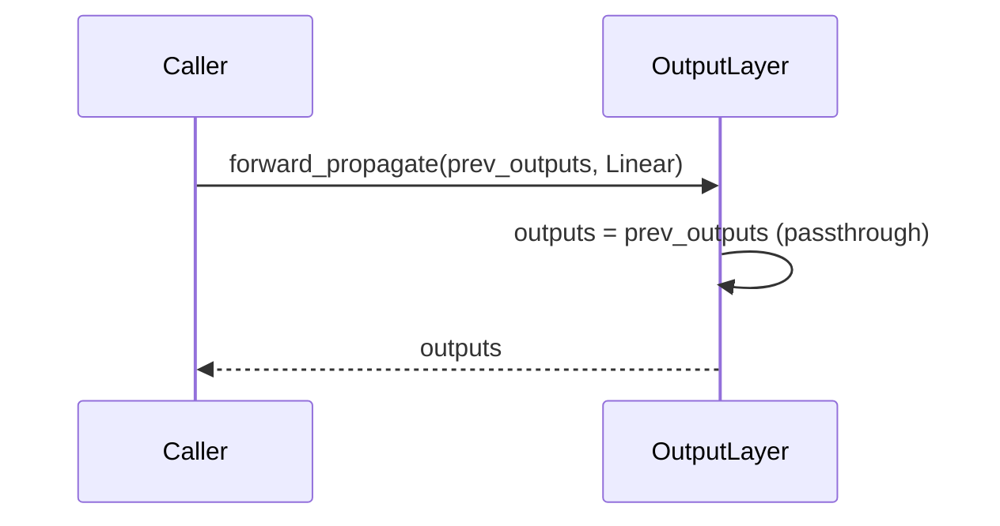
```mermaid
sequenceDiagram
    participant Caller
    participant OutputLayer

    Caller->>OutputLayer: forward_propagate(prev_outputs, Linear)
    OutputLayer->>OutputLayer: outputs = prev_outputs (passthrough)
    OutputLayer-->>Caller: outputs
```

**Implementation:**
- No weights (uses hidden layer outputs directly)
- Linear activation (passthrough)
- Outputs represent network predictions

### Complete Forward Pass

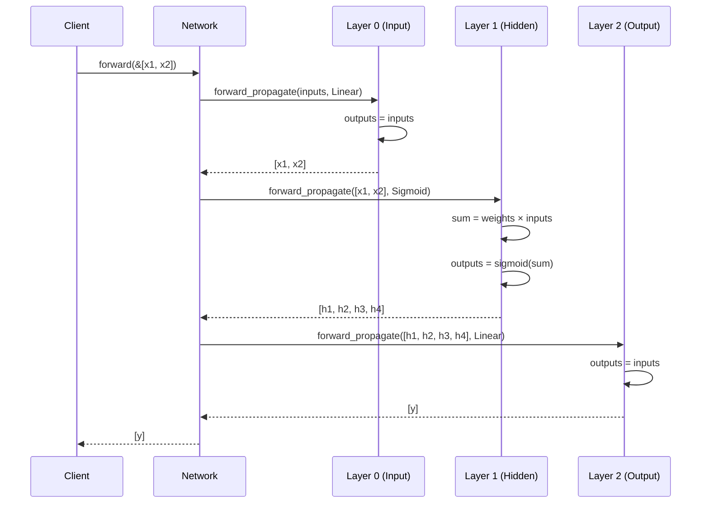
```mermaid
sequenceDiagram
    participant Client
    participant Network
    participant L0 as Layer 0 (Input)
    participant L1 as Layer 1 (Hidden)
    participant L2 as Layer 2 (Output)

    Client->>Network: forward(&[x1, x2])

    Network->>L0: forward_propagate(inputs, Linear)
    L0->>L0: outputs = inputs
    L0-->>Network: [x1, x2]

    Network->>L1: forward_propagate([x1, x2], Sigmoid)
    L1->>L1: sum = weights × inputs
    L1->>L1: outputs = sigmoid(sum)
    L1-->>Network: [h1, h2, h3, h4]

    Network->>L2: forward_propagate([h1, h2, h3, h4], Linear)
    L2->>L2: outputs = inputs
    L2-->>Network: [y]

    Network-->>Client: [y]
```

### Mathematical Formulation

For a 3-layer network (input → hidden → output):

**Input Layer (L0):**
```
outputs[i] = inputs[i]
```

**Hidden Layer (L1):**
```
weighted_sum[j] = Σ(weights[i][j] × prev_outputs[i])  for i in 0..n_inputs
outputs[j] = σ(weighted_sum[j])
where σ(x) = 1 / (1 + e^-x)
```

**Output Layer (L2):**
```
outputs[k] = prev_outputs[k]
```

### Code Example

```rust
use neural_net_core::forward;
use neural_net_types::FeedForwardNetwork;

let mut network = FeedForwardNetwork::new_with_config(2, 4, 1)?;

// Forward propagation
let input = [1.0, 0.5];
let output = forward(&mut network, &input)?;

println!("Input: {:?}", input);
println!("Output: {:?}", output);
```

## Backpropagation

**Purpose**: Calculate error gradients and update weights to minimize loss.

### High-Level Flow

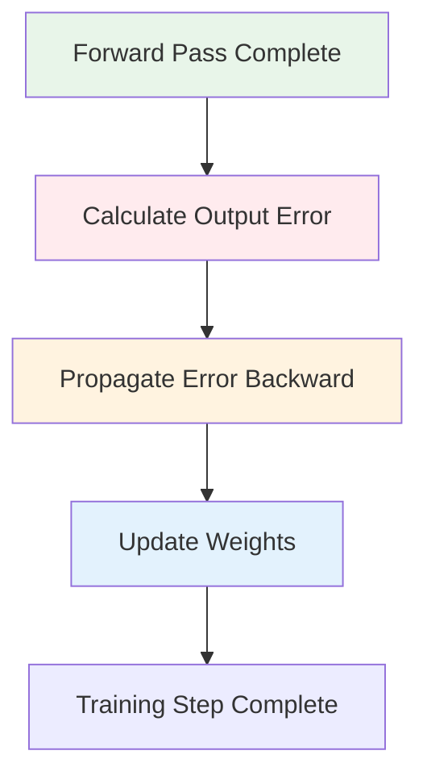
```mermaid
graph TB
    START[Forward Pass Complete] --> CALC_OUTPUT_ERROR[Calculate Output Error]
    CALC_OUTPUT_ERROR --> PROP_ERROR[Propagate Error Backward]
    PROP_ERROR --> UPDATE_WEIGHTS[Update Weights]
    UPDATE_WEIGHTS --> DONE[Training Step Complete]

    style START fill:#e8f5e9
    style CALC_OUTPUT_ERROR fill:#ffebee
    style PROP_ERROR fill:#fff3e0
    style UPDATE_WEIGHTS fill:#e3f2fd
```

### Error Propagation Direction

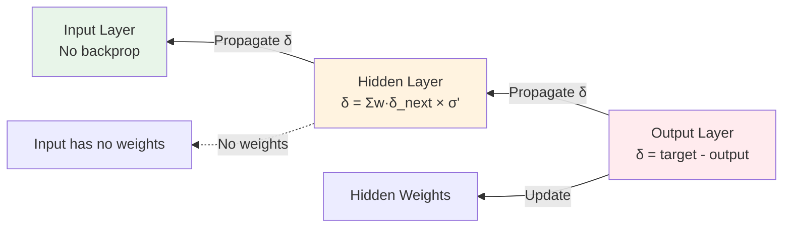
```mermaid
graph RL
    OUTPUT[Output Layer<br/>δ = target - output] -->|Propagate δ| HIDDEN[Hidden Layer<br/>δ = Σw·δ_next × σ']
    HIDDEN -->|Propagate δ| INPUT[Input Layer<br/>No backprop]

    OUTPUT -->|Update| W_HIDDEN[Hidden Weights]
    HIDDEN -.->|No weights| W_INPUT[Input has no weights]

    style OUTPUT fill:#ffebee
    style HIDDEN fill:#fff3e0
    style INPUT fill:#e8f5e9
```

### Output Layer Error Calculation

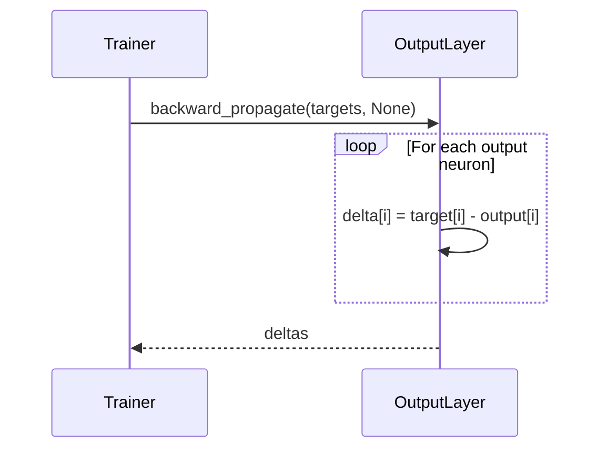
```mermaid
sequenceDiagram
    participant Trainer
    participant OutputLayer

    Trainer->>OutputLayer: backward_propagate(targets, None)

    loop For each output neuron
        OutputLayer->>OutputLayer: delta[i] = target[i] - output[i]
    end

    OutputLayer-->>Trainer: deltas
```

**Formula:**
```
δ_output[i] = target[i] - output[i]
```

This is the **error signal** that will be propagated backward.

### Hidden Layer Error Calculation

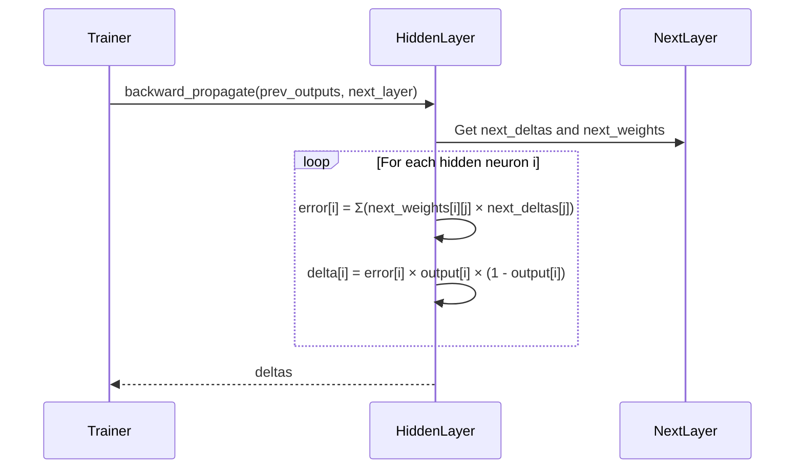
```mermaid
sequenceDiagram
    participant Trainer
    participant HiddenLayer
    participant NextLayer

    Trainer->>HiddenLayer: backward_propagate(prev_outputs, next_layer)

    HiddenLayer->>NextLayer: Get next_deltas and next_weights

    loop For each hidden neuron i
        HiddenLayer->>HiddenLayer: error[i] = Σ(next_weights[i][j] × next_deltas[j])
        HiddenLayer->>HiddenLayer: delta[i] = error[i] × output[i] × (1 - output[i])
    end

    HiddenLayer-->>Trainer: deltas
```

**Formula:**
```
error[i] = Σ(next_weights[i][j] × next_deltas[j])  for all j in next layer
delta[i] = error[i] × output[i] × (1 - output[i])
```

The term `output[i] × (1 - output[i])` is the **derivative of sigmoid**.

### Weight Update

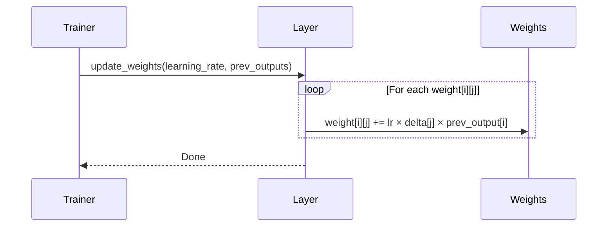
```mermaid
sequenceDiagram
    participant Trainer
    participant Layer
    participant Weights

    Trainer->>Layer: update_weights(learning_rate, prev_outputs)

    loop For each weight[i][j]
        Layer->>Weights: weight[i][j] += lr × delta[j] × prev_output[i]
    end

    Layer-->>Trainer: Done
```

**Formula:**
```
Δw[i][j] = η × δ[j] × prev_output[i]
w[i][j] = w[i][j] + Δw[i][j]
```

Where:
- `η` (eta) = learning rate (typically 0.01 to 0.5)
- `δ[j]` = error gradient for neuron j
- `prev_output[i]` = activation from previous layer

### Complete Backpropagation Pass

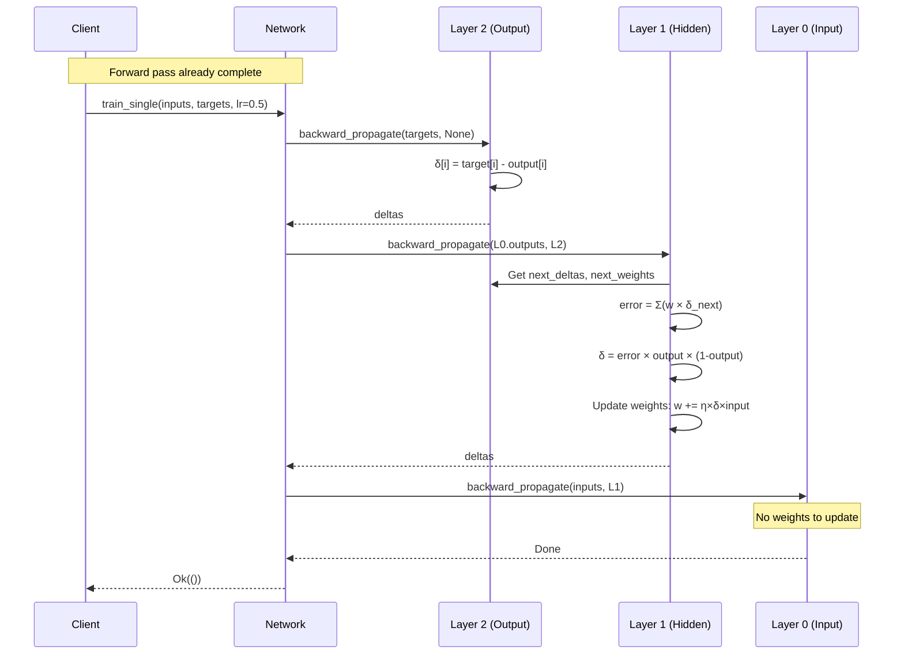
```mermaid
sequenceDiagram
    participant Client
    participant Network
    participant L2 as Layer 2 (Output)
    participant L1 as Layer 1 (Hidden)
    participant L0 as Layer 0 (Input)

    Note over Client,Network: Forward pass already complete

    Client->>Network: train_single(inputs, targets, lr=0.5)

    Network->>L2: backward_propagate(targets, None)
    L2->>L2: δ[i] = target[i] - output[i]
    L2-->>Network: deltas

    Network->>L1: backward_propagate(L0.outputs, L2)
    L1->>L2: Get next_deltas, next_weights
    L1->>L1: error = Σ(w × δ_next)
    L1->>L1: δ = error × output × (1-output)
    L1->>L1: Update weights: w += η×δ×input
    L1-->>Network: deltas

    Network->>L0: backward_propagate(inputs, L1)
    Note over L0: No weights to update
    L0-->>Network: Done

    Network-->>Client: Ok(())
```

### Mathematical Formulation

#### Output Layer (L2):
```
δ_2[i] = target[i] - output[i]
```

#### Hidden Layer (L1):
```
error[j] = Σ(weights_L1→L2[j][k] × δ_2[k])  for all k in L2
δ_1[j] = error[j] × output_1[j] × (1 - output_1[j])

For each weight w[i][j] connecting L0[i] to L1[j]:
Δw[i][j] = η × δ_1[j] × output_0[i]
w[i][j] = w[i][j] + Δw[i][j]
```

#### Input Layer (L0):
```
No backpropagation (no weights to update)
```

## Training Loop

### Single Example Training

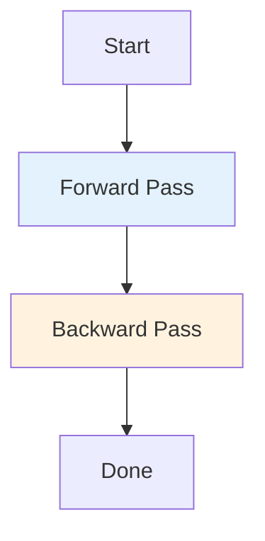
```mermaid
graph TB
    START[Start] --> FWD[Forward Pass]
    FWD --> BWD[Backward Pass]
    BWD --> DONE[Done]

    style FWD fill:#e3f2fd
    style BWD fill:#fff3e0
```

### Batch Training

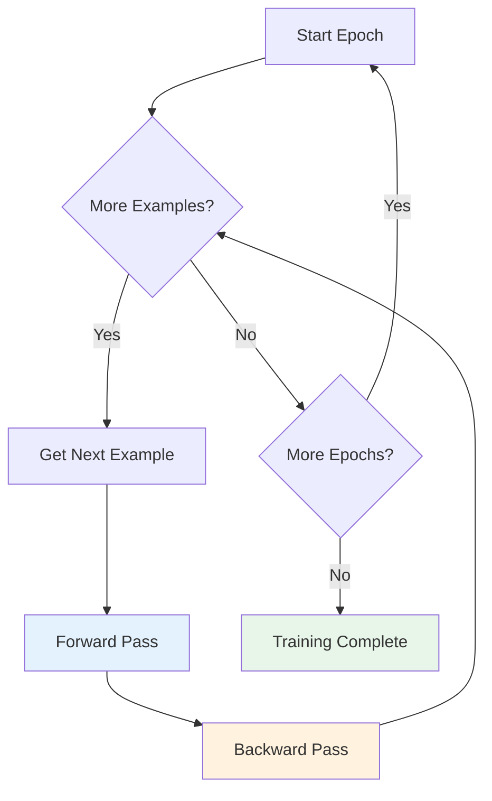
```mermaid
graph TB
    START[Start Epoch] --> ITER{More Examples?}
    ITER -->|Yes| NEXT[Get Next Example]
    NEXT --> FWD[Forward Pass]
    FWD --> BWD[Backward Pass]
    BWD --> ITER
    ITER -->|No| EPOCH_DONE{More Epochs?}
    EPOCH_DONE -->|Yes| START
    EPOCH_DONE -->|No| DONE[Training Complete]

    style FWD fill:#e3f2fd
    style BWD fill:#fff3e0
    style DONE fill:#e8f5e9
```

### Training by Iteration

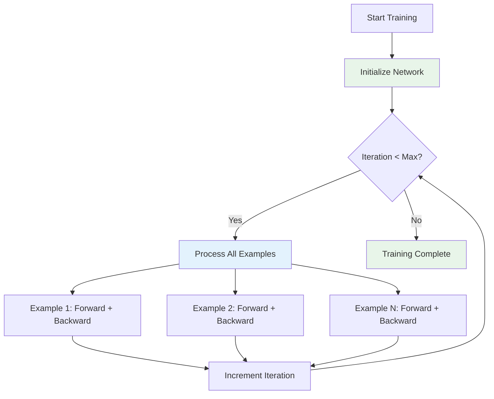
```mermaid
graph TB
    START[Start Training] --> INIT[Initialize Network]
    INIT --> ITER{Iteration < Max?}

    ITER -->|Yes| BATCH[Process All Examples]

    BATCH --> EX1[Example 1: Forward + Backward]
    BATCH --> EX2[Example 2: Forward + Backward]
    BATCH --> EXN[Example N: Forward + Backward]

    EX1 --> CHECK_ITER[Increment Iteration]
    EX2 --> CHECK_ITER
    EXN --> CHECK_ITER

    CHECK_ITER --> ITER

    ITER -->|No| DONE[Training Complete]

    style INIT fill:#e8f5e9
    style BATCH fill:#e3f2fd
    style DONE fill:#e8f5e9
```

### Training by Error

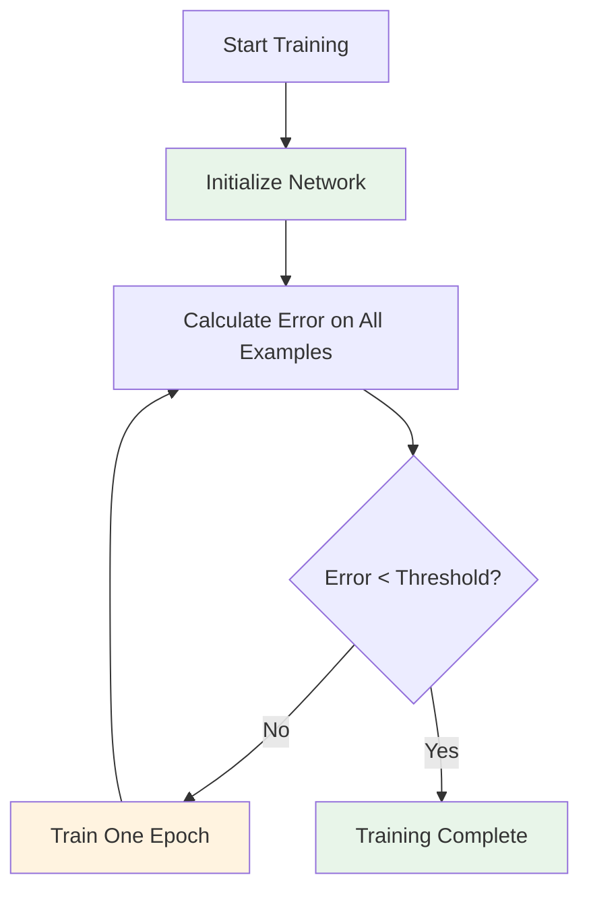
```mermaid
graph TB
    START[Start Training] --> INIT[Initialize Network]
    INIT --> CALC_ERROR[Calculate Error on All Examples]

    CALC_ERROR --> CHECK{Error < Threshold?}

    CHECK -->|No| BATCH[Train One Epoch]
    BATCH --> CALC_ERROR

    CHECK -->|Yes| DONE[Training Complete]

    style INIT fill:#e8f5e9
    style BATCH fill:#fff3e0
    style DONE fill:#e8f5e9
```

### Code Examples

#### Train Single Example

```rust
use neural_net_core::train_single;
use neural_net_types::FeedForwardNetwork;

let mut network = FeedForwardNetwork::new_with_config(2, 2, 1)?;

let input = [1.0, 0.0];
let target = [1.0];
let learning_rate = 0.5;

train_single(&mut network, &input, &target, learning_rate)?;
```

#### Train XOR Network

```rust
use neural_net_core::train_single;
use neural_net_types::FeedForwardNetwork;

let mut network = FeedForwardNetwork::new_with_config(2, 2, 1)?;

let inputs = vec![[0.0, 0.0], [0.0, 1.0], [1.0, 0.0], [1.0, 1.0]];
let targets = vec![[0.0], [1.0], [1.0], [0.0]];

// Train for multiple epochs
for epoch in 0..10000 {
    for (input, target) in inputs.iter().zip(targets.iter()) {
        train_single(&mut network, input, target, 0.5)?;
    }

    // Optional: Check error every 1000 epochs
    if epoch % 1000 == 0 {
        let error = calculate_total_error(&mut network, &inputs, &targets)?;
        println!("Epoch {}: Error = {:.6}", epoch, error);
    }
}
```

## Activation Functions

### Sigmoid

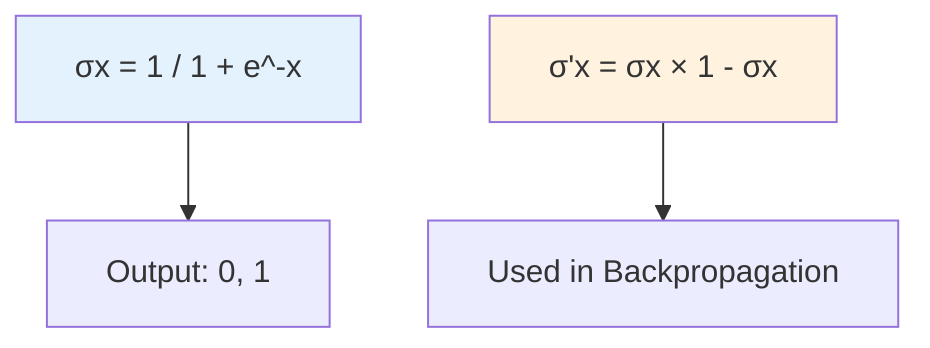
```mermaid
graph TB
    FORMULA[σx = 1 / 1 + e^-x]
    DERIV[σ'x = σx × 1 - σx]

    FORMULA --> RANGE[Output: 0, 1]
    DERIV --> BACKPROP[Used in Backpropagation]

    style FORMULA fill:#e3f2fd
    style DERIV fill:#fff3e0
```

**Properties:**
- Smooth, differentiable
- Output range: (0, 1)
- Derivative: `σ'(x) = σ(x) × (1 - σ(x))`
- Use case: Hidden layers, binary classification

**Graph:**
```
   1.0 ┤     ╭────
       │   ╭─╯
   0.5 ┤ ╭─╯
       │╭╯
   0.0 ┤
       └────────────
      -6    0    6
```

### Linear

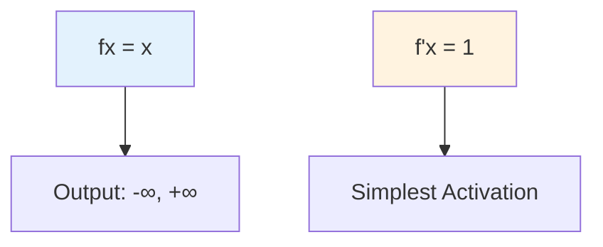
```mermaid
graph TB
    FORMULA[fx = x]
    DERIV[f'x = 1]

    FORMULA --> RANGE[Output: -∞, +∞]
    DERIV --> SIMPLE[Simplest Activation]

    style FORMULA fill:#e3f2fd
    style DERIV fill:#fff3e0
```

**Properties:**
- Identity function
- Output range: (-∞, +∞)
- Derivative: `f'(x) = 1`
- Use case: Input/output layers, regression

### ReLU (Rectified Linear Unit)

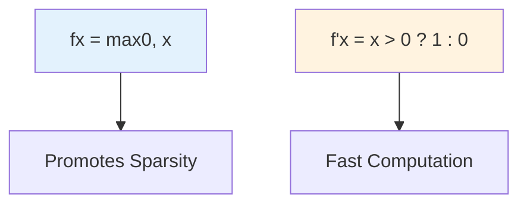
```mermaid
graph TB
    FORMULA[fx = max0, x]
    DERIV[f'x = x > 0 ? 1 : 0]

    FORMULA --> SPARSE[Promotes Sparsity]
    DERIV --> FAST[Fast Computation]

    style FORMULA fill:#e3f2fd
    style DERIV fill:#fff3e0
```

**Properties:**
- Non-linear but computationally efficient
- Output range: [0, +∞)
- Derivative: `f'(x) = 1 if x > 0, else 0`
- Use case: Deep networks, hidden layers
- Issue: Can cause "dead neurons" (always 0)

**Graph:**
```
   10 ┤       ╱
      │      ╱
    5 ┤     ╱
      │    ╱
    0 ┤────┘
      └────────────
     -5    0    5
```

### Comparison

| Activation | Range | Derivative | Pros | Cons |
|------------|-------|------------|------|------|
| Sigmoid | (0, 1) | σ × (1-σ) | Smooth, interpretable | Vanishing gradient |
| Linear | (-∞, +∞) | 1 | Simple, fast | No non-linearity |
| ReLU | [0, +∞) | 0 or 1 | Fast, sparse | Dead neurons |
| Tanh | (-1, 1) | 1 - tanh² | Zero-centered | Vanishing gradient |
| Leaky ReLU | (-∞, +∞) | 0.01 or 1 | Avoids dead neurons | Extra hyperparameter |

## Learning Rate

The learning rate (η) controls how much weights are adjusted during training.

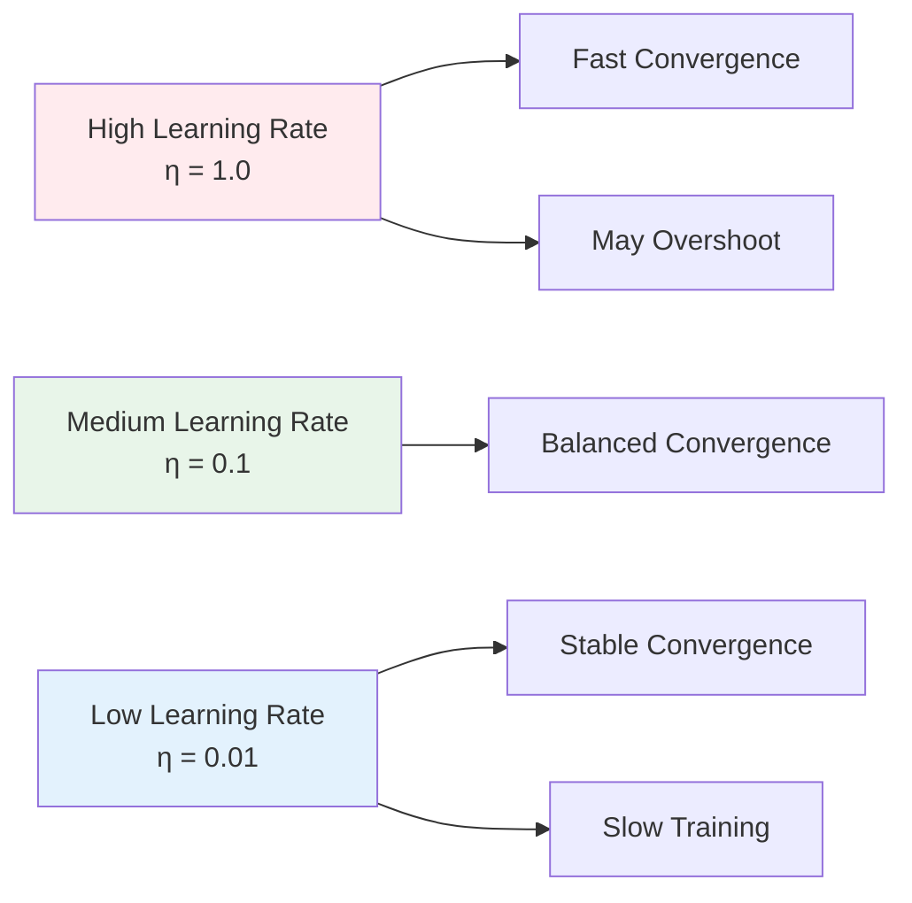
```mermaid
graph LR
    LR_HIGH[High Learning Rate<br/>η = 1.0]
    LR_MED[Medium Learning Rate<br/>η = 0.1]
    LR_LOW[Low Learning Rate<br/>η = 0.01]

    LR_HIGH --> FAST[Fast Convergence]
    LR_HIGH --> UNSTABLE[May Overshoot]

    LR_MED --> BALANCED[Balanced Convergence]

    LR_LOW --> STABLE[Stable Convergence]
    LR_LOW --> SLOW[Slow Training]

    style LR_HIGH fill:#ffebee
    style LR_MED fill:#e8f5e9
    style LR_LOW fill:#e3f2fd
```

### Effect on Training

**Too High (η > 1.0):**
- May overshoot optimal weights
- Training oscillates or diverges
- Network fails to converge

**Optimal (η ≈ 0.1 - 0.5):**
- Steady convergence
- Good training speed
- Stable weight updates

**Too Low (η < 0.01):**
- Very slow training
- May get stuck in local minima
- Requires many more iterations

### Recommended Values

| Network Size | Problem Complexity | Suggested η |
|--------------|-------------------|-------------|
| Small (2-4-1) | Simple (XOR) | 0.5 |
| Medium (10-20-5) | Moderate | 0.1 |
| Large (100+) | Complex | 0.01 |

## Error Calculation

### Mean Squared Error (MSE)

```
MSE = (1/N) × Σ(target[i] - output[i])²
```

Where:
- N = number of examples
- target[i] = expected output for example i
- output[i] = network's actual output for example i

### Total Network Error

```rust
fn calculate_total_error(
    network: &mut FeedForwardNetwork,
    inputs: &[[f32; N]],
    targets: &[[f32; M]],
) -> Result<f32> {
    let mut total_error = 0.0;

    for (input, target) in inputs.iter().zip(targets.iter()) {
        let output = forward(network, input)?;
        for (out, tgt) in output.iter().zip(target.iter()) {
            total_error += (tgt - out).powi(2);
        }
    }

    Ok(total_error / inputs.len() as f32)
}
```

## Optimization Strategies

### Gradient Descent Variants

```mermaid
graph TB
    GD[Gradient Descent] --> SGD[Stochastic GD<br/>Update per example]
    GD --> BGD[Batch GD<br/>Update per epoch]
    GD --> MBGD[Mini-Batch GD<br/>Update per batch]

    SGD --> NOISY[Noisy updates]
    SGD --> FAST[Fast iterations]

    BGD --> STABLE[Stable updates]
    BGD --> SLOW[Slow iterations]

    MBGD --> BALANCED[Balance speed/stability]

    style SGD fill:#e3f2fd
    style BGD fill:#fff3e0
    style MBGD fill:#e8f5e9
```

### Current Implementation

The platform currently implements **Stochastic Gradient Descent (SGD)**:
- Weights updated after each training example
- Fast iterations
- Can escape local minima due to noise
- Good for small to medium datasets

## Related Pages

- [[Data-Flow]] - Detailed sequence diagrams
- [[Activation-Functions]] - In-depth activation function guide
- [[Core-Components]] - Algorithm implementation details
- [[Example-Structure]] - How examples use these algorithms

## References

- [Backpropagation Tutorial](http://www.cs.bham.ac.uk/~jxb/NN/l7.pdf)
- [FNN Theory](http://www.di.unito.it/~cancelli/retineu06_07/FNN.pdf)
- [Architecture Document](../../blob/main/documentation/architecture.md)
